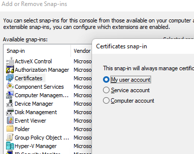

.. _f_problem_solving:

FAQ and Problem Solving
============================

This section will help you solve some problems or errors that may occur when using 3Di.
Some issues are due to the software, these will be summarised in the section Known Issues, including a temporary solution.
Errors, due to input data or other user settings can occur in various components or steps of the modeling process:

#. Generating a 3Di model from the spatialite data or

#. During simulation via the live site or via an API call.

The section 'Frequently endured issues' mentions different types of errors and how to find them.

We start with answering the frequently asked questions.

As our software is constantly improving, we will update this page with solved issues.

Frequently Asked Questions
^^^^^^^^^^^^^^^^^^^^^^^^^^^^

**Klondike**

- Are all my models automatically migrated?

*We will supply schematisations for the new route. New Models need to be created by the user. This can easily be done by going to management.3di.live --> models --> schematisations select a schematisation and click 'generate model'.

*An explainer on schematisations and simulation templates can be found* `here <https://docs.staging.3di.live/h_basic_modelling_concepts_threedi.html>`_.

- I installed the new plugin but I don't see any models. What happened to them?

*Don't worry, your schematisation have all been migrated. Simply generate the models using the management.3di.live page and your models will be available*

- Can I calculate with models generated with inpy using the new Models and Simulations plugin?

*No, you can't. Either use the old plugin for that or go to management.3di.live and generate the 3Di model from the schematisation of choice. We highly recommend everyone to start using the new route*

-	I don’t like change, can I still use the old inpy & Tortoise?

*Yes, you can. For a limited time this workflow will remain available.*

-	Do all models work on the new route after the Klondike release?

*Almost all of them do. There is a very limited number of models that contains errors we cannot fix or set as a warning. We have contacted the owners of these models individually. 
Even though we have done our best in identifying these models, but in some rare cases your model doesn't do what you expect in the new route. Please contact our servicedesk if this is the case*

-	Are all grid generation functionalities of 3Di still supported?

*All of them except for the dem obstacle detection.*

-	Do I need to change all of my scripts?

*There is a migration workflow available* `here <https://api.3di.live/v3/docs/migrate_to_threediapi/>`_. 
*The migration is only required if you want to use the new functionality.*

-	I uploaded extra files using Tortoise. Is this still supported?

*No. Only data that is used in a schematisation is supported.*

-	I added extra tables in my SQLite, will they be deleted?

*No, those will be ignored.*

-	How do I edit a simulation template?

*You can’t. But you can clone it into a new simulation and edit that.*

-	Can I change infiltration in a simulation template?

*No, infiltration is part of the schematisation. You can copy a schematisation and change the infiltration file there.
An explainer on schematisations and simulation templates can be found* `here <https://docs.3di.live/h_basic_modelling_concepts_threedi.html>`_.

- Why is the name of my simulation template 'default'? 

*The name is being read from the v2_global_settings table in the 'name' column. If that happens to be 'default', then that is the name of your simulation template.*

- What happens if I add an extra entry in the v2_global_settings table? 

*Extra entries will be ignored.*

- I have a variant on my schematisation that I like to test, what is the best way of doing so? 

*Copy/clone the schematisation, make your changes and upload it as a new schematisation.*

- What is a good location for my working directory in the Modeller Interface 3Di Models And simulations plugin?

*Choose any directory you like but we strongly advise you not to use the same directory as you were using for tortoise.*

- How do I change my working directory in the Modeller Interface '3Di Models and Simulations' plugin?

* Via the settings of the plugin (see below). 

.. figure:: image/f_changepluginsettings2.png
    :alt: Change the working directory of 3Di Models and Simulations	

- Is all information from my spatialite being read ?

*Yes, either it is being used as part of the schematisation and converted to a 3Di Model, or it is part of the simulation template.*

- My QGIS defaults to the Dutch language, does that matter?

*What matters is that the numbers notation is set to English. There is some bug in QGIS with scientific notations and Dutch number notations which can cause weird behaviour of the plugin. 
Please set your QGIS or Modeller Interface to English (settings --> options --> locale --> en_GB).*

**General**

- My model shows unstable behaviour, what can I do to avoid this? 

Instability is not common within 3Di, but certain settings or modelling choices can cause problems for the solver. 

*We have these tips:*

1) Decrease your calculation time step (background information: courant number)
2) Decrease your output time step temporarily. This makes it easier to analyse what goes wrong
3) Check combinations of nodes with a small storage area and pump stations with a large capacity. Make sure the 'gemaalkelder/pump basement' is large enough
4) Check if there are pump stations that are pumping to another 1D-node within the same 2D-computational cell
5) Check whether there are sewerage pipes shorter than 1 meter. If so, see if you can make them longer or add storage on the nodes that the pipes are connected to. 
6) Put the 'pump_implicit_ratio' in the numerical settings to 1. This makes sure that the model calculates smoothly for pump stations (see  :ref:`matrixsolvers` --> pump_implicit_ratio)

	

Known Issues
^^^^^^^^^^^^^^

General
--------

- When applying 2D boundary conditions, it is not allowed to have more than one grid resolution on the edge. However, there is no clear error message for this. To solve this, add a grid refinement line on the boundary. This will force a uniform grid on the 2D boundary line.

- Note, that in v2_control tables (v2_control_table, v2_control_memory, v2_control_pid, v2_control_timed) the unit for adjusting the pump discharge capacity via the API is actually *m3/s*, even though the unit used normally is *L/s*. 
NB: This is only the case via the API. In the Modeller Interface (sqlite) the unit is in l/s. 

- For simulations including interflow or embedded elements, not all results can be viewed. Moreover, the water balance ignores part of the flow, therefore it will seem to be inconsistent.

- There are some issues related to projections. We are encountered this for our UK-based models (.sqlite). These models will show a shift in the  geometries in QGIS. The reprojection from EPGS:27700 (British National Grid) to WGS84 is based on an outdated reprojection in the spatialite. There is a solution for this:

1. In QGIS open the (table without geometry) table "spatial_ref_sys"
2. go to row srid 27700
3. update column proj4text (overwrite existing value) with +proj=tmerc +lat_0=49 +lon_0=-2 +k=0.9996012717 +x_0=400000 +y_0=-100000 +datum=OSGB36 +units=m +no_defs

This might also be the case for other projections.

- Laterals currently do not work for other projection systems than epsg:28992.

- The *manhole_storage_area* in the v2_global_settings table of the data base must be set as an INTEGER.

- After downloading a recent result netcdf within the QGIS-plugin the following error occurs: "The selected result data is too old and no longer supported in this version of ThreediToolbox. Please recalculate the results with a newer version of threedicore or use the ThreediToolbox plugin for QGIS 2." This error might also occur when trying to download a NetCDF larger than 2GB. If this happens, try downloading it via the result email or adjust the model settings.

- Wind shield factor is not taken into account during a simulation

- Boundary conditions can only be applied via the model sqlite. Uploading a boundary condition as a json file using the API will result in a failure of the simulation.

- The waterdepth interpolation in the livesite may show unexpected behaviour; it shows triangular patterns. These deviations are only visual, so the results are still correctly. This will be fixed in the near future.

Modeller Interface
---------------------

- The Modeller Interface and the plugins have trouble installing if there is already a previous version installed because of old dependencies. Please remove (before installing a new version) the folder '{user profile} \ python' alle folders instead of 'expressions', 'plugins' and 'share'.  (e.g. the error 'sqlalchemy' might indicate this is the case)
	
- If you have an older version of the MI (e.g. based on QGIS 3.10), you should remove it via *Windows Apps & Features*, to avoid any conflicts. 

- When using the sideview-tool in the QGIS-plugin, the length of the side view profile of pipes in the graph can be different than the actual length of the pipe. This is due to a projection conversion error in QGIS and does not affect 3Di calculations.

- A schematisation that is uploaded via the MI without processing will appear falsely in the management pages as 'not valid'. If you upload the schematisation again with processing, the model will be generated. 

- The Sideview is not supported for channels. 

- Embedded and interflow can not be read with the standard tooling.

- When using an infiltration rate file in v2_simple_infiltration, an infiltration value of 'NULL' is not valid and will cause an error. Please use an infiltration rate value of 0 instead.

- Leakage does not work in the Modeller Interface. Please use the API for now if you want to use leakage. 

Live site
-----------

- The live site uses always the max for initial water level, even when a different aggregation method is selected in the spatialite.

- The live site doesn't show lateral inflow defined in the spatialite.

- If a raster has both NaN and Nodata values the live site DEM will color yellow (showing color scale for -9999)

- In the live site it is not possible to visualise structures together with the schematisation.

Management pages
-----------------

- A schematisation that is uploaded via the MI without processing will appear falsely in the management pages as 'not valid'. If you upload the schematisation again with processing, the model will be generated. 

Frequently endured issues
^^^^^^^^^^^^^^^^^^^^^^^^^^

Per category, we include the frequently endured issues. In case you think a specific issue should be included, please let us know.

Uploading a new revision/migrating a model
--------------------------------------------

Error: (400)
++++++++++++++

*Error: (400)
Reason: Bad Request
HTTP response headers: HTTPHeaderDict({'server': 'openresty/1.15.8.3', 'date': 'Fri, 11 Feb 2022 07:44:04 GMT', 'content-type': 'application/json', 'content-length': '68', 'vary': 'Accept, Origin, Cookie', 'allow': 'POST, OPTIONS', 'x-frame-options': 'DENY', 'x-content-type-options': 'nosniff', 'strict-transport-security': 'max-age=63072000', 'referrer-policy': 'strict-origin-when-cross-origin', 'x-xss-protection': '1'})
HTTP response body: ["Maximum number of active threedimodels for a schematisation is 3"]*

You have reached the max number of active 3Di models for this schematisation. Please go the management.3di.live and remove one or more 3Di models that are attached to this schematisation

sqlite3.IntegrityError: CHECK constraint failed: _alembic_tmp_v2_aggregation_settings
++++++++++++++++++++++++++++++++++++++++++++++++++++++++++++++++++++++++++++++++++++++++++++++++++++++++

This can be fixed by the following 2 adjustments.

1. Set aggregation = 0  instead of aggregation = FALSE

2. remove table _alembic_tmp_v2_aggregation_settings 

Running a simulation
----------------------

"exit_code": "4161 [health_check_premature_container_error]"
++++++++++++++++++++++++++++++++++++++++++++++

Please run the simulation again. There was a temporary disruption.

"exit_code": "4265 [health_check_postprocessing_error]"
++++++++++++++++++++++++++++++++++++++++++++++

Please run the simulation again. There was a temporary disruption.

ERROR - F - Matrix diagonal element, near zero
++++++++++++++++++++++++++++++++++++++++++++++

At one calculation point there is no storage area or the wet cross section area is near zero or even negative. This may be caused by various reasons listed below:

* Structure levels are below cross section reference levels, f.i. a culvert below the bed level. This is not possible as when water level drops below the bed level, flow through the culvert has no area to flow to. Update reference or structure levels so that they match. Reference levels can be below structure levels.

* A lateral inflow from laterals or an inflow surface is connected to a node without storage area, f.i. an pump end node or boundary node. Removes laterals or inflow from these nodes.

* Water level boundary is below structure level.

* All definition values for width and height must be positive.

* Pump start level is below pump stop level.

The error is followed by a reference to the node without any storage or link without wet cross section area. This will look something like::

    near zero, aii(nod)<1.0d-10,nod,aii(nod),su(nod)  14614   14439  0.0000E+00  0.0000E+00

The first number (14614 in this example) refers to the calculation node on which the error occurs. This number can be found using the QGIS plugin when a result of this model is available. The number can be located using the *node_results*. The id's in this table match the one given here. The second number is a link id and can be found using the *line_result* layer.

ERROR : The combination of cross-section types is invalid for input channel number:
+++++++++++++++++++++++++++++++++++++++++++++++++++++++++++++++++++++++++++++++++++

Not all cross-section definition types can be combined for a single channel. Only type 1 (rectangle) and type 2 (circle) or type 5 and 6 (both tabulated) can be combined. If you have multiple cross-section types on one channel change these or split the channel.

ERROR - F - Impossible line connection at calculation node:            729
++++++++++++++++++++++++++++++++++++++++++++++++++++++++++++++++++++++++++

This error may occur when using embedded in combination with structures. Make sure no structure is placed entirely inside a 2D computational cell. You can only check this when you have a copy of the 2D computational grid. You can obtain this by making a purely 2D model of your DEM and grid refinement of try making one using the 'create grid' function in the QGIS processing toolbox.

Runtime Error: NetCDF: String match to name in use
++++++++++++++++++++++++++++++++++++++++++++++++++

Check the aggregation NetCDF name settings, names must be unique.

Loading results
-----------------

Runtime Error: attempt to write a readonly database
++++++++++++++++++++++++++++++++++++++++++++++++++++

This means that the gridadmin.sqlite is still in use by you or another user or is not closed correctly.
You can fix this by removing the file 'gridadmin.sqlite-journal' (not gridadmin.sqlite!). 

Signing in and sign up
------------------------

403 - You do not have a 3Di account. Please contact your manager and ask for an invitation
+++++++++++++++++++++++++++++++++++++++++++++++++++++++++++++++++++++++++++++++++++++++++++++

Please contact our support office and let us know your login name or mail address and the error code if you received any. 

.. note::
    Please ensure that "https://auth.lizard.net/" domain is indeed displayed
    in your browser's address bar and that your browser displays the lock
    symbol indicating that the connection is secure.

Finding a model
-----------------

Can't find the model you are looking for?
Please check the following:

- If you have access to the organisation to which the model belongs

- If the model is available on API v3 (https://docs.3di.live/d_api.html#api-v3)
Please contact the service desk if you need assistance.

Connecting to the 3Di API
-------------------------

In some cases the 3Di Models and Simulations plugin (part of the 3Di Modeller Interface) can give a generic SSLError on a Windows system (see figure below).
To solve this issue, please contact your organisation's system administrator.
Instructions for your system administrator on how to solve this problem are given below the figure::

  Error: HTTPSConnectionPool(host='api.3di.live', port=443): Max retries exceeded with url: /v3/auth/token/ (Caused by SSLError(1, 'A failure in the SSL Library occurred (_ssl.c:1129)')))

.. figure:: image/f_ssl_error_qgis.png
    :alt: Screenshot of the error

This error is resulting from a combination of how the plugin validates SSL/TLS certificates and how Windows expects that to happen.
We are using Let's Encrypt as our certificate supplier for most of our 3Di webservices.
In September 2021 their root certificate 'DST Root CA X3' expired and was replaced by the 'ISRG Root X1' certificate.
All of the Let's Encrypt domain name certificates are issued by Intermediate Certificate 'R3'.
There are some cases where this Intermediate Certificate is still issued by 'DST Root CA X3', and this can create issues.

To solve this, please open a Microsoft Management Console (mmc.exe) and add the Certificates Snap-In for the user.

Open the "Intermediate Certification Authorities" and then the "Certificates" folder.
Find the 'R3' Intermdiate Certificate, and check who the issuer is.
If this is only 'DST Root CA X3', please remove it and visit https://api.3di.live/v3 with a browser.

Please contact our servicedesk after this fix is applied and are still receiving the error message.

Solved issues
^^^^^^^^^^^^^^

The below errors and bugs should not be experienced anymore. Please let us know if you do still encounter them.

- The toolbox does currently not work properly for QGIS 3.22. You cannot edit your schematisations. Please use QGIS 3.16 for now if you have this issue or use the Modeller Interface.

- DEM edits do not work as intented for newly generated models (Klondike route). 

- If you use the type ‘half verhard’, the gridadmin generation will crash. We will fix this by 4-4-2022.  In the meantime, we advise to choose an other type.

- The Pipe view and Orifice view can be broken in the downloaded spatialite. If that happens, the service desk can provide 2 SQL scripts as workaround.

- The 3Di Toolbox plugin does not work with QGIS 3.16.8 and above. To avoid problems, install the Modeller Interface or download the OsGeo Network Installer from qgis.org

- Calculations that had both rain radar and laterals crashed somewhere during the simulation. 

- Dry Weather Flow in API v3 or the Modeller Interface is not taken from the spatialite. Users can define the DWF by using the dwf calculator and applying it as a lateral

INP generation
-----------------

After uploading or pushing a new revision 3Di.lizard.net/models will generate a model automatically. If an error occurs during this process the status bar will turn red and show FAIL. By clicking FAIL the log messaging is shown. You may now look for errors either through the web page or by downloading the file in the upper right corner of the screen. Look for any line that starts with *ERROR* and see if you recognize the examples below.

ERROR - could not create threedimodels resource: (400)
++++++++++++++++++++++++++++++++++++++++++++++++++++++++

The complete error looks like this::

              2021-10-07 14:16:57,132 - threedi_spatialite_tools.threedi_files.api_resources - ERROR - could not create threedimodels resource: (400)
              Reason: Bad Request
              HTTP response headers: HTTPHeaderDict({'content-length': '91', 'x-xss-protection': '1', 'x-content-type-options': 'nosniff', 'strict-transport-security': 'max-age=63072000', 'vary': 'Accept, Origin, Cookie', 'server': 'openresty/1.15.8.3', 'allow': 'GET, POST, HEAD, OPTIONS', 'date': 'Thu, 07 Oct 2021 12:16:57 GMT', 'x-frame-options': 'DENY', 'referrer-policy': 'strict-origin-when-cross-origin', 'content-type': 'application/json'})
              HTTP response body: {"slug":["Enter a valid \"slug\" consisting of letters, numbers, underscores or hyphens."]}

Please check the column 'name' in the v2_global_settings table of the sqlite. This name should not contain spaces. If that is the case, remove the space or replace it with a _

ERROR can not detect use case from settings.
+++++++++++++++++++++++++++++++++++++++++++++
Followed by::

            Settings from v2_globalsettings are: use_2d_flow True
            use_1d_flow False dem_file rasters/dem.tif
            conf.manhole_storage_area 100.0

The use case was not specified correctly. Check the manhole storage area given your use case (1D, 0D, 2D or an combination). Manhole storage area must be NULL when using only 2D. For other settings see the global settings section in the database overview, download :download:`here <pdf/database-overview.pdf>`.

AttributeError: 'NoneType' object has no attribute '__tablename__'
++++++++++++++++++++++++++++++++++++++++++++++++++++++++++++++++++++++++

Some tables that should be empty are not. For instance when v2_connected_pnt table (used for breaches) is filled, while your model has no 1D elements. Try emptying the tables you do not use. You can see which tables in the spatialite database are filled by dragging the spatialite into your QGIS project. A pop-up screen appears showing all geometry tables including the number of records per table. Check each table without a geometry.

TypeError: Improper geometry input type: <type 'NoneType'>
+++++++++++++++++++++++++++++++++++++++++++++++++++++++++++

Some feature(s) in a table with geometry has an improper geometry. This usually means the geometry field is empty. This may happen when you delete all vertices, while editing while the record in the table still exists. You must either fix the (missing) geometry or remove the given record.

ERROR: No cross section on channel with pk 558
++++++++++++++++++++++++++++++++++++++++++++++

For a channel in your model is no cross-section defined. The error displays the pk (primary key) or channel id for which channel the cross-section location is missing. Add a cross-section location and definition to the given channel.

If you expect this may be the case for multiple channels or cross-sections you can check your model using joins in QGIS. Join the definition table to the location table and see which location has no definition by opening the table. Do the same for channels; join the locations to the channel and check the table for any missing locations.

Fortran runtime error: Bad integer for item 2 in list input
++++++++++++++++++++++++++++++++++++++++++++++++++++++++++++

Most likely you have failed to provide the channel, culvert or pipe calculation type, options are isolated, connected, embedded or double connected. Fill the calculation type for each of these tables.

ERROR  : Bad integer for item 2 in list input (= network file)
++++++++++++++++++++++++++++++++++++++++++++++++++++++++++++++

Similar to the error above. In addition, for every connection node the type is derived from the connecting channels, culvert, pipes or manhole. When the node is not connected to any of these, the type cannot be derived. Add a manhole to nodes that are not connected to any channel, culvert, pipe to set the type for these nodes.

ERROR  : Connected 1D calculation node at nodata value of raster.
++++++++++++++++++++++++++++++++++++++++++++++++++++++++++++++++++

Followed by::

        Channel ID and pixel coordinates are:           2034          1681           559
        ERROR  : Calculation node          18398

A connected calculation node is outside the DEM. It may be an end or start node as well as a calculation node halfway a channel segment. Check if any channels or nodes are outside the DEM and set them to isolated.

ERROR  : There is at least one erroneous location of a 2D open boundary.
+++++++++++++++++++++++++++++++++++++++++++++++++++++++++++++++++++++++++

Followed by::

    It is not located at an active edge. This (these) boundary(ies) is (are) ignored

The 2D boundary condition line is outside the DEM raster. Place 2D boundary lines in the center of the last row of pixels of the DEM.

AttributeError: 'NoneType' object has no attribute 'full_name'
++++++++++++++++++++++++++++++++++++++++++++++++++++++++++++++++++++

This error may be caused by the following:

* One or more rasters are missing. For instance, there is no DEM given or the given them does not exists in the repository. Make sure you added it in Tortoise

* The minimum grid space and DEM resolution are not aligned properly, the amount of pixels in the smallest computational grid cell must be an even number. Change the grid_size in the global settings or update your rasters to meet this requirement.

* A channel may have a cross section location exactly on the start or endpoint or the profile location is not snapped to any vertex. Check your locations using geometry functions like intersect.

* Rasters are not aligned or have different geometries. Check your rasters using Gdalinfo and :ref:`rasters`.

* Grid refinement or levees are outside the DEM.

Error in node sequence of network file
+++++++++++++++++++++++++++++++++++++++

Some required fields are left blank, like the crest level of a weir. Fields may be empty in v2_orifice, v2_channel, v2_weir, v2_culvert or v2_pumpstation. Check your recent edits and compare them with the :download:`database overview <pdf/database-overview.pdf>`.

ERROR: Error in 1d administration:
++++++++++++++++++++++++++++++++++

Followed by::

        Number of input boundaries is not the same to the number of boundaries found by the computational core

A boundary condition is linked to a node with more than one connection. A boundary may not be spaced on a junction of multiple channels, pipes or structures. Check the elements that are linked to the connection nodes that have boundary conditions.

ValueError: invalid literal for int() with base 10: '5.21585549'
+++++++++++++++++++++++++++++++++++++++++++++++++++++++++++++++++

This error may be caused by an incorrect time series in one of the boundary condition tables (e.g. v2_1d_boundary_conditions). The time steps should be integers (e.g. 3, 15, 67) and can not contain decimal numbers. The boundary condition itself (second number) does not have to be an integer.

For example::

        0,0.33
        5,0.46

is a valid time series. And::

        0.5,0.33
        5.1,0.46

is an invalid time series.

Results Analysis
-------------------

ThreeDiToolbox Installation
+++++++++++++++++++++++++++++++++++++

During installation and/or upgrading of the *ThreeDiToolbox* (QGIS Plugin), one may encounter problems.
Various options are described at `ThreeDiToolbox <https://github.com/nens/ThreeDiToolbox/wiki#>`_

ThreeDiGrid
+++++++++++++++++++++++++++

The python package that can assist in analysing and making your own tools based on the 3Di results can be found at this `location <https://github.com/nens/threedigrid>`_. The full threedigrid documentation can be found via the following link: `Threedigrid documentation <https://threedigrid.readthedocs.io/en/latest/readme.html>`_.

No Limit to infiltration
+++++++++++++++++++++++++++++

The setting max_infiltration_capacity_file found in the global settings table is depricated. The setting was not removed from the global settings table, but is added to the infiltration_simple_table. Values from there are taken into account. This is solved in the autumn release 2018, however older versions of the spatialite still have this setting there.

