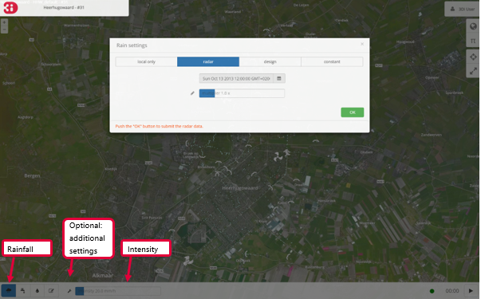
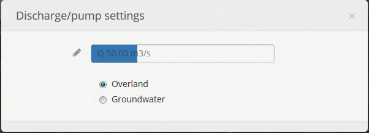
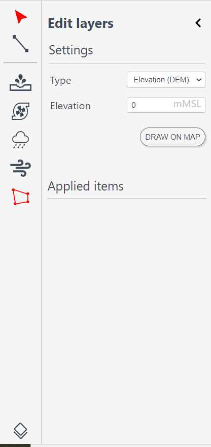
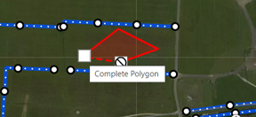
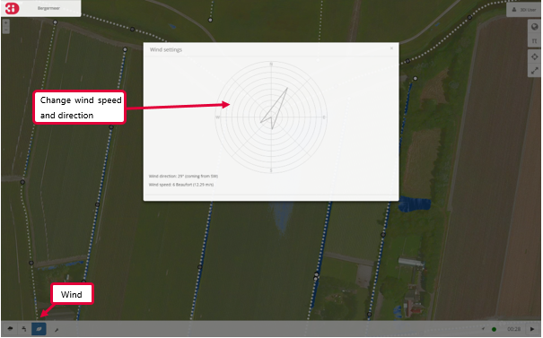
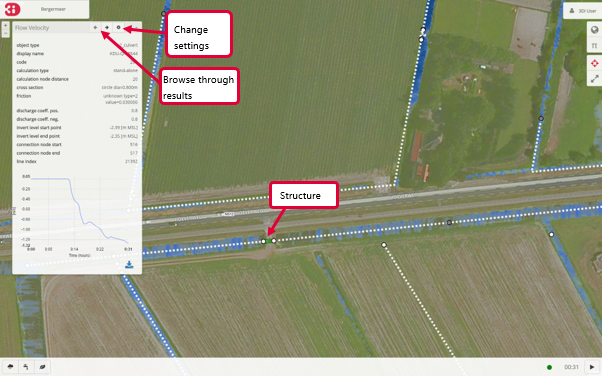
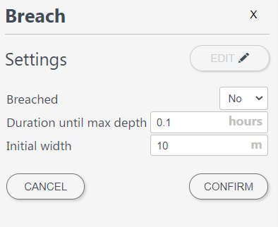
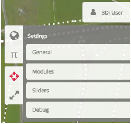

.. _qgisplugin:

Forcing & Edits
========

Rainfall
--------

Through the precipitation icon rainfall can be added to the model. When clicking on the map, a blue circle and the icon of a raincloud appear on the map. The size of the raincloud is proportional to the size of the window. Zooming out will result in a larger raincloud and vice versa. Using the menu at the bottom left of the screen the intensity of rainfall can be adjusted.

The above example is about the so-called *local only* rain event. By pressing the *additional settings* button (wrench icon) a new menu opens with different options for the rainfall:

* **Radar**: use historical rainfall data.
* **Design**: use a design event. This event is homogeneous over the entire model area and heterogeneous in time.
* **Constant**: a homogeneous event in both space and time across the entire model range.

These three options for adding rainfall all cover the entire model area, in contrast to the *local only* event.

When the rainfall is active a cloud icon appears on the bottom right of the screen. Information about the rainfall event can be accessed by clicking this icon.

Pump (or constant discharge)
----------------------------

With the tap icon a constant source (or sink) of water can be added to the model. Select the tap and click at a location on the map to add the pump. You can then change the rate (in m3/s) you want to apply. A positive value means water is added to the model, a negative value means water is taken out of the model. The water that is taken out of the model will not flow back into the model and is considered a loss. The icon which is displayed on the map changes from a tap into a hose for negative values. 

By pressing the *additional settings* button (wrench icon) a new menu opens with more options for changing the pump settings. Here it can be selected whether the pump will add (or extract) water from the surface water (overland) or the groundwater. The latter is only possible if the model contains a groundwater component (**v2**). Using the marker icon exact values can be chosen. 

Flood Fill (v1)
---------------

With the droplet icon part of the model can be put under water, a so called flood fill (**v1**).

* Choose the water level (in meters) and click on the map.
* Starting at the chosen location, the model is filled with water up to the water level selected. The flood fill option will look for a flow path (using the DEM).
* The result of the flood fill becomes visible as soon as the user starts the calculation.

By clicking the *additional settings* button (wrench icon) an additional settings becomes available. It can be selected whether the flood fill value is considered an absolute value (e.g. relative to a global reference level, like MSL), or as a relative value (i.e. relative to the local elevation).

DEM edit/ Raster edit
------------------------------------------------

A DEM edit is a tool in our live site, it allows to adjust the height of the bathymetry. This can be done at any time during the simulation. 

To edit the bathymetry of the model, make sure the DEM-layer is activated. This can be done by clicking on 'Map layers' (globe icon), then open the layer group 'Foreground' and then activate the DEM-layer by clicking on 'DEM'.  
By clicking the pencil icon in the lower left corner of the screen, edits in the DEM can be made. The slider on the right of the icons can be used to set the new height of the DEM. This is the absolute value in meters relative to sea level. The polygon icon on the left side of the screen can be used to draw a polygon on the DEM, to indicate the location of the edit. When clicking this icon a cursor showing the text 'Click to start draw polygon' pops up. A polygon can be drawn by clicking multiple vertices on the DEM and closing it by clicking on the first point again. The DEM edit is immediately committed when finishing the polygon. The result can be checked using the 'Cross profile' tool.

   
For v1 models, any layer that is included in the model can be adjusted. 
   
For v2 models it is also possible to make a DEM edit via the API: `3di.lizard.net/api/v1/calculation/start/ <https://3di.lizard.net/api/v1/calculation/start/>`_  , thereby allowing external applications to perform a DEM edit as well. However, the steps performed by ‘process results’ do not take the DEM edit into account.  Take this into consideration when interpreting the results near your edit. 

Wind (v2)
---------

A compass card appears after clicking on the leaf icon followed by clicking on the wrench icon. By clicking in the compass card a homogeneous wind field with a specific direction and speed can be set up for the whole model (**v2**).

1D network
----------

Channels and structures can be included as 1D elements in the model. The channels show the direction of flow with the help of moving points. The direction and speed are based on the flow velocity in the channel. The different sizes of the points are based on the flow rate. The results (flow rate, water level, waterdepth and flow velocity) are available at the structures by selecting them.

It is also possible to adapt some properties of structures during the calculation. This includes among others the closing of a culvert or increasing the pumping capacity.

Breaches (v2)
--------------------

If breach locations are predefined in the model, these can be activated as follows (**v2**):

#. Make the breach locations visible by clicking the globe icon, *Structures* and *Breaches* in succession. The breach locations will show as red points when zoomed in far enough. 
#. By clicking a breach location a pop-up screen with settings for this breach appears.
#. Using the gear icon the breach can be opened and settings can be altered.

To show the flow rate over time, select a breach location using the point information tool. 

Advanced settings
-----------------

Advanced settings are available by clicking the pi icon in the top right corner. In this menu some advanced settings can be altered. 

.. _reset_model:
 
