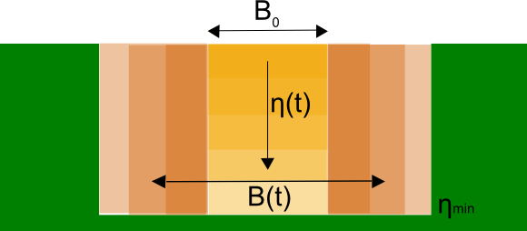

.. _obstacles:

Obstacles and breaches
======================

The subgrid technique used in 3Di allows for a very detailed description of the elevation. However, the subgrid technique does not recognize all narrow elements within a cell as blocking. Only when these are located at the cell edges they are detected and will block flow. When an element can be defined as narrow depends on the dimensions of the computational cell. Examples of narrow elements can be levees, residential blocks or quay walls. There are several methods for dealing with these elements. One can always refine the computational grid, however, this can be unnecessarily give an increase in the computation cost, but blocking a flow can be essential for a correct result. 3Di offers two different methods to achieve this. It can either be done by general obstacle detection, or by adding an obstacle at a specific location. To elaborate, when using general obstacle detection, the modeler only gives an obstacle height, which the 3Di computational core uses to determine obstacle locations itself. Using the latter method, a modeler can add an obstacle with a specific location and height.

In practice these two methods can have a different outcome. The explicitly defined obstacles are much stricter in closing 2D flow lines. For some situations this is necessary, however it can also result in an ‘angular’ flow domain which might result in additional friction. The ‘general’ obstacle detection is on the other hand, not always strict enough, but it does not require any work of the modeler. Moreover, it is also possible to use both options in one model. In this case, when both methods block a flow line, the explicitly defined obstacle is dominant over the general approach.

Obstacles
---------

If the model wishes to include an obstacle that may not be detected by the computational grid or doesn't exist in the elevation model it can be given explicitly. These obstacles are given by a line segment and an elevation. These lines and elevations are placed over the quadtree. The routine checks which 2D links cross the obstacle line. For those links that are crossed the obstacle height is used instead of the elevation height for Flow computation. The figure below shows an example of an obstacle line in green.

.. figure:: image/b6_gridwithobstacles.png
   :scale: 50%
   :alt: virtual_conservation_box
   :align: right

   Figure 2: A computational grid for 2D flow including local grid refinements. The momentum domains in x- (pink) and y-direction (blue) are indicated by the planes. The obstacle elements are given with a green line and the flow links with a dashed blue line. The flow links closed by the obstacle are marked with a thick red line.

.. _breaches:

Breaches
------------

3Di can simulate the consequences of a breach in a levee. In such case, the dimensions of the breach determine flow through the breach and therefore the flood. The growth of a breach is a very complex process. It is a phenomenon where hydrodynamics, morphology, groundwater and soil mechanics interact. Many aspects of this interaction is still unknown, and therefore it is difficult to model. Moreover, detailed modeling would require very detailed information about the levee. Generally, there is only a limited amount of information about the soil, structure, moisture content etc of the levee.   Nevertheless, rules of thumb have been developed that describe the breach growth, which allow us to make an estimate of the breach growth.

In a 3Di model, flow may occur between 1D and 2D elements. In certain cases this exchange is limited by a levee. The exchange height is determined by the height of the levee. When a few extra properties of the levee are specified for these connections, a breach can be modelled that can grow over time. More information on levees, can be found in :ref:`obstacles`

Breach growth formulation
++++++++++++++++++++++++++++++++++++++

In 3Di, the formula of Verheij and van de Knaap (2002) is used to describe the growth of a breach. For this formulation it is expected that the material of the levee (sand or clay), an initial breach width, the maximum breach depth and the period that is needed to reach this depth are known.

   Longitudinal cross-section of breach showing the breach growth parameters.

This formulation splits the growth of the breach into two phases; in the first phase the breach deepens and in the second phase the breach widens. Mathematically, the first phase can be described as:

.. math::
   :label: breach_growthb

   B(t) = B_0    \qquad \qquad \qquad \qquad  \qquad  \qquad       t_{start} < t < T_0

.. math::
   :label: breach_growthet

   \eta(t + \Delta t) = \eta(t) - \frac{t}{T_0} (\eta(t) - \eta_{min}) \qquad        t_{start} < t < T_0

| In which:
| :math:`B(t)` is the width of the breach at time t,
| :math:`\eta_{min}` is the minimum level of the breach,
| :math:`T_0` is the period in the minimum level is reached,
| :math:`B_0` is the initial breach width, and
| :math:`\Delta t` is the time step
| :math:`\eta(t)` is the level of the breach at time t.
|

Once the minimum breach level is reached, the width of the breach increases according to:

.. math::
   :label: breach_growth2

   B(t + \Delta t) = B(t) + \frac{\partial B}{\partial t}  |_t \Delta t  \qquad     t > T_0 \\
   \frac{\partial B}{\partial t}  |_t = \frac{f_1  f_2}{u_c^2 ln[10]}  \frac{[g(h_{up}(t) - h_{down}(t))]^{3/2}}{1 + \frac{f_2g}{u_c}(t - T_0) }   \qquad     t > T_0

| In which:
| :math:`f_1, f_2` empirically derived parameters, different per sediment type,
| :math:`u_c` is the critical velocity
| :math:`h_{up}, h_{down}` is the water level upstream and downstream of the breach.
|

Because the water level gradient in front and behind the breach is included in the formulation, a natural balance may arise. This means that the breach stops growing, when the water levels are equal.

The above formulation also corrects for the presence of different types of materials by using a critical velocity and the parameters :math:`f_1` and :math:`f_2` . The growth rate of the breach increases for materials that erode more easily. In principle, this formulation distinguishes only sand and clay.

Exchange formulation
++++++++++++++++++++++++

The flow between 1D and 2D at the breach is computed based on a simplified momentum balance. A balance is made between the friction and the forcing. Note, that the volume in the breach is neglected.

More details on how to use obstacles, levees and breaches can be found in :ref:`flood_model`.
