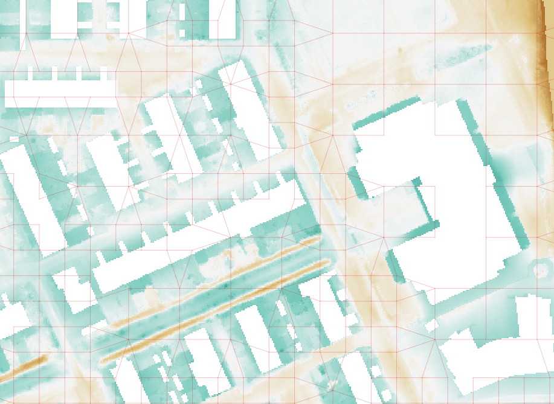

.. _rain:

Rainfall
========

One of the source terms described in  :ref:`cons_volume` is rain. Naturally, rain can fall on the 2D domain. However, 3Di also supports inflow from rain in the 1D domain. The *rain* is determined by the 0D :ref:`inflow` module and adds the outgoing flow directly in the 1D network. 

Rain in the 2D Domain
---------------------------

There are several options for the user concerning rain. Rain is always set as an intensity in mm/hr. During a 3Di simulation, rain is automatically converted into rainfall, as it is scaled with the active cell surface area. The active area of a cell is defined by the cell size and the bathymetry. In case the bathymetry is not defined (the bathymetry raster can contain nodata values) in parts of a cell, these parts do not contribute to the active area.

   
   It can only rain in areas where the bathymetry is defined. The areas with nodata values in the Bathymetry file are white.

Input
^^^^^^^^^^^^   
   
The options for rain:

1. **Radar-based rain** - Based on the radar rain images, temporally and spatially varying rain information is available. The Dutch `Nationale Regenradar <https://nationaleregenradar.nl/>`_ is available for all Dutch applications. On request, the information from other radars can be made available to 3Di as well.

#. **Design rain** - Time varying rain intensity can be used globally during a computation. The so-called design rain events are time series, which are traditionally used to test the functioning of a sewer system in the Netherlands. These originate from `RIONED <https://www.riool.net/neerslaggebeurtenissen-1>`_. However, all time-series from Lizard can directly be coupled to a 3Di simulation.

#. **Constant rainfall** - The rain intensity is uniform and constant in time during a computation.

#. **Rain cloud** - a circle type of spatial rainfall with a constant value within the circle and specified time period 

Via the 3Di API are only options 1, 2, and 3 available. Via the API, multiple periods of constant rain can be added, to customize your own rain event.

Rainfall on 0D node (inflow)
-------------------------------

Apart from rainfall on the 2D domain, 3Di uses a 0D :ref:`inflow` module (impervious area or surface area). The rainfall volume (area x rainfall_intensity x delta t) is calculated for each time step for each impervious area or surface area. Based on the formulation of the impervious area or surface area (:ref:`inflow`), the discharge hydro-graph (discharge over time) is calculated as a lateral discharge on its downstream 1D node.  

.. figure:: image/b_rainfall_inloop.png
   :alt: rainfall_inloop
   
   Rainfall is translated to a lateral discharge on a 1D node.
   
The so-called surfaces that represent the areas capturing the rain always contain a geometry. This allows the use of the 0D module in combination with spatially varying rain.

Rainfall on 0D and 2D
----------------------------

3Di allows the user to select whether rainfall falls on 0D, 2D or both. Using both 0D and 2D rainfall can be useful in several cases, for example:

- complex sewerage models that use inflow for the flow of water from roofs to the sewerage and 2D surface for rainfall and discharge over roads, or

- large systems in which a small area is modeled in detail while upstream catchments are lumped in 0D inflow.

When using both 0D and 2D rainfall one must be aware that the user is responsible for defining the correct areas in 0D and in 2D. This in order to avoid an overestimation of the area capturing rain. This can be ensured by cutting areas from the DEM or by including interception (:ref:`interception`). 

.. figure:: image/b_rainfall_hybrid.png
   :alt: rainfall_hybrid
     
   Rainfall over 2D and through 0D surface as a lateral discharge.

Spatially varying rainfall
--------------------------------

The resolution of spatially distributed rainfall data does usually not match the resolution of the 2D computational cells. Generally, the resolution of the rainfall data is much coarser than the resolution of the computational grid. The rain intensity per computational cell is based on the intensity at the location of the center of the cell. This intensity is scaled with the active surface of the computational cell.

For spatially varying rainfall in combination with the 0D inflow module, the intensity is determined based on the location of the centroid of the inflow surface.
