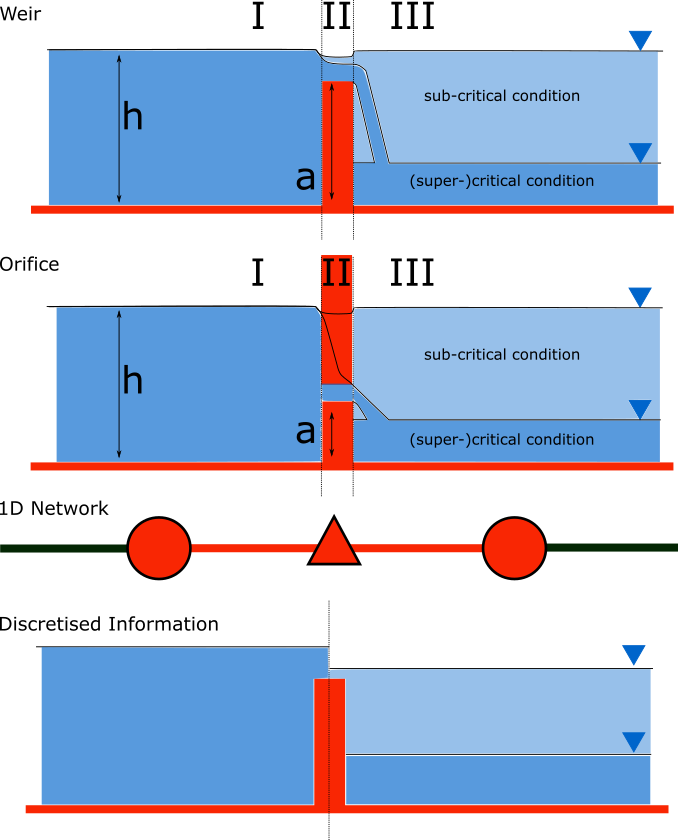

.. _structures:

1D flow over structures
=======================

Structures control the behaviour of water systems, therefore it is crucial to take these into account. 3Di recognises various types of structures, pumps, weirs, orifices and culverts. To guarantee the structures are implemented in your 3Di model, structures are defined as connections between two computational nodes, similar to channels and pipes. The sections below give an overview of the structures available in 3Di. Moreover, structures can be controled. This means that characteristics can be adjusted based on simulation results. 
This can be done using the, in 3Di implemented, control functions (:ref:`control`) or by controls designed by the user via the 3Di API (:ref:`apicalculations`).

.. _pump:

Pumps
------

Pumps in 3Di drain water from one location to another location, within or outside the model domain. The behaviour of a pump is specified by defining the start and stop levels of the pump and the pump capacity. Naturally, water cannot be drained by a pump when it is not there. In real life, pump capacities are often larger than its supply. This behaviour will be seen in your model results. However, this behaviour causes alternating water levels and discharges. This happens in real life and also in your simulations on short time scales, but will effectively not affect the behaviour of your system. 
In the computational core, we can adjust the pump capacity to ensure a more balanced of the pump.  
This functionality is called the pump_implicit_ratio and can be switched off or on. In default it is switched on. More about this functionality can be found in this section in the documentation: :ref:`pump_implicit_ratio`.
 
.. figure:: image/b_structures_pump.png
   :alt: structures_pump
     
   Schematic display of a pump function

In 3Di, users can add pumps to a schematisation via a connection node. Characteristics for pumps can be set by configuring the attributes: 

.. TODO:  Eenheden van attributen toevoegen

* Capacity: Maximum discharge for which the pump is able to displace water from the suction node to the delivery node. 

* Start level: in case of water levels higher than the start level, the pump is switched on. 

* Lower stop level: in case of water level below the stop level, the pump is switched off. This level should be below the start level. 

* Upper stop level: in case of water levels above this level the pump is switched off as well. This is an optional value, but if it is used, it is always higher that the start level. 

* Type: Parameter to set whether the start and stop levels are defined at suction side or delivery side of the pump. [See Figure] 

There are two methods to define a pump in a 3Di schematisation: 

1. *Pump between two nodes*: A pump between two nodes drains water from the  node at suction side to the node at delivery side with the specified pump capacity. Depending on the type of pump the suction side or delivery side water levels determine the activity of the pump.

2. *End pump*:  For an end pump only the suction side node needs to be specified. With no node defined for the delivery side, all water being drained by this pump. All water pumped from the model is specified in the flow_summary.log as contribution to the global water balance. The pump characteristics to be specified are the same as for a pump type with start/stop levels at suction side. Since no delivery side node is present, it is not possible to specify a pump type with start stop level at delivery side.

**Pumps in combination with structure controls**

Pumps can be used in combination with controls. You can design a control that allows the water level at different or multiple locations determine the pumps behaviour, instead of purely local water levels. However, the local availability of water will always affect the pump capacity as well. As water that is not locally at the pump cannot be drained away. This is ensured by stopping the pump when the local water level is below the stop level. Your control affects the pumps’ behaviour, within the range of conditions for which the pump is designed.  

*Example* 

Given a controlled pump at location X with a stop and start level of 0.0 mNAP and 2 mNAP, respectively. The trigger for the control is the water level from location A. For higher waterlevels the pump capacity is increased. However, in case the water level at X is below 0.0 mNAP, but at A in a active range, the pump will stop. The pump can only become active again for waterlevels at X above 2.0 mNAP. 

.. _weir:

Weirs and Orifices
------------------

Weirs are generally used to maintain and control the water level. Orifices connect two parts of channel networks. Both structures force the flow to converge strongly at the entrance and to diverge behind the structure. At the converging part of the flow, the assumption of conservation of momentum in 1D is invalid. Locally at the structure, conservation of energy is much more suited. The formulations for the flow over the weir and through the orifice are therefore based on Bernoulli's principle. For a weir in open water it reads: 

.. math::
   
   h_I+\frac{u_I^2}{2g}=h_{II}+a+\frac{u_{II}^2}{2g}

where :math:`h` is the local water depth, :math:`u` the local cross-sectionally averaged velocity, :math:`g` the gravitational accelaration and :math:`a` the height of the crest. The sub-scripts refer to the flow domains, indicated in the figure below. This is an example for open water structures, but the principle is the same for structures with closed profiles. In that case :math:`h` is not the water depth, but the energy height. For structures having closed profiles, the transition of water depth to energy height is automatically taken care of in case the area fills with water.

     
   Illustration of short crested weir and orifice under sub- and (super-)critical conditions; a simplified view of the 1D network and a sketch of the available discretised information. 

It is assumed that :math:`u_I` is negligible compared to :math:`u_{II}`. Two states of the flow are identified; sub- and (super)-critical flow. In case of (super-)critical flow, the downstream waterlevel does not affect the flow over the structure. Although, this is the case under sub-critical conditions. To optimize between accuracy and computational speed, 3Di schematises structures as connections between two nodes, as can be seen in the third panel of the figure. This assumption implies that the water level on the location of the structure is unknown. 
The fourth panel of the figure shows the information known in a discretised world. In case the flow is critical, the waterdepth/level at the structure can be determined using the upstream waterlevel and the definition for critical flow: 

.. math::e
   h_{II}= \frac{2}{3}(h_I-a)
   
For this case, the velocity through/over the structure is given by:

.. math::
   u_{II}= C \sqrt{\frac{2}{3}g (h_I-a)}

:math:`C` is a discharge coefficient, which can be set depending on the type and the shape of the structure and the entrance. It is a measure for the so-called shape losses.

In case of sub-critical flows, the waterlevel downstream of the structure is important.  Under these conditions the flow velocity through/over the structure is:

.. math::
   u_{II}= C \sqrt{\frac{2} g (\zeta_I-\zeta_{III})}

at the weir crest is assumed to be the same as the downstream water level. In this case :math:`\zeta` is the water level, which can be derived from the waterdepth.

The total discharge through the structure depends on the defined cross-section and the derived water level at the location of the structure. 

.. math::
   Q_{II}= A_{II} u_{II}
   
where :math:`A` is the wet cross-sectional area and :math:`Q` is the total discharge.

For longer structures, frictional effects can become important. For the so-called broad-crested weirs and orifices an extra loss-term is added to Bernoulli's equation. The frictional losses :math:`dh_F` are computed as:

.. math::
   dh_F= \frac{c_f L u_{II}^2}{2 g R}

where :math:`c_f` is the dimensionless friction coefficient, :math:`L` the length of the structure and :math:`R` is the hydraulic radius. The dimensionless friction coefficient can be based on either Manning or the Chézy formulation. It is also of importance that the strucure length is correctly set. The computational core expects that this is the geometrical distance between the two connection nodes. 
 
An advantage of these formulations is that these do not limit the timestep during the simulation.

The attributes that define these structures are:

* Crest level: The crest level of the weir. In case of an orifice this could be equal to the bottom level.

* Crest type: Selects a short or broad crested weir/orifice formulation.

* Discharge coefficient positive/negative: The coefficient used in the discharge formulation. Depending on the flow direction the coefficients could be different. 

* Cross-section definition: This defines the cross-section of the structure.

.. _culvert:

Culvert
-------

Culverts can connect parts of 1D networks and allow flow under roads or other obstacles. In contrast to orifices, the flow behaviour in a culvert is assumed to be determined by shape and much less dominated by entrance losses. The flow in culverts is assumed to be a pipe flow with possible changes in cross-section. Culverts can be used for longer sections of pipe-like structures and do not have to be straight. Shorter, straight culverts are best modelled as an orifice. 

For culverts and orifices, the energy loss caused by the change in flow velocity at the entrance and exite are accounted for by 3Di. The discharge coefficients for culverts can be used to account for any additional energy loss. 

The input parameters for culverts are similar to those for orifices, specified in the section above. Culverts use invert levels at the start and end instead of the crest level in weirs and orifices. The input parameters are all described in the spatialite database :download:`here <pdf/database-overview.pdf>`.