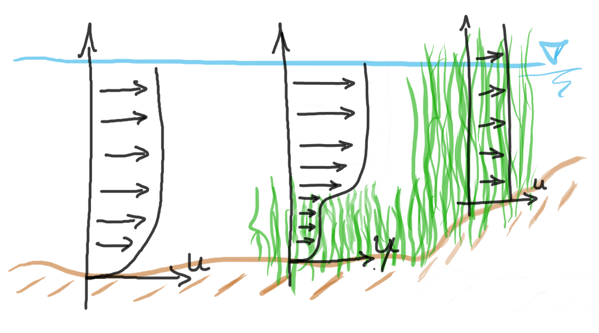
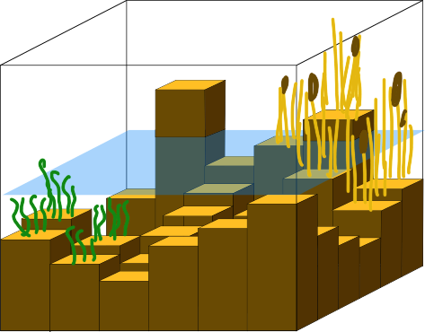

.. _surface_flow:

2D Surface flow
================

The 2D surface flow is based on the 2D depth-averaged shallow water equations. These equations are based on the conservation of momentum. 3Di considers the various processes; inertia, advection, pressure and friction for computing the horizontal flow.

The documentation in general and this section specifically will be further improved. However, the methods that we use to deal with the flow in the 2D domain are thoroughly described and published in Stelling 2012 and in Volp et al. 2013.

 .. TODO: Extend

.. _flow_with_vegetation:

2D Surface flow with vegetation
===============================

Physics of flow through vegetated waterways and floodplains
-----------------------------------------------------------

Currently, we are working on a paper to be submitted in the Journal of Hydraulic engineering, explaining all the details of the method. However, there are two key aspects of the vegetation routine, that will be explained already explained below. First, the concept of taking the vegetational drag into account as a vertical drag. Secondly, the importance of high resolution variations of the flow due to the varying vegetation characteristics.

    
    Vertical velocity profiles altered by vegetation.

In the computational core of 3Di, we are solving a force balance for the momentum domains. Forces act differently on a fluid parcel. For example, gravity is a body force, where bottom friction is due to a shear stress acting on a surface. Bottom friction alters the vertical velocity profile to a profile that can be described by a logarithmic function. Vegetation changes this vertical profile as well, due to the extra drag. This drag scales with a representative vertical plane. This can be either the full water column, for emerging vegetation or the height of the vegetation for sub-merged vegetation. 

There are only a limited amount of formulations that describe the vegetation drag under emerged and sub-merged conditions (Vargas-Luna 2015). However, for flooding conditions, high water forecast or tidal applications, it is crucial to be able to deal with these transitions. Therefore, in 3Di the formulation of Baptist 2005 is implemented. It uses the plant characteristics, height and stem diameter, and the number of stems to determine the representative vertical plane.

The second aspect concerns the importance of the high spatial variability of vegetation. There are various reasons to considerate high resolution information of the vegetation. First of all, flow finds a route of the least resistance. The patchiness of vegetation allows the water to find specific routes, allowing to fill up or drain certain areas much quicker, than would be expected by uniform fields. Moreover, the variability in plaint vegetation combined with the high variability of bottom height should be taken into account as well. The relative height with respect ot the water level is what determines the drag, not the absolute height. In the figure below this is sketched. 

The effect of the vegetated area on the flow is in the Baptist 2005 formulation described as a shear stress as a function of some coefficients related to the vegetation characteristics and of the velocity:

.. math::

   \tau_v = \frac{1}{2}C_D m D min[H_v, H]  \label{eq:veggie_drag_baptist} 
    
| In which: 
| :math:`U` , the velocity vector with :math:`(u,v)` the velocity components in :math:`x,y`-direction
| :math:`H` the water depth
| :math:`H_v` the relative vegetation height
| :math:`D` the stem diameter
| :math:`m` the number of stems per square meter 
| :math:`C_{DV}` The vegetation drag coefficient 

    A computational cell of 3Di, including the subgrid bathymetry and the vegetation patches.

The final four parameters of the equation are all input parameters that are used for 2D flow with vegetation are described in detail in :ref:`vegetation_drag`. They can be defined as raster values and as global values. The parameters that describe the vegetation characteristics are defined at the subgrid-resolution. The high resolution information acts at different ways to the computation of the drag. In the first place, to determine the correct vertical plan that enforces the drag, the vegetation height is combined with high resolution bathymetry information. This ensures that only the vegetation in the wet domain contributes to the force balance and that the correct vertical plane is defined. Moreover, knowing that the bathymetry and the drag significantly changes within a momentum domain, means that the velocity within such a domain varies as well. Therefore, based on a similar reasoning, we have shown in Volp et al., for the bottom friction an estimate of the high resolution velocity variation is made. This formulation uses the vegetation characteristics, the bottom roughness and the bathymetry variations. This results in a very accurate results, even when using coarse computational cells. 

