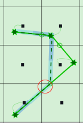
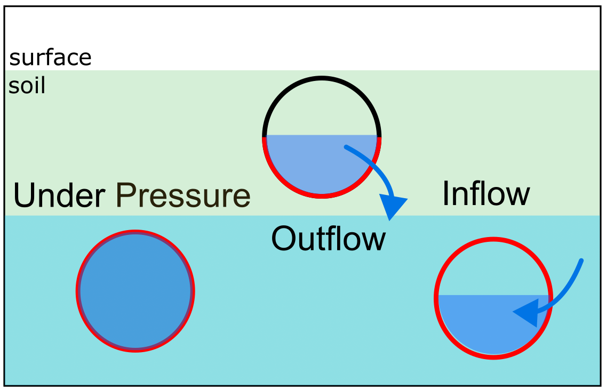

.. _1d2d_exchange:

1D2D Exchange
=============

3Di offers the possibility to make connections between the 1D and the 2D domain. This offers the possibility to preserve the complexity of the modelling domain, but to make use of the extra resolution and speed of 1D computations. In such case, the 1D elements are generally narrow compared to the dimensions of the 2D resolution.

.. _calculation_types:

Calculation types
-----------------

In 1D-2D schematisations, the interaction between the each 1D element and the 2D domain can be set by choosing the calculation type. The following calculation types can be chosen.

- Isolated: no connection to the 2D domain

- Connected: one connection to the 2D domain

- Double connected: two connections to the 2D domain

- Embedded: fully integrated with the 2D domain

In the figure below, three channels are drawn within a 2D domain. It shows a connected channel (orange), a double connected channel (purple) and an embedded channel (green). The squares indicate the computational points of the water level and the circles the locations of the velocity points. Their connections with the 2D domain are indicated with curved, dashed lines.

.. figure:: image/b_1dchanneltypes.png
   :figwidth: 600 px
   :alt: channel_types

   Channel in a 2D domain with calculation types connected (orange), double connected (purple) and embedded. Squares: calculation nodes; circles: velocity points (center of the flowline); thin swirly lines: 1D2D connection; green stars: 1D calculation nodes that are removed because they are merged with 2D nodes.

Calculation types are defined for individual 1D elements; different calculation types can be combined in one model.

Isolated
^^^^^^^^

1D elements with calculation type *isolated* do not interact with the 2D surface domain. This calculation type is also used for 1D elements in models without 2D flow.

.. figure:: image/b_isolatedelement.png
   :figwidth: 300 px
   :alt: isolated_1D_networks

   Example of an isolated element, the thin red line indicates the top of the cross-section information.

Connected
^^^^^^^^^

Description
"""""""""""

When the calculation type is *connected*, a 1D2D connection is made for each calculation node, connecting it to the 2D cell it is in. Each 1D2D connection has an exchange level. Water will start flowing through the 1D2D connection when the water level exceeds the exchange level in either the 1D or the 2D computational point. This is illustrated in the figure below.

.. figure:: image/b_connectedelement.png
   :figwidth: 600 px
   :alt: connected_1D_networks

   Four examples of connected elements. 1) The exchange level is higher than (the lowest pixel in) the 2D cell. 2) The exchange level is lower than (the lowest pixel in) the 2D cell. 3) The exchange level is not set; flow is possible as soon as the 1D water level exceeds the level of the lowest pixel in the 2D cell. 4) Double connected channel, where exchange levels have different values.

How flow through 1D2D connections is calculated is described in :flow_1d2d:

Customising 1D2D connections for channels
"""""""""""""""""""""""""""""""""""""""""

By default, 1D2D connections connect the 1D calculation point to the 2D cell it is in. For channels, this can be customised using a :ref:`exchange_line`. For each 1D calculation point, the closest point on the exchange line is found and the 1D2D connection is made with the 2D cell this closest point is in.

A :ref:`potential_breach` creates a single 1D2D exchange line from a channel to the 2D cell the end of the potential breach line is in.

These customisation options are available for channels only; not for culverts, pipes, or manholes.

Which exchange level is used?
"""""""""""""""""""""""""""""

Several schematisation objects have attributes to set the exchange level of 1D2D connections. When building the computational grid, 3Di uses a fixed hierarchy to process these values. If the first item in the hierachy is not available, it uses the next item; if that is not available, the next; et cetera.

1. Potential breach: Exchange Level (channels only)
2. Exchange line: Exchange level (channels only)
3. Maximum crest level of all intersected obstacles
4. Bank level (interpolated; for channels) or Drain level (for manholes)
5. DEM value at the 1D end of the 1D-2D connection

.. _calculation_type_embedded:

Embedded
^^^^^^^^

Description
"""""""""""
When the calculation type is embedded, the 1D element uses the 2D calculation nodes (and its water level) instead of separate 1D nodes.

The figure below shows an embedded channel in the computational grid. 3Di fixes the locations where the 1D element crosses the 2D cells. In between those points, the 1D embedded point is defined (green stars in the figure). These are merged with the 2D calculation nodes: there is only one water level, used in both the 1D and the 2D domain. However, these 2D calculation nodes are now connected by two flowlines: the original 2D flowline, and the embedded 1D flowline. The velocities and discharges through the embedded 1D flowline are computed with the 1D flow equation.

Storage in embedded nodes
"""""""""""""""""""""""""

The embedded element modifies the storage of the 2D cell it is embedded in. The figure below shows three possible configurations:
1. The embedded channel is fully below the pixels of the 2D cell. All the storage in the 1D cross-section is added to the storage of the 2D cell.
2. The embedded cross-section is wider than the 2D cell. This is allowed in 3Di, but it is not recommended.
3. The elevations in the embedded 1D cross-section overlap with the elevations of the pixels in the 2D cell. The storage in the part of the cross-section below the pixels in the 2D domain is added to the storage of the 2D cell. The part of the 1D cross-section that is above the highest pixel in the 2D cell is ignored.

.. figure:: image/b_embeddedelement.png
   :figwidth: 400 px
   :alt: embedded_1D_networks

   Examples for the storage in the combined 1D2D embedded domain.

Cross-sectional area in embedded flowlines
""""""""""""""""""""""""""""""""""""""""""

The cross-sectional area that is used in the 1D flow calculation is determined in a way similar to how the storage is handled. The part of the 1D cross-section that is below the DEM pixels is used, the rest is ignored. The cross-sectional area that is used for the calculation of 2D flow is unaltered by the embedded elements that pass through the cells.

1D2D Flow
---------

Flow through a 1D2D connection is computed using a reduced momentum balance:

.. math::
   :label: reduced 1D momentum equation

   0 = -g\frac{\partial \zeta}{\partial s} \big\rvert_{1D2D}-\frac{\tau_f}{\rho}

This momentum equation in combination with a cross-section defines the flux between the computational domains.

.. math::
   :label: Q 1D2D

   Q_{1D2D} = u_{1D2D} A_{1D2D}

The cross-sectional area of the 1D2D connection is the exchange depth times an exchange length. This exchange length is calculated in a different way for channels and for pipes. For pipes, the exchange length is based on the storage areas of the corresponding connection node [S]:

.. math::
   :label: storagearea

   A_{1D2D} = L_{1D2D} H_{1D2D} = 4 \sqrt{S H_{1D2D}}

In case of open water elements, there calculation of the exchange length is different for connected (two banks per 1D2D connection) and double connected (one bank per 1D2D connection).
For connected elements:

.. math::
   :label: storagearea2

   A_{1D2D} = L_{1D2D} H_{1D2D} = 2 L_{bank} H_{1D2D}

For double connected elements this implies:

.. math::
   :label: storagearea3

   A_{1D2D} = L_{1D2D} H_{1D2D} = L_{bank} H_{1D2D}
   

.. _1d2d_groundwater_exchange:

Exchange between 1D and groundwater
-----------------------------------

Groundwater (2D domain) can interact with channels and pipes (1D domain). The flow is governed by various parameters: the material of the pipe/channel, the surrounding soil of the groundwater, et cetera. 3Di focuses on the large scale effect of the interaction and not on the detailed micro-scale flow. 3Di computes the flux between the two domains based on a diffusive equation, similar to the Darcy equation:

.. math::
   :label: 1D2D groundwater exchange equation

   Q_{1D2D} = -A_{1D2D} \kappa_{in/out} \frac{\partial \eta}{\partial \delta}

| where:
| :math:`Q_{1D2D}` is the discharge between the domains, positive direction is from the 1D domain to the 2D domain 
| :math:`A_{1D2D}` is the wet cross-sectional area 
| :math:`\kappa_{in/out}` is the hydraulic conductivity
| :math:`\eta` is the water level gradient
| :math:`\delta` is the exchange thickness

The wet cross-sectional area is based on the length and the wetted perimeter of the 1D-element. This depends on the upstream water level and the cross-section definition of the 1D element. This is indicated in the figure below for a flux out of the 1D elements.

   Sketch of 1D-2D groundwater exchange and the wetted perimeter in red depending on the flow direction.

Each exchange is forced by a water level gradient and scaled by the hydraulic conductivity. Depending on the pipe wall material or the channel bed characteristics, the incoming and outgoing flow rates can scale differently. Therefore, an incoming and an outgoing hydraulic conductivity value can be defined. Another scaling factor is the thickness of the pipe or the bed (e.g. the layer of leaves and other non-decomposed organic matter) of the channel.

Breach flow
-----------

Breaches are a special case of 1D2D connections. The flow through a breach is calculated with the broad crested weir equation, more information on the exact calculation of breach flow can be found in :ref:`breach_flow`.

