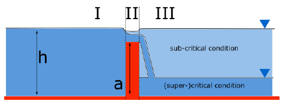

.. _breaches:

Breaches
=================

3Di can simulate the consequences of a breach in a levee. In such case, the dimensions of the breach determine flow through the breach and therefore the flood. The growth of a breach is a very complex process. It is a phenomenon where hydrodynamics, morphology, groundwater and soil mechanics interact. Many aspects of this interaction is still unknown, and therefore it is difficult to model. Moreover, detailed modeling would require very detailed information about the levee. Generally, there is only a limited amount of information about the soil, structure, moisture content etc of the levee.   Nevertheless, rules of thumb have been developed that describe the breach growth, which allow us to make an estimate of the breach growth.

In a 3Di model, flow may occur between 1D and 2D elements. In certain cases this exchange is limited by a levee. The exchange height is determined by the height of the levee. When a few extra properties of the levee are specified for these connections, a breach can be modelled that can grow over time. More information on levees, can be found in :ref:`obstacles`

Breach growth formulation
++++++++++++++++++++++++++++++++++++++

In 3Di, the formula of Verheij and van de Knaap (2002) is used to describe the growth of a breach. For this formulation it is expected that the material of the levee (sand or clay), an initial breach width, the maximum breach depth and the period that is needed to reach this depth are known.

.. figure:: image/b_breach_growth.png
   :alt: breach growth
   :align: right

   Longitudinal cross-section of breach showing the breach growth parameters.

This formulation splits the growth of the breach into two phases; in the first phase the breach deepens and in the second phase the breach widens. Mathematically, the first phase can be described as:

.. math::
   :label: breach_growthb

   B(t) = B_0    \qquad \qquad \qquad \qquad  \qquad  \qquad       t_{start} < t < T_0

.. math::
   :label: breach_growthet

   \eta(t + \Delta t) = \eta(t) - \frac{t}{T_0} (\eta(t) - \eta_{min}) \qquad        t_{start} < t < T_0

| In which:
| :math:`B(t)` is the width of the breach at time t,
| :math:`\eta_{min}` is the minimum level of the breach,
| :math:`T_0` is the period in the minimum level is reached,
| :math:`B_0` is the initial breach width, and
| :math:`\Delta t` is the time step
| :math:`\eta(t)` is the level of the breach at time t.
|

Once the minimum breach level is reached, the width of the breach increases according to:

.. math::
   :label: breach_growth2

   B(t + \Delta t) = B(t) + \frac{\partial B}{\partial t}  |_t \Delta t  \qquad     t > T_0 \\
   \frac{\partial B}{\partial t}  |_t = \frac{f_1  f_2}{u_c^2 ln[10]}  \frac{[g(h_{up}(t) - h_{down}(t))]^{3/2}}{1 + \frac{f_2g}{u_c}(t - T_0) }   \qquad     t > T_0

| In which:
| :math:`f_1, f_2` empirically derived parameters, different per sediment type (values for 3Di are given in table xxx),
| :math:`u_c` is the critical velocity
| :math:`h_{up}, h_{down}` is the water level upstream and downstream of the breach. 

.. list-table:: Parameter values breaches 3Di
   :widths: 40 40 40
   :header-rows: 1

   * - Parameter
     - Clay
     - Sand
   * - :math:`f_1`
     - 0.8
     - 0.02
   * - :math:`f_2` 
     - 1.4
     - 0.6

Because the water level gradient in front and behind the breach is included in the formulation, a natural balance may arise. This means that the breach stops growing, when the water levels are equal.

The above formulation also corrects for the presence of different types of materials by using a critical velocity and the parameters :math:`f_1` and :math:`f_2` . The growth rate of the breach increases for materials that erode more easily. In principle, this formulation distinguishes only sand and clay.

Breach flow
++++++++++++++++++++++++

3Di uses a long crested weir formulation for the flow rate through a breach. The figuere below shows the main variables and the three flow domains used in the equations followed by 3Di in this regard.
 

In case of a breach the assumption holds that water will flow from domain I to III. 

| :math:`h_I` open water level (upstream, 1D)
| :math:`h_{II}` water level in the breach
| :math:`h_{III}` inside water level (downstream, 2D)
| :math:`a` crest level, which is reach by exchange_level - breach_depth

Which equation applies depends on whether the flow is subcritical or (super)critical. The flow is (super)critical if the difference in water levels between domain I and III is greater than one-third of the water depth at the crest:

.. math::
   :label: when_supercritical_flow

   (h_I - h_{III}) > \frac{1}{3}(h_I - a)

Supercritical breach flow
-------------------------

For supercritical flow the following equation applies:

.. math::
   :label: super_critical_breachflow

   u_{II} = \sqrt{\frac{2g(h_I-a)}{3(1-\gamma L)}}

In which: 

| :math:`v_{II}` flow velocity through the breach
| :math:`g` gravitation constant
| :math:`\gamma` friction loss term
| :math:`L` Length of the breach

For :math:`g`, 9.81 :math:`m/s^2` is used; for :math:`L`, the fixed value of 30 m is used for breaches, representative for most dikes. The friction loss term :math:`\gamma` is calculated as follows:

| :math:`\gamma = \frac{c_f}{R}`
| :math:`c_f = \frac{g}{C^2}`
| :math:`R = \frac{A}{P}`
| :math:`A = C_{Q}Wd_{II}`
| :math:`P = W + 2h_{II}`
| :math:`d_{II} = max(\frac{2}{3}(h_I-a),(h_{III}-a))`

In which: 

| :math:`c_f` friction coefficient, for breaches a fixed value of 50
| :math:`R` hydraulic radius
| :math:`A` wet cross-sectional area
| :math:`P` wet radius
| :math:`W` breach depth
| :math:`C_Q` discharge coefficient
| :math:`d_{II}` flowdepth on the breach

Subcritical breach flow
-------------------------

When the flow is subcritical the following equation applies:

.. math::
   :label: sub_critical_breachflow

   u_{II} = C_1*\sqrt{\frac{2g(h_I-h_{II}-a)}{(1-\gamma L)}}

The variables used in this equation are identically to the variables used in the supercritical formulation and the :math:`\gamma` is calculated following the same equations as in the previous section. 

More details on how to use obstacles, levees and breaches can be found in :ref:`flood_model`.
