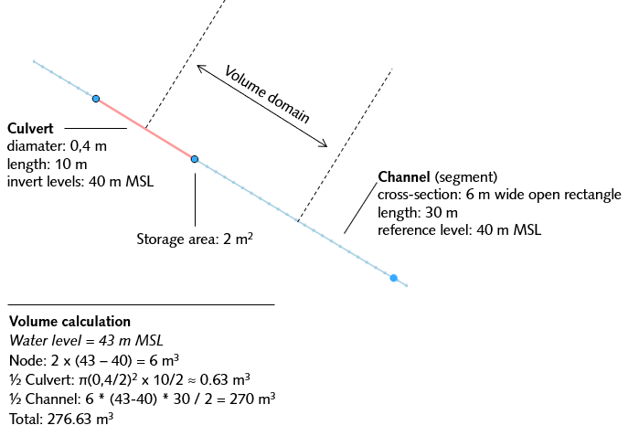
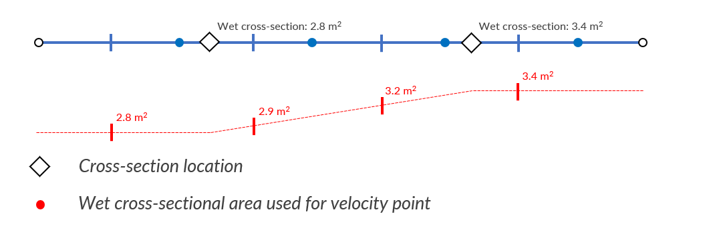
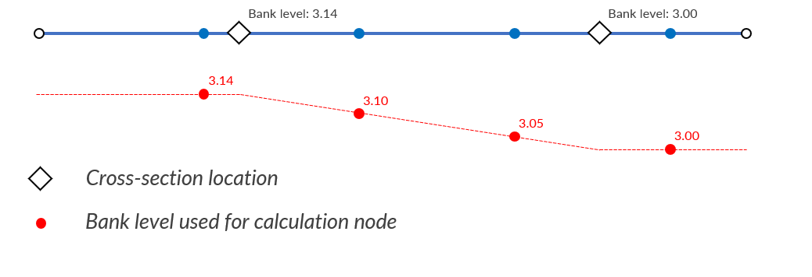

.. _computational_grid:

Computational grid
==================

To allow flow to be computed numerically, space and time must be discretised. Time steps are defined for time and grids are defined for space. 

3Di simulations can consist of a surface water, a groundwater and a 1D network component. The surface water and groundwater components are in principle a two-layer model, which can be coupled to the 1D network. The grids of the surface water and groundwater domain are similar, while the 1D network is fundamentally different.

In the sections below, we elaborate on the grids specified for computations in the 2D surface water and groundwater domains and in the 1D domain. 

.. _computational_grid_2d_domain:

Computational grid for 2D domain
--------------------------------

3Di uses a structured, staggered grid. For the 2D domain, this implies that computational cells are perfect squares. Pressure, water levels and volumes are defined in the cell centres; velocities and discharges are defined at the cell edges.

.. figure:: image/b1_1.png
   :figwidth: 400 px
   :alt: grid 2d

   Example of a staggered 2D grid including a refinement; water levels/ pressures are defined in the cell centres (blue dots) and velocities at the cell edges (blue bars). Water level domains are indicated by blue areas, and the momentum domains by green and orange areas.

The hydrodynamic computations are based on the conservation of volume and momentum. See :ref:`cons_volume`, :ref:`onedee_flow`, :ref:`surface_flow`, and :ref:`groundwater` for more information. In order to solve these flow equations, the domains in which they are valid need to be defined first. In the Figure above, the volume and momentum domains are shown.

Grid refinement in 2D
^^^^^^^^^^^^^^^^^^^^^

The computational cost of a simulation is strongly related to the number of computational cells. One always needs to find a balance between grid resolution and computational time. In a model area, there are often regions in which flow is more complex or for which results with a finer resolution are required. To optimise the computational cost and grid resolution, users can refine the grid locally. 3Di uses a method called quad-tree refinement. The grid is refined subdividing cells in four; a cell edge can not be smaller less than half of its neighbour (see the Figure below). This is a simple refinement method that forces smooth grid variations, enhancing accurate solutions of the equations.

.. figure:: image/b1_6_quadtree_grid.png
   :figwidth: 400 px
   :alt: quadtree_refinement

   An example of a computational grid with quad-tree refinements.

In models with groundwater, the grid refinement is applied in both the surface water layer and the groundwater layer.

.. 2d_grid_settings:

2D grid settings
++++++++++++++++

The 2D computational grid is generated based on the following settings:

- *Minimum cell size (grid_space)*: height or width of the smallest cell, in meters. 

	.. note: 
		
		The minimum cell size (grid_space) must be an even multiple of the pixel size of the DEM. For example, if the pixel size is 0.5 m, the minimum cell size can be 5.0 m (5 / 0.5 = 10, which is even). But if the pixel size is 1 m, the minimum cell size cannot be 5.0 m (5 / 1 = 5, which is not even). 

- *Number of refinement levels (kmax)*: the number of refinement levels. The size of all cells will be :math:`grid_space × 2^{kmax - 1}`, unless the are affected by grid refinements. For example, if the minimum cell size is 10 m and kmax is 1, all cells will be 10 × 10 m. If the minimum cell size is 10 and kmax is 3, the cell width becomes 10 × 2 × 2 = 40 m, so all cells will be 40 × 40 m.

- *Grid refinements*: locations where the number of refinement levels is locally maximised. In case two refinement levels are defined at the same location, 3Di will refine to the smallest cell size indicated.

Groundwater
^^^^^^^^^^^
For the groundwater domain, another 2D grid is used. This is coupled vertically with the grid for the surface domain. Again, pressure, water levels and volumes are defined in the cell centres while velocities and discharges are defined between vertically staggered cells. In the Figure below, an example of the two-layer coupling is shown.

Grid refinements are present in both the surface layer and the groundwater layer.

.. figure:: image/b1_2dv.png
   :figwidth: 300 px
   :alt: grid 2dv

   Example of a vertically staggered grid.

.. _1dgrid:

Computational grid for 1D domain
--------------------------------

In 3Di, 1D networks can be defined, representing open channels, manholes, weirs, orifices, culverts and closed pipes. This allows for an extensive description of the system, without actually computing cross-flow phenomena, reducing the computational cost.

There are several options to couple the 1D and the 2D domain (see Section :ref:`onedee_flow`). All options for the coupling allow for a fully integrated computation, which means that the full 1D and 2D systems are solved as one.

The 1D domain of the computational grid uses a staggered grid, just like the 2D domain (see the figure below). Volumes and water levels (or pressures) are defined at calculation nodes. Discharges and velocities are defined at velocity points in between the calculation nodes.

.. figure:: image/b1_1d.png
   :figwidth: 400 px
   :alt: 1D structure of the grid.

   An example of the grid of a 1D Network. Water levels (or pressures) are defined at the nodes (dark blue dots) and velocities at center of the flowline that connects the nodes (dark blue bars). Water level domains are indicated by the light blue areas, and the momentum domains by the light green areas.

.. _techref_storage_in_1d_domain:

Storage in the 1D domain
^^^^^^^^^^^^^^^^^^^^^^^^

The available storage for a 1D node consists of the storage of the node (if the node is created at the location of a connection node that has a storage area > 0) plus the storage available in the halves of the channels, pipes, or culverts that connect to the node. This follows logically from the staggered grid approach. An example is given in the figure below.

   Example of how storage is calculated in the 1D network: the volume in the node plus the half the volume of the culvert and channel that are connected to it.

.. _techref_calculation_point_distance:

Calculation point distance
^^^^^^^^^^^^^^^^^^^^^^^^^^

When the computational grid is generated from the schematisation input, computational nodes are placed at each connection node. Additionally, computational nodes can be generated in between these locations. The spacing between these computational nodes is determined by a calculation point distance, the 1D grid resolution. In 3Di this distance can be specified for each individual pipe, culvert, or channel by filling the ‘dist_calc_points’ attribute of those features.
If the specified calculation point distance is larger than the length of the feature, no additional calculation nodes are generated in between the connection nodes. This is visualised in the figure below.

.. figure:: image/h_calculation_point_distance_intro.png
   :figwidth: 600 px
   :alt: calculation point distance intro
   
   Example of the generated calculation nodes between two nodes on a channel.

The cross-section of channel segments at a (new) velocity point is determined by linearly interpolating the wet cross-sectional area from the cross-section locations during the simulation. If a velocity point is not in between two cross-section locations, the cross-section from the nearest cross-section location is used.
If more than two cross-section locations exist between two velocity points, the ones in the middle are ignored.

   
   Example of the generated velocity points between cross-section locations.

These additional computational nodes can be isolated, (double) connected or embedded. This depends on the type that was attributed to the original pipe, cannel or culvert. In case of (double) connected elements the exchange levels are set automatically. The exchange levels for for (double) connected elements are determined similarly as with the cross-sections. For channels, the bank levels for the additional computational nodes are determined by linear interpolation between the bank levels that are specified by the user at  the cross-section locations on the channel. If the computational node is not in between two cross-section locations, the bank level of the nearest cross-section location is used. This is illustrated in the figure below.
In case more than two cross-section locations are defined between two (new) computational nodes, the ones in the middle are ignored.

   
   Example of the used bank levels based on the cross-section locations for (double) connected elements.

For pipes and culverts, the drain level of the generated computational nodes is determined by linear interpolation between the drain levels at the start and end of the pipe or culvert. This is relevant only for pipes and culverts with calculation type ‘connected’. In the case of pipes, this can be a way to schematise gullies. Pipes and culverts always have a single cross-section over their entire length, so interpolation of the cross-section is not necessary.
If drain levels are not set, the height of the DEM at that location is used as exchange height.

.. _computational_grid_objects:

Computational grid objects
--------------------------
The schematisation input in the 1D and 2D domain results in one computational grid. This grid consists of the following objects:

* Cell
* Flowline
* Node
* Obstacle
* Pump (line)
* Pump (point)

Cell
^^^^
The cells of the computational grid. 

Geometry
++++++++
Polygon.

Attributes
++++++++++

.. list-table:: Cell attributes
   :widths: 6 4 4 2 4 30
   :header-rows: 1

   * - Attribute alias
     - Field name
     - Type
     - Units
     - Description
   * - ID
     - id
     - integer
     - \-
     - Unique identifier
   * - Node type
     - node_type
     - integer
     - \-
     - Defines the type of the calculation node as 2D Surface water (1), 2D Groundwater (2), 1D Without storage (3), 1D With storage (4), 2D Surface water boundary (5), 2D Groundwater boundary (6), or 1D Boundary (7). 
   * - DEM averaged
     - has_dem_averaged
     - boolean
     - \-
     - If set to 'true', the DEM values within the calculation cell are averaged.
   * - Maximum surface area
     - max_surface_area
     - decimal number
     - m\ :sup:`2`
     - xHELPx
   * - Bottom level
     - bottom_level
     - decimal number
     - m MSL
     - Subgrid cell with the lowest elevation within the calculation cell.
   * - Impervious layer elevation
     - impervious_layer_elevation
     - decimal number
     - m MSL
     - xHELPx

Flowline
^^^^^^^^
Straight line between two nodes.

Geometry
++++++++
Line.

Attributes
++++++++++

   * - Attribute alias
     - Field name
     - Type
     - Units
     - Description
   * - ID
     - id
     - integer
     - \-
     - Unique identifier
   * - Discharge coefficient positive
     - discharge_coefficient_positive
     - decimal number
     - \-
     - Discharge coefficient in the positive direction.
   * - Discharge coefficient negative
     - discharge_coefficient_negative
     - decimal number
     - \-
     - Discharge coefficient in the negative direction.
   * - Line type
     - line_type
     - integer
     - \-
     - Flowline type, e.g. 2D, 1D connected or 1D isolated
   * - Source table
     - source_table
     - text
     - \-
     - For flowlines generated from 1D objects: the table in which this object is described.
   * - Source table ID
     - source_table_id
     - integer
     - \-
     - For flowlines generated from 1D objects: the ID of the table in which this object is described.
   * - Invert level of the start point
     - invert_level_start_point
     - decimal number
     - m MSL
     - If the flowline belongs to a 1D object: the invert level of the start point of the object.
   * - Invert level of the end point
     - invert_level_end_point
     - decimal number
     - m MSL
     - If the flowline belongs to a 1D object: the invert level of the end point of the object.
   * - Exchange level
     - exchange_level
     - decimal number
     - m MSL
     - If the flowline belongs to a 1D object: the exchange level of the object.
   * - Start calculation node ID
     - calculation_node_id_start
     - integer
     - \-
     - ID of the calculation node that coincides with the starting point of the flowline.
   * - End calculation node ID
     - calculation_node_id_end
     - integer
     - \-
     - ID of the calculation node that coincides with the end point of the flowline.
   * - Sewerage
     - sewerage
     - boolean
     - \-
     - If set to 'true': flowline belongs to a sewerage object.
   * - Sewerage type
     - sewerage_type
     - integer
     - \-
     - Function of the pipe in the sewerage system. Used for visualisation and administrative purposes only. See :ref:`pipe_notes_for_modeller`.

Node
^^^^
Centre of a computational cell in which water levels and pressures are defined (2D domain) or the end point of a 1D object or the connection point between two 1D objects (1D domain).

Geometry
++++++++
Point.

Attributes
++++++++++

   * - Attribute alias
     - Field name
     - Type
     - Units
     - Description
   * - ID
     - id
     - integer
     - \-
     - Unique identifier
   * - Connection node ID
     - connection_node_id
     - integer
     - \-
     - xHELPx
   * - Node type
     - node_type
     - integer
     - \-
     - Defines the type of the calculation node as 2D Surface water (1), 2D Groundwater (2), 1D Without storage (3), 1D With storage (4), 2D Surface water boundary (5), 2D Groundwater boundary (6), or 1D Boundary (7). 
   * - Calculation type
     - calculation_type
     - integer
     - Yes
     - \-
     - Sets the 1D2D exchange type: embedded (100), isolated (101), connected (102), or double connected (105). See :ref:`calculation_types`.
   * - Is manhole
     - is_manhole
     - boolean
     - \-
     - \-
   * - Storage area of the connection node 
     - connection_node_storage_area
     - decimal number
     - m\ :sup:`2`
     - \-
   * - Maximum surface area
     - max_surface_area
     - decimal number
     - m\ :sup:`2`
     - xHELPx
   * - Bottom level
     - bottom_level
     - decimal number
     - m MSL
     - Subgrid cell with the lowest elevation within the associated calculation cell.
   * - Drain level
     - drain_level
     - decimal number
     - m MSL
     - Drain level of the manhole. See :ref:`_manhole_notes_for_modellers`.

Obstacle
^^^^^^^^
Border of a computational cell along which exchange with the neighbouring cell cannot take place for water levels under the crest level of the obstacle.

Geometry
++++++++
Line.

Attributes
++++++++++

   * - Attribute alias
     - Field name
     - Type
     - Units
     - Description
   * - ID
     - line_id
     - integer
     - \-
     - Unique identifier
   * - Exchange level
     - exchange_level
     - decimal number
     - m MSL
     - Exchange level for the linear obstacle.

Pump (line)
^^^^^^^^^^^
Pumpstation that transports water from one connection node to another.

Geometry
++++++++
Line.

Attributes
++++++++++

   * - Attribute alias
     - Field name
     - Type
     - Units
     - Description
   * - ID
     - id
     - integer
     - \-
     - Unique identifier
   * - Display name
     - display_name
     - text
     - \-
     - Name field
   * - Start calculation node ID
     - calculation_node_id_start
     - integer
     - \-
     - ID of calculation node from which the water is pumped.
   * - End calculation node ID
     - calculation_node_id_end
     - integer
     - \-
     - ID of calculation node to which the water is pumped.
   * - Source table ID
     - source_table_id
     - integer
     - \-
     - The ID of the table in which the pump is described.
   * - Type
     - type
     - integer
     - \-
     - Sets whether pump reacts to water level at: suction side (1) or delivery side (2).
   * - Bottom level
     - bottom_level
     - decimal number
     - m MSL
     - Subgrid cell with the lowest elevation within the calculation cell.
   * - Start level
     - start_level
     - decimal number
     - Yes
     - m MSL
     - Pump switches on when the water level exceeds this level.
   * - Lower stop level
     - lower_stop_level
     - decimal number
     - Yes
     - m MSL
     - Pump switches off when the water level becomes lower than this level.
   * - Capacity
     - capacity
     - decimal number
     - Yes
     - L/s
     - Pump capacity.

Pump (point)
^^^^^^^^^^^^
Pumpstation that pumps water out of the model domain.

Geometry
++++++++
Point.

Attributes
++++++++++

   * - Attribute alias
     - Field name
     - Type
     - Units
     - Description
   * - ID
     - id
     - integer
     - \-
     - Unique identifier
   * - Display name
     - display_name
     - text
     - \-
     - Name field
   * - Start calculation node ID
     - calculation_node_id_start
     - integer
     - \-
     - ID of calculation node from which the water is pumped.
   * - End calculation node ID
     - calculation_node_id_end
     - integer
     - \-
     - ID of calculation node to which the water is pumped.
   * - Source table ID
     - source_table_id
     - integer
     - \-
     - The ID of the table in which the pump is described.
   * - Type
     - type
     - integer
     - \-
     - Sets whether pump reacts to water level at: suction side (1) or delivery side (2).
   * - Bottom level
     - bottom_level
     - decimal number
     - m MSL
     - Subgrid cell with the lowest elevation within the calculation cell.
   * - Start level
     - start_level
     - decimal number
     - Yes
     - m MSL
     - Pump switches on when the water level exceeds this level.
   * - Lower stop level
     - lower_stop_level
     - decimal number
     - Yes
     - m MSL
     - Pump switches off when the water level becomes lower than this level.
   * - Capacity
     - capacity
     - decimal number
     - Yes
     - L/s
     - Pump capacity.