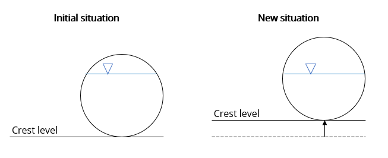
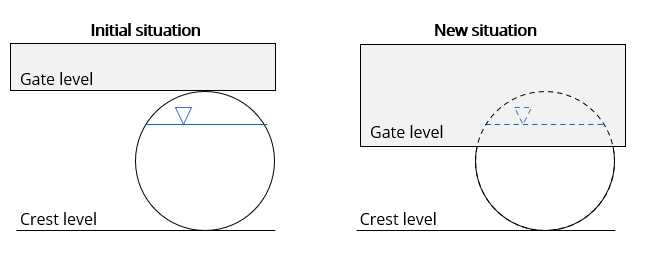

.. _control:

Structure control
=================

Several structure properties can be changed during the simulation, such as the crest or gate level, pump capacity or discharge coefficients. The simplest way to do this is by directly setting them to a specific value at a specific time, using a :ref:`timed_control`. They can also be made to react dynamically to changes in water level, volume, discharge, or flow velocity. There are two types of these dynamic controls: :ref:`memory_control` and :ref:`table_control`.

For example, a weir's crest level can be made to react to the (average) upstream water level, as shown in the figure below.

.. figure:: image/c_control_updated2.png
   :alt: control structures overview

Structure controls can be defined in the schematisation (see :ref:`structure_control_objects`), and/or when starting the simulation (see the :ref:`sim_structure_controls` section in the simulation wizard manual). When structure controls have been defined in the schematisation, this information will be read into the :ref:`Simulation template<simulation_and_simulation_templates>` when generating a :ref:`threedimodel`. Using the :ref:`a_api`, control structures can be added at any time during the simulation.

Structure controls can be applied to the structures listed under :ref:`controllable_structures`.

Structure controls can be made to react dynamically to the flow variables listed under :ref:`measurements`.
   
.. _timed_control:

Timed control
-------------

Timed structure controls are used to set specific properties of hydraulic structures during a specified time in the simulation. 

Timed control can only be added to simulations and saved in simulation templates; it is not possible to define timed control in the schematisation.

For example, to set the crest level of weir with ID 154 to 1.5 m MSL during the second hour of the simulation, you could define a timed control with the following parameters:

- Offset: 3600 s

- Duration: 3600 s

- Value: 1 m MSL

- Type: "set_crest_level"

- Structure ID: 154

- Structure type: "v2_weir"

See the :ref:`timed control section in the simulation wizard manual<sim_timed_control>` for details on how to include them in a simulation. 

.. _table_control:

Table control
-------------

The table control sets the hydraulic structure's properties by using an *action table*. The action table defines an action value for each measured value. Each increment of the flow value in the action table acts as a threshold to set the corresponding structure property value. In combination with a mathematical operators ``>`` and ``<`` the action will be executed when the measurement value either falls below the threshold or exceeds it. Example for table control input is:

.. list-table:: Example action table for table control
   :widths: 40 40 
   :header-rows: 1

   * - Water level [m MSL]
     - Weir crest level [m MSL]
   * - 1.2
     - 0.8
   * - 1.4
     - 0.6
   * - 1.6
     - 0.8
   * - 1.8
     - 1.0

Depending on the mathematical operator, the behavior for this control of the crest level of the control is different. For instance, when using the ``>`` operator, the structure value will be set to 0.8 m MSL when the water level exceeds 1.2 m MSL. When the ``<`` operator is used, the structure value will be set to 0.8 when the water level falls below 1.2 m MSL. Depending on the operator, the default value of the structure will be applied at the top or bottom of the increments. For instance, with the ``>`` operator, the structure default will be applied when the water level is below 1.2 m MSL.

For details on measurement variables and measurement locations, see :ref:`measurements`.

See the :ref:`table control section in the simulation wizard manual<sim_table_control>` for details on how to include them in a simulation. 

See the schematisation object :ref:`layer_table_control` for details on how to define table controls in the schematisation.

.. _memory_control:

Memory control
--------------

The memory control has two thresholds which trigger an adjustment of an hydraulic structure property. When the measured flow variable exceeds the defined upper threshold, the control becomes active and adjusts the property of a structure to a new value. When the measured value subsequently drops below the lower threshold, the control becomes inactive again and the property of the structure defaults back to its original value. This operation is similar to a pump's start and stop levels.

It is also possible to invert the memory control. In this case, the control is usually initially active. When the measured value exceeds the upper threshold, the control becomes inactive. When subsequently the measured value falls below the lower threshold, the control becomes active again and adjusts the structure property. 

As an example, consider a memory control on a culvert by measuring water levels with the following input parameters:

- upper threshold: 1.2 m MSL

- lower threshold: 0.8 m MSL

- type: set discharge coefficients

- action value:  [0.0, 0.0]

The control will be activated when the water level at the measuring station rises above 1.2 m MSL for the first time. Now, the culvert's discharge coefficients are set to 0.0, i.e. closing off the culvert. When the water level subsequently falls below 0.8 m MSL, the control becomes inactive and the discharge coefficients default back to their original values, i.e. opening the culvert again. 

For details on measurement variables and measurement locations, see :ref:`measurements`.

See the :ref:`memory control section in the simulation wizard manual<sim_memory_control>` for details on how to include them in a simulation. 

See the schematisation object :ref:`layer_memory_control` for details on how to define memory controls in the schematisation.

.. _controllable_structures:

Controllable hydraulic structures
---------------------------------

The following structure properties can be controlled:

**Weirs**

- Crest level (m MSL)

- :ref:`weir_discharge_coefficients`

- Gate level (m MSL)

**Orifices**

- Crest level (m MSL)

- :ref:`orifice_discharge_coefficients`

- Gate level (m MSL)

**Culverts**

- :ref:`culvert_discharge_coefficients`

- Gate level (m MSL)

**Pumps**

- :ref:`Pump<pump>` capacity

.. _controlling_crest_level:

Controlling the crest level
^^^^^^^^^^^^^^^^^^^^^^^^^^^

When the crest level is changed, the whole cross-section shifts up or down. The cross-sectional shape does not change. This is illustrated in the figure below.

   Example of an orifice with a circular cross-section for which the crest level is changed by a structure control.

.. _controlling_gate_level:

Controlling the gate level
^^^^^^^^^^^^^^^^^^^^^^^^^^

When the gate level is changed, the cross-sectional area is reduced from the top. This is illustrated in the figure below.

   Example of an orifice with a circular cross-section for which the gate level is changed by a structure control.

.. _measurements:

Measurements
------------

At the assigned measurement locations, a predefined flow variable is monitored throughout the simulation. The value of this flow variable is used to trigger an action within a hydraulic structure.

It is possible to use multiple measurement locations for one control structure. These measurement locations together form a measurement group. The user can assign weights to each measurement location. The control of a hydraulic structure is based on the weighted average derived from these measurement locations. The combined weight should add up to 1. In case only one measurement location is used, the weight must have a value of 1.  

The following variables can be measured:

- Water level

- Volume

- Discharge

- Flow velocity
