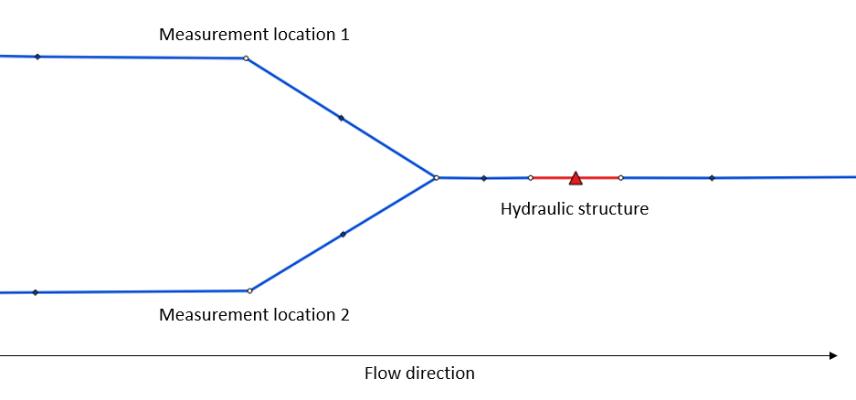

.. _control:

Control structures
==================

Within schematisations, parameters of hydraulic structures can autonomously adapt during simulations, functioning as control structures. Users can establish flow variable thresholds at specific calculation nodes within the schematisation. These thresholds, when exceeded, trigger adjustments to corresponding hydraulic structure parameters in accordance with predefined criteria. Alternatively, an alternative method of parameter adjustment involves the implementation of time-based modifications.

For example, a weir within a schematisation can reduce its crest level when a certain water level is reached at an upstream measurement location. This simulates the behavior of a controllable weir, as shown in the figure below.

   
Measurement locations
---------------------

At the assigned measurement locations, a predefined flow variable is monitored throughout the simulation. The value of this flow variable is used to trigger an action within a hydraulic structure. It is important to note that the designated measurement location must be a connection node.

It is possible to use multiple measurement locations for one control structure. These measurement locations together form a measurement group. The user can assign weights to each measurement location. The control of a hydraulic structure is based on the weighted average derived from these measurement locations. The combined weight should add up to 1. In case only one measurement location is used the weight must have a value of 1.  

Control types
-------------

Three different types of control structures are implemented in 3Di:

- :ref:`table_control`

- :ref:`memory_control`

- :ref:`timed_control`

.. _table_control:

Table structure control
^^^^^^^^^^^^^^^^^^^^^^^

The table control has a combination of flow values and action values as input. Each increment of the flow value in the input table acts as a threshold for a corresponding structure value which is set on the structure. In combination with a mathematical operators larger than and smaller than (<,>) the action will be executed when the measurement value either falls below the threshold or exceeds it. Example for table control input is:

.. list-table:: Example control table
   :widths: 40 40 
   :header-rows: 1

   * - Waterlevel [MSL]
     - Weir crest level [MSL]
   * - 1.2
     - 0.8
   * - 1.4
     - 0.6
   * - 1.6
     - 0.8
   * - 1.8
     - 1.0

Dependent on the mathematical operator the behavior for this control of the crest level of the control is different. For instance, when the larger than (>) operator the structure value will be 0.8 m above MSL between 1.2 m above MSL and 1.4 m above MSL. When the smaller than (<) operator is set the structure value will be 0.8 below 1.2 m above MSL. Dependent on the operator the default value of the structure will be applied at the top or bottom of the increments. For instance with the larger than operator the structure default will be applied below 1.2 m above MSL.

The measurement value stems from the flow variable that is set to monitor within each control and linked to a group of measurement locations that are described above to react to this flow variable.

.. _memory_control:

Memory structure control
^^^^^^^^^^^^^^^^^^^^^^^^

The memory control has two thresholds which trigger an adjustment on a hydraulic structure. When the measured flow variable exceeds the defined upper threshold the control becomes active and adjusts the property of a structure to a new value. When the value flow variable subsequently (first the upper threshold has been exceeded) drops below the lower threshold the control becomes inactive and the property of the structure defaults back to its original value. This operation is similar to a pump with on and off thresholds.

As an extra parameter the option for inverse operation of the control can be set. In this case when the flow variable exceeds the upper threshold the control becomes inactive and was already active. After the value of the flow variable subsequently falls below the lower threshold the control becomes active again and adjusts the structure property. 

We consider a memory control on a culvert by measuring water levels with the following input parameters:

- upper threshold: 1.2 m above MSL

- lower threshold: 0.8 m above MSL

- adjusted structure value (action value):  0.0 (cutoff using discharge coefficient)

The control will be activated when the water level at the measuring station rises above 1.2 m above MSL for the first time. Now the structure property of discharge coefficients becomes 0.0 resulting in the cutoff of flow. When the water level subsequently falls below 0.8 m above MSL, the control becomes inactive and the discharge coefficients defaults back to 1.0 which was its original value. 

.. _timed_control:

Timed structure control
^^^^^^^^^^^^^^^^^^^^^^^
Time-controlled structures manage adjustments in hydraulic structures based on time intervals rather than measured flow variables. Input parameters for such structures include an offset value, duration, adjusted hydraulic structure value, and the type of hydraulic structure.

As an illustration, let's examine a time-controlled scenario involving a weir initially set at a crest level of 1.5m above MSL. The pertinent input parameters are as follows:

- Offset value: 300 seconds

- Duration: 600 seconds

- Adjusted value: 1m above MSL

This control strategy initiates after a delay of 300 seconds. During the ensuing 600-second period, the weir's crest level is lowered to 1.5m above MSL. Subsequently, the weir's crest level is gradually restored to its original height of 1.5m above MSL.

Adjustable hydraulic structures
-------------------------------

Different structures can be used when using a control on a structure. The list of structures with their possible properties to adjust  are:

**Weirs**

- Crest level

- Discharge coefficients (to cutoff flow at 0.0)

**Orifices**

- Crest level

- Discharge coefficients (to cutoff flow at 0.0)

**Culverts**

- Discharge coefficients (to cutoff flow at 0.0)

**Pumps**

- Pump discharge

   
