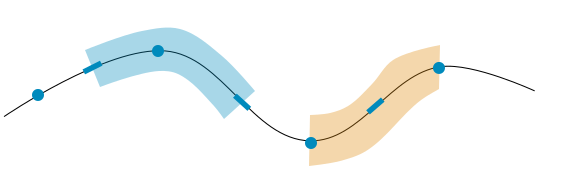
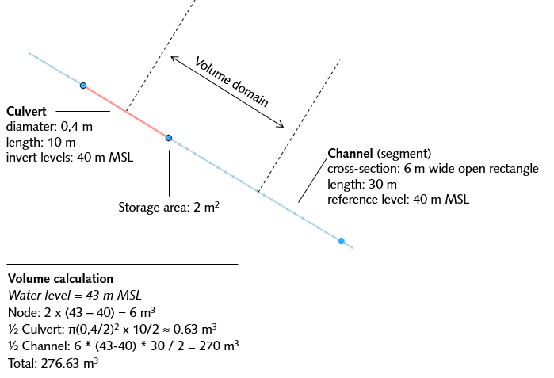
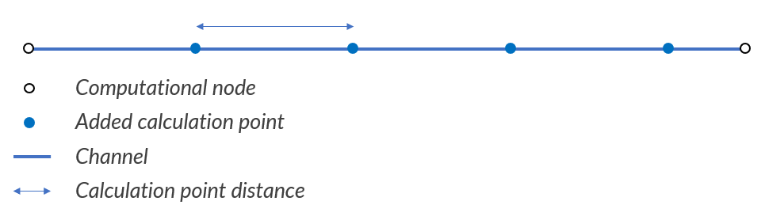
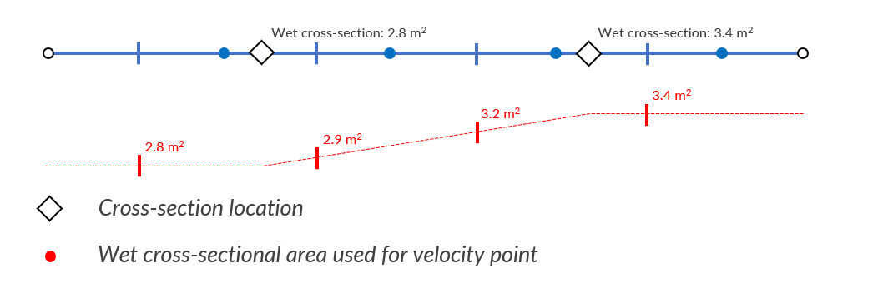
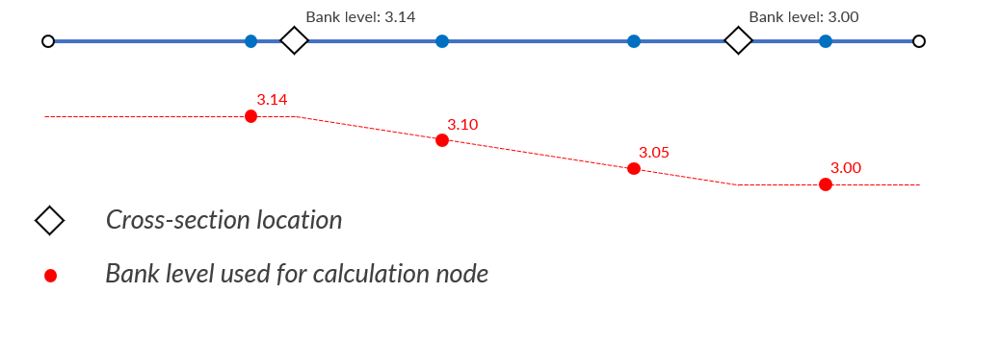

.. _grid:

Computational grid
------------------

To allow flow to be computed numerically, space and time need to be discretised. For time are time-steps defined, and for space is a grid defined. In the sections below we elaborate on the grid specified for computations in the 1D and in the 2D surface water and groundwater domains.

3Di simulations can consist of a surface water, a groundwater and a 1D network component. The surface water and groundwater components are in principle a two-layer model, which can be coupled to the 1D network. Therefore, the grid of the surface water and groundwater domain are similar, while the 1D network is fundamentally different.

Computational grid for 2D domain
===================================

In 3Di we make use of a so-called structured, staggered grid. This implies for the surface water and the groundwater domain that computational cells are perfect squares, where the pressure/ water levels and volumes are defined in the cell centres and velocities and discharges are defined at the cell edges. This also yields for the vertical coupling. In the Figures below, an example is shown of a grid in a 2D domain and the two-layer coupling.

   Example of a staggered 2D grid including a refinement; water levels/ pressures are defined in the cell centres (blue dots) and velocities at the cell edges (blue bars). Water level domains are indicated by blue areas, and the momentum domains by green and orange areas.

.. figure:: image/b1_2dv.png
   :figwidth: 300 px
   :alt: grid 2dv

   Example of a vertical staggered grid

The hydrodynamic computations are based on the conservation of volume and momentum. In the next sections (:ref:`cons_volume`,  :ref:`onedee_flow`, :ref:`surface_flow`, and :ref:`groundwater`), the methods concerned for the computations are discussed. However, in order to solve the equations, the domains in which they are valid, need to be defined. In the Figure above, the volume and momentum domains are shown.

Grid refinement in 2D
++++++++++++++++++++++++

The computational cost of a simulation is strongly related to the number of computational cells. One always needs to find a balance between grid resolution and computational time. There are often regions where the flow is more complex or where one requires results with a finer resolution. To optimise the computational cost and grid resolution, users can refine the grid locally. 3Di uses a method called quad-tree refinement. This means, that in space, refinements are placed by dividing neighboring cells by a factor 4 (Figures below and above). This is a simple refinement method that forces smooth grid variations, which enhances an accurate solution of the equation.

   An example of a computational grid with quad-tree refinements.

In case groundwater is taken into account, the grid refinement is present in both the surface layer and the groundwater layer.

.. _subgridmethod:

Subgrid method
++++++++++++++++

Flow is strongly affected by the bathymetry. Therefore, to simulate flow accurately, information of the bathymetry is crucial. To illustrate the importance of a well described bathymetry, consider the three flows in a flume shown in the Figure below. While the bathymetry differs only slightly, the flow behaves completely different.

Nowadays, detailed bathymetry information becomes more and more available.  However, it is difficult to take detailed grid information into account, without a strong increase in computational cost. In search of an optimal balance between computational cost and accuracy, the so-called subgrid method (:cite:t:`Casulli2009`, :cite:t:`Casulli2011`, :cite:t:`Stelling2015`, :cite:t:`Volp2013`) is developed and implemented in 3Di.

.. figure:: image/b1_3.png
   :figwidth: 600 px
   :alt: bathymetry variations example

   Examples of flow in a flume, where a slight change in bathymetry strongly affects the flow.

The basic idea behind the subgrid method, is that water levels vary much more gradually than the bathymetry. In hydrodynamic computations, water levels are assumed to be uniform within a computational cell. Traditionally, this is also assumed for the bathymetry within such a cell. The subgrid-based approach allows the bathymetry to vary within one computational cell, while the water level remains uniform. In 3Di two grids are to be defined; a high resolution subgrid and a coarse(r) computational grid. All input data, such as the bathymetry, roughness and infiltration rates can be defined on the high resolution grid, while the computations are performed on the coarse computational grid. Volumes and cross-sectional areas are based using the high resolution bathymetry information. The variation of the bathymetry within a computational cell means that a cell can be dry, wet or partly wet. This approach has two implications:

- The volume has a non-linear relation with the water level, because when the water level rises, the wet surface area increases is well. Such a system can be solved using a newton iteration. To compute the volumes at the next time step.

- As we are allowed to have a non-linear relation between water level and volume, 3Di can deal automatically with flooding and drying. No artificial thresholds are necessary.

.. figure:: image/b1_4.png
   :figwidth: 400 px
   :alt: subgrid_bathymety_cell

   An example of a computational cell with a bathymetry defined on the subgrid.

Input
++++++

Users define for the grid generation a cell size (of the finest grid resolution) and the number of refinement layers. A computational cell consists always of an even number of subgrid cells. In addition, the user needs to define where and if refinements should be defined. One can define polygons or lines to indicate these areas and the refinement level.

Some facts and figures
++++++++++++++++++++++

-	The use of high resolution information goes hand in hand with large amounts of data. To compress this data, it is stored during the computations in tables. More information about this can be found in :ref:`tables`.
-	There are more variables defined at the high resolution grid; such as roughness, infiltration capacity and hydraulic connectivity. These will be introduced later in the documentation.

Input
+++++

The numerical grid is generated based on some the following settings:
- Grid space
- Number of refinement levels
- Grid refinements

The grid space is the measure of the dimension of a computational cell. It is important that a width and the height of a grid cell contains an even number of subgrid cells. In case the dimensions of a subgrid cell are *0.5 x 0.5 m*:sup:`2`, the grid space can be 5.0 x 5.0 :math:`m^2`. In case the dimensions of a subgrid cell are *1.0 x 1.0 m*:sup:`2`, the grid space can not be *5.0 x 5.0 m*:sup:`2`. The grid space is defined in the v2_global_settings table and is the dimension of the smallest grid size. The *kmax* setting is the number of refinement levels. Locations where the refinements need to be defined can be added by a line using the v2_grid_refinement table, or by an area using v2_grid_refinement_area. In case two refinement levels are defined at the same location, 3Di will refine to the highest level indicated. 3Di will always aim at a minimum number of grid cells, it will coarsen the grid as fast as possible, but it will only be possible to do that in steps of four.

.. _1dgrid:

Computational grid for 1D domain
================================

In 3Di, 1D networks can be defined, representing open channels, manholes, weirs, orifices, culverts and closed pipes. This allows for an extensive description of the system, without actually computing cross-flow phenomena, reducing the computational cost.

There are several options to couple the 1D and the 2D domain (see Section :ref:`onedee_flow`). All options for the coupling allow for a fully integrated computation, this means that the full 1D and 2D systems are solved as one.

The 1D domain of the computational grid uses a staggered grid, just as the 2D domain (see the figure below). Volumes and water levels (or pressures) are defined at calculation points. Discharges and velocities are defined at velocity points in between.

   An example of the grid of a 1D Network. Water levels (or pressures) are defined at the nodes (dark blue dots) and velocities at center of the flowline that connects the nodes (dark blue bars). Water level domains are indicated by the light blue areas, and the momentum domains by the light green areas.

.. _techref_storage_in_1d_domain:

Storage in the 1D domain
++++++++++++++++++++++++
The available storage for a 1D node consists of the storage of the node (if the node is created at the location of a connection node that has a storage area > 0) plus the storage available in the halves of the channels, pipes, or culverts that connect to the node. This follows logically from the staggered grid approach. An example is given in the figure below.

   Example of how storage is calculated in the 1D network: the volume in the node plus the half the volume of the culvert and channel that are connected to it.

.. _techref_calculation_point_distance:

Calculation point distance
+++++++++++++++++++++++++++

When the computational grid is generated from the schematisation input, computational nodes  are placed at each connection node. Additionally, computational nodes can be generated in between these locations. The spacing between these computational nodes is determined by a calculation point distance, the 1D grid resolution.  In 3Di this can be specified for each individual pipe, culvert, or channel by filling the ‘dist_calc_points’ attribute of those features.
If the specified calculation point distance is larger than the length of the feature, no additional calculation points are generated in between the connection nodes. This is visualised in the figure below.

The cross-section of channel segments at a (new) velocity point is determined by linearly interpolating the wet cross-sectional area from the cross-section locations during the simulation. If a velocity point is not in between two cross-section locations, the cross-section from the nearest cross-section location is used.
If more than two cross-section locations exist between two velocity points, the ones in the middle are ignored.

These additional computational nodes can be isolated, (double) connected or embedded. This depends on the type that was attributed to the original pipe, cannel or culvert. In case of (double) connected elements the exchange levels are set automatically. The exchange levels for for (double-) connected elements are determined similarly as the cross-sections. For channels, the bank levels for the additional computational nodes are determined by linear interpolation between the bank levels that are specified by the user at  the cross-section locations on the channel. If the computational node is not in between two cross-section locations, the bank level of the nearest cross-section location is used. This is illustrated in the figure below.
In case more than two cross-section locations are defined between two (new) computational nodes, the ones in the middle are ignored.

For pipes and culverts, the drain level of the generated computational nodes is determined by linear interpolation between the drain levels at the start and end of the pipe or culvert. This is relevant only for pipes and culverts with calculation type ‘connected’. In the case of pipes, this can be way to schematise gullies. Pipes and culverts always have a single cross-section over their entire length, so interpolation of the cross-section is not necessary.
If drain levels are not set, the height of the DEM at that location is used as exchange height.
