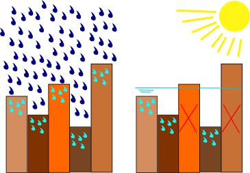

.. _infiltration:

Infiltration
============

3Di supports two methods for computing infiltration: the so-called *simple infiltration* and the *Horton based infiltration*. The simple infiltration uses an infiltration rate that is constant in time, while the Horton based infiltration is based on the concept of infiltration which reaches an equilibrium rate after some time. In 3Di, the infiltration computed with the first method in represented by the removal of water from the system. For the second method, a groundwater layer is defined into which water can infiltrate. From this layer, water can also exfiltrate in case the groundwater level reaches the surface level.

.. _simpleinfiltration:

Simple Infiltration
^^^^^^^^^^^^^^^^^^^^
 
Infiltration is the process of water slowly sinking into the soil. The infiltration rate depends on the type of soil and the land coverage. This rate is constant in time throughout the simulation, with two exceptions: 1) when the availability of water is limited and 2) when a user defines a maximum infiltration capacity. 

In 3Di, the infiltration rate in mm/day is defined for each subgrid cell. The infiltration is computed per computational cell. Therefore, the infiltration rate per pixel is translated to values per computational cell and can depend on the water level. 

When using the subgrid method, water starts filling a cell from the lowest subgrid cell. When simulating rainfall-runoff scenarios, the overall water depths are relatively small. Therefore, often only a small part of a computational cell is wet. If the infiltration rate is low in the wet part of the cell, the infiltration will be limited. In reality however, rain falls over a full spatial domain, and reaches the lowest areas only after a while. It might be infiltrated before it reaches those areas. Therefore, the total infiltration rate per computational can be made dependent of the rain. A user does not only define the infiltration rates, but also the *infiltration_surface_option* which can be found in the global settings table. In Fig. 29, an overview of the various types is given.

     
   Infiltration during rainfall acts on the entire surface within one computational cell (left). When rain stops, infiltration only acts on those pixels below the water level.
 

In the first option, the infiltration rate in a cell is defined based on the assumption that the entire cell is wet. In other words, the infiltration rate in a cell is independent of the water level (left panel). In the second option, the infiltration rate is based on the cumulative rates in the wet areas (middle panel). In this case the infiltration rate is dependent of the water level. The third option is the default option and is a combination of the two previous options. In this case the infiltration rate of the full cell domain is used while it is raining and only the infiltration rate of the wet area is used when it is dry (right panel).
 
In 3Di, many raster input variables are stored in tables. This also holds for the infiltration rate, which allows for the infiltration rate to be dependent on the water level and for an efficient storage of the information. The table increment for the infiltration tables equals the 2D increment.
 
Maximum infiltration capacity
-----------------------------------------
 
The maximum infiltration capacity is the maximum volume of water which can infiltrate at a certain location during one simulation. The user defines a layer with a thickness per pixel in meters. The capacity per pixel is computed by multiplying this thickness with the pixel surface area. 
The maximum infiltration per computational cell is the sum of the capacity of all pixels within that area. It will stop infiltrating when the maximum infiltration is reached.

Input
------
The user can define all aspects for simple infiltration in the *simple_infiltration_table*.
 
.. _hortoninfiltration:

Horton based infiltration
^^^^^^^^^^^^^^^^^^^^^^^^^^

The second method for computing infiltration is based on the Horton equation. This includes an infiltration rate which is initially higher but decreases to an equilibrium rate. This type of infiltration is always used in combination with a groundwater level. In such, the infiltration is always limited. More information about the Horton based infiltration can be found here: :ref:`grwhortoninfiltration`.

.. Technical description
.. -----------------------------
.. 
.. The infiltration is implicitly added to the continuity equation. This means that the infiltration discharge depends on the infiltration capacity and the water level at the new and the old time level:
..  
.. .. math::
..    :label: infiltration
..  
..    Q_{inf} = I * ( H^{(k+1)} / H^n )
..  
.. | in which,  
.. | k = the indices for the inner Newton iteration loop, 
.. | n = the time step and 
.. | Q\ :sub:`inf`\ = the infiltrated volume per time interval.
.. 
.. This is to ensure stability and to ensure conservation of mass.
.. 

.. note::
   Infiltration is represented by an extraction of water from the system. If less water is available in the node or cell then what is to be extracted, 3Di will limit the infiltration. Just before the cell becomes dry, the infiltration rate will be less than the infiltration rate in the user input. This is done to guarantee stability and capture reality better.
   
   *A Surface-Subsurface Model; balancing speed, accuracy and reality. Stelling and Volp (to be published).*
 
