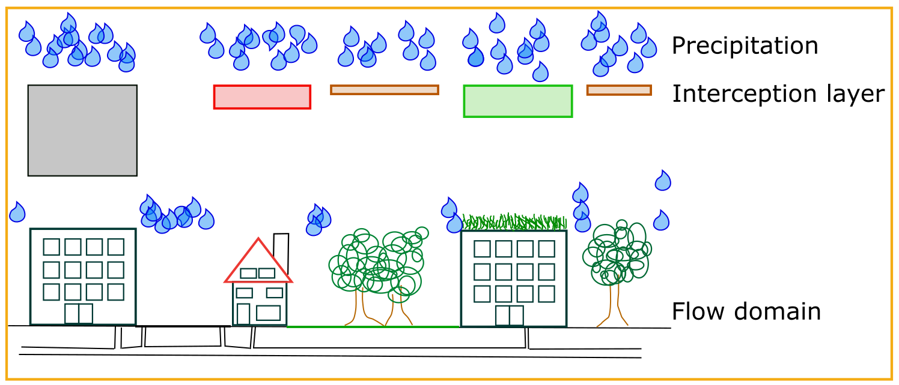

.. _interception:

Interception
=============

Introduction
----------------

Interception refers to the process that not all precipitation reaches the ground. This can be due to buildings or vegetation, however the storage capacity of those element is generally limited. This means that when the precipitation exceeds a certain level, it does reach the ground. In case of 3Di, this implies that from than on it contributes to the flow.

Interception in 3Di and the grid independence
----------------------------------------------------

The precipitation combined with interception determines the amount of water that reaches the ground, or in other words the 2D flow domain of 3Di. Based on the land cover map, one can determine the interception. This is added as an extra layer to 3Di. This layer is first filled by the precipitation, before the water can reach the ground (See Figure below). 

   
3Di, based on the subgrid technique, aims at minimizing the grid dependence of the results. This is certainly crucial for interception, as this determines the amount of water that is active during the simulation. Therefore, users can define the interception using a high resolution raster (similar to the bathymetry raster). 3Di analyses the values per computational grid. It relates the potential intercepted volume with the surface area that can still capture the precipitation (See Figure below). 

.. figure:: image/b_interception_grid.png
   :alt: interception grid

This implies that when there are areas within a computational cell that can still store rain, that in the other areas of that cell, rain can reach the ground.
   
   
Input
----------

There are two methods to make use of interception. The first is to set a global interception value. This value is set for every subgrid cell in the model. The second method is by including a interception raster. Each subgrid cell will have its own 
interception capacity. The dimension of the values used are in meter.

Output
-----------

The intercepted volume is registered in the results file (:ref:`3dinetcdf`). The intercepted volume is a cumulative variable; it is the total amount of volume that is intercepted in time and therefore growing. It can also be included in the file with the aggregated results. It should be aggregated using the *current*-method (:ref:`aggregationnetcdf`). This to insure that a correct reconstruction of the water balance is possible.

The total intercepted volumes is also included in the flow summary. Note, that the precipitation minus the interception is the volumes that reaches the 2D flow domain.