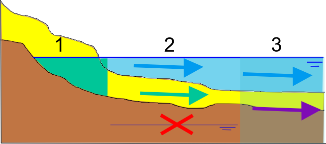
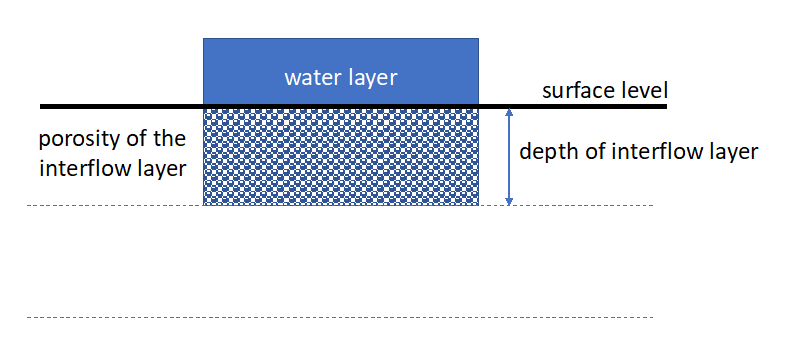
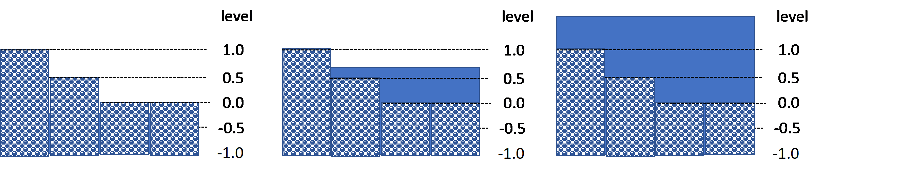
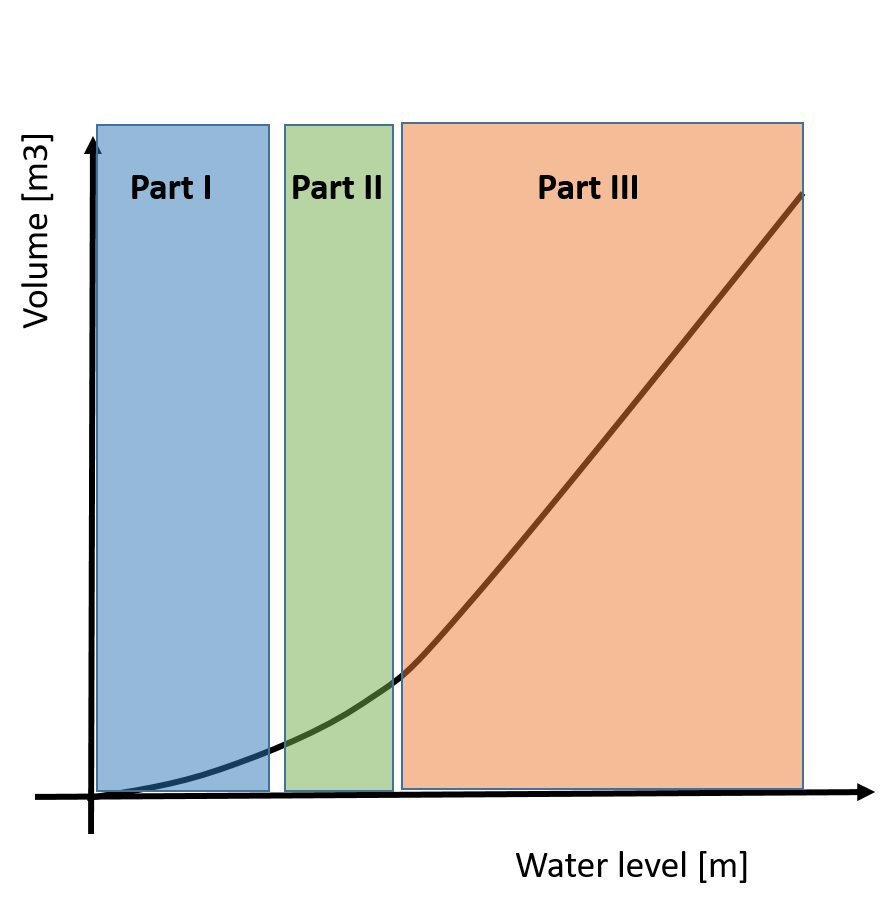
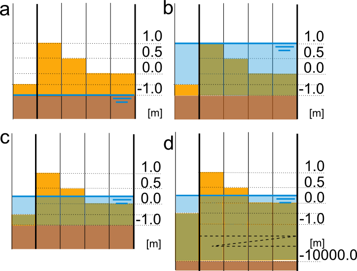
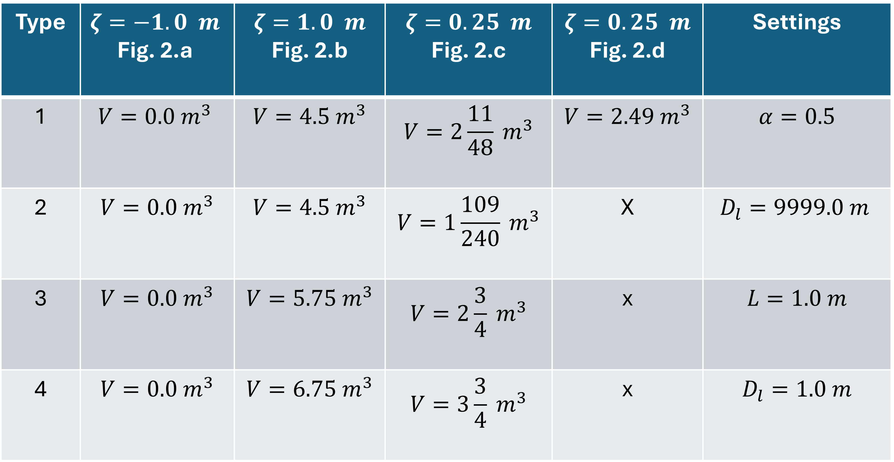

.. _interflow:

2D Interflow
============

In a 2D model, the water flows over the surface and can infiltrate into the soil. Surface water flow is described by the shallow water equations. The infiltration is based on the available water above the surface, the maximum infiltration rate and the storage capacity of the soil. All these parameters are defined on a geographical raster, and translated to a set of values for each computational cell.

The interflow layer is an extra layer that can be defined below the surface. Surface water can be stored and can flow within the interflow layer. The flow through the interflow layer is described by the Darcy equation. The Darcy type of flow is believed to be more realistic for surface/subsurface flow in rainfall runoff conditions. This is because, in these cases, one deals with very thin water layers for which small (unknown) structures in the soil and on the ground level affect the flow. In such case the flow resembles more a Darcy type of flow than surface water flows.

Basic principles of interflow
-----------------------------

   Applications of the interflow layer

The interflow layer is defined by setting the thickness of the interflow layer, the porosity and the hydraulic conductivity. Together, these variables determine the storage capacity and the flow of the interflow layer. When the ground level is uniform, the thickness of the interflow layer has a unique interpretation, but when the ground level varies within a computational cell, there are multiple interpretation possible. This interpretation can be chosen by the user by setting the interflow type. Before explaining the differences due to the subgrid approach, first, the interflow concept will be explained for a uniform ground level.

Computation of volume in 2D domain
----------------------------------

When introducing an interflow layer, one introduces only new flow links and extra storage capacity, but no new pressure/water level points. This implies that the volume of water in a computational cell consists of the volume in the porous layer and that of the open water layer. The thickness of the interflow layer, the porosity and the water level determine the water volume of a computational cell:

.. math::
   :label: interflow_volume

     V = \alpha H_I A + H A,

| In which:
| :math:`\alpha` is the local porosity,
| :math:`H_I` is the thickness of the interflow layer,
| :math:`A` is the pixel surface and
| :math:`H` is the water depth.

The water level rises from the deepest level in a cell. Therefore, water is first stored in the interflow layer and only when the water level rises above the surface level is water stored on the surface. This implies, that :math:`H_I` can be maximally the thickness of the interflow layer and H>0 when the water level is above the surface level. The porosity depends on the soil characteristics, below one finds some examples.

.. figure:: image/b_interflow_examples_porosity.png
   :alt: Applications of the interflow layer
   :scale: 75 %

   Applications of the interflow layer

Computation of flow in the interflow layer
------------------------------------------

The flow through the interflow layer is calculated by the 2D implementation of Darcy’s law for groundwater flow:

.. math::
   :label: interflow_flow

   Q_I^x = -\kappa A_I^x \frac{\delta \zeta}{\delta x}\\
   Q_I^y = -\kappa A_I^y \frac{\delta \zeta}{\delta y}

| In which:
| :math:`Q_I^x` and :math:`Q_I^y` = the horizontal discharges in the interflow layer.
| :math:`\kappa` = the hydraulic conductivity
| :math:`A_I^x` and :math:`A_I^y` = the cross-sectional area.

Note: The Darcy’s velocity does not take into account that medium is a grain-aggregate. In reality water flows through pore-paths (inter-connected pores) only. The interflow velocity computed in 3Di is related to the discharge through the concept of effective porosity.

Interflow in combination with the subgrid approach
----------------------------------------------------

The basic principles of interflow are simple, but applied with subgrid method, it becomes more complicated. To fully understand interflow with subgrids, it is important to realize that each computational cell (one computational cell has multiple subgrid  cells) has one volume value and hence one water level. The flow from one cell to another has two components, namely interflow and surface flow. (Only when using the groundwater flow option in 3Di, two volumes are computed for each cell, a groundwater volume and a surface water volume).

However, when within a computational cell the surface level varies, the moment that the water level rises above the ground level is different per subgrid cell as the water level is uniform within a computational cell. 3Di allows four different methods to deal with the subgrid information. The user defines this by setting the interflow type.

Without the interflow layer, the volume of water in a cell is computed from the surface of the lowest subgrid cell. If interflow is used, the volume is computed from another reference level, namely the impervious layer. In the example of the figure below, the lowest elevation is 0.0 m and the interflow depth is defined at 1.0 m. This means that the reference (or impervious) level is at -1.0 m in this cell.

   Sketch of interflow layer for, form left to right, Part I, II and III

The interflow layer is completely dry (V=0 m\ :sup:`3`\) if the water level in a cell is at the level of the impervious layer (-1.0 m). The interflow layer is completely filled (saturated), if the water level is at the same level as the highest surface level of a subgrid cell in this computational cell (+1.0 m). The relation between the water level and the volume, as shown in the graph below, can be split into three parts. In part I; there is only water in the interflow layer. The curve is fully determined by the porosity distribution. In part II; water is partly in the interflow layer and partly above the ground level. In part III; the volume rises linearly with the water level as the interflow layer is fully saturated and the whole surface area of the cell is wet.

   Relation between water level and volume

The user defines the thickness of the interflow layer. As the surface level varies, the level of the impermeable layer would vary too. Numerically, it has advantages to choose a uniform reference level within a computational cell. So the defined thickness of the interflow layer is always relative to the lowest pixel. The lowest pixel is either defined in the computational cell or in the modelling domain. This is up to the user. To be able to control the storage capacity, the porosity within a subgrid cell can be rescaled, to guarantee an unchanged storage capacity. Whether this rescaling is performed also depends on the user settings. In the next paragraph, the four option are explained in detail.

Using the automatic rescaling of the porosity, the storage volume in the interflow layer is according to the expected volume based on the defined porosity and defined depth of the interflow layer. If rescaling is used, then the user also has to define a reference level for the impervious layer. This extra reference level has no physical meaning and has been added for advanced numerical purposes, such as stability. The porosity is rescaled to this extra permeable reference level. In case the porosity is kept constant, the storage capacity in areas with higher surface levels is larger than in lower lying areas. However, in this case the relation between the water level and the volume remains linear (except at the transition of surface level).

Technical explanation of the four interflow types
---------------------------------------------------

There are 4 types or settings of interflow that determine the relation between porosity, water level and volume. For types 1 and 2 the user explicitly defines the thickness of the porosity layer and the depth of the impervious (the reference) layer. In theory both should have the same value. But early practice showed that using a very deep impervious layer, results in a more stable simulation. When choosing interflow type 1 or 2, the porosity is rescaled in order to preserve the storage capacity as would be based on the thickness and the porosity. For interflow type 3 and four the porosity remains constant.

**Type 1**
For type 1 the user defines a fixed thickness of the interflow layer throughout the model domain and a uniform impervious layer elevation, which is determined relative per computational cell. One is also to define a porosity, which can be defined globally or with a raster. The porosity and the thickness of the interflow layer determine the storage capacity in the calculation cell. De elevation of the impervious layer determines whether the cell is dry or wet. To guarantee the storage capacity defined by the thickness of the layer and the porosity, the  porosity in the interflow layer is rescaled (:math:`\hat{\alpha}`) to the elevation of the impervious layer, according to:

.. math::
   :label: porosity_scaled

   \hat{\alpha} = \frac{\alpha * L}{max(H_I, L)}

| In which:
| :math:`\alpha` = input porosity,
| :math:`L` = interflow layer depth and
| :math:`H_I = D_{sur} – D_{inp}`,

| defining,
| :math:`D_{sur}` = surface level elevation and
| :math:`D_{inp}`  = elevation of the impervious layer.

The rescaled porosity is then used to compute the volumes and the water levels.

**Type 2** This interflow type resembles type 1. The porosity is determined according to the method described under type 1. The only difference is that the elevation of the impervious layer is not determined relative to the lowest surface level within one computational cel, but relative to the lowest pixel in the entire model domain.

**Type 3** When using interflow type 3, the volume in the interflow layer depends on the porosity per pixel and the depth of the impervious layer is relative to the deepest surface level in the computational cell. The porosity can be given globally or as a raster with different values per pixel. In type 3 the porosity is not rescaled.

**Type 4** is similar to type 3 but determines the depth of the interflow layer relative to the lowest surface level in the whole model.

*The figure and the table below show an example of de volumes in a calculation cell with interflow relative to the water level. In the last column the interflow settings are given. The rows in the table correspond to the situations displayed in the figure. The calculation cell's area is one square meter and for simplicity the cells contains only 4 pixels*

   Overview of different states using interflow

Settings for interflow
--------------------------

Below two tables are included with a summary of the possible settings for interflow.

.. list-table:: Settings for interflow layer
   :widths: 45 45 45
   :header-rows: 1

   * - Parameter
     - Uniform in model domain
     - Spatially varying in model domain
   * - Porosity
     - .. math::
         \checkmark
     - .. math::
         \checkmark
   * - Porosity layer
     - .. math::
         \checkmark
     - 	X
   * - Hydraulic conductivity
     - .. math::
         \checkmark
     - .. math::
         \checkmark
   * - Impervious layer elevation
     - .. math::
         \checkmark
     - X

.. list-table:: Interflow Types
   :widths: 30 30 30 30
   :header-rows: 1

   * - Porosity
     - Per Cell
     - Model Wide
     - Result
   * - Rescale
     - Type 1
     - Type 2
     - Storage is known a priori
   * - Constant
     - Type 3
     - Type 4
     - Extra storage in interflow layer

Good to know
------------

**Infiltration** Infiltration from the interflow layer is only active when the water level is above the surface level (lowest point of the DEM in that computational cell). Infiltration is not a process that allows water from the surface to the interflow layer, it is from the total cell volume out of the model. When the water level drops below the lowest surface level of the cell, the infiltration stops. In case, you would like to allow the infiltration to continue and allow water to exit interflow layer, one can use the surface sources and sinks functionality.

**Laterals** Nothing actually changes for the laterals. The extraction of water continues until the total volume is zero. This means that the water level can be lower than the DEM.

**Obstacles and levees** Flow in the interflow layer is affected (stopped) by obstacles and levees. Flow in the interflow layer does not flow under/through levees.

**Connection with 1D** There is no separate link between interflow and 1D-elements. So no seepage from deep channels, all flow between 1D and 2D happens via the 2D surface. This also implies that drainage or bank levels of 1D elements cannot be set below the 2D surface.

**Embedded channels or pipes** Both embedded elements and interflow affect the volume in 2D computational cells and it is therefore not advised to use them together.
