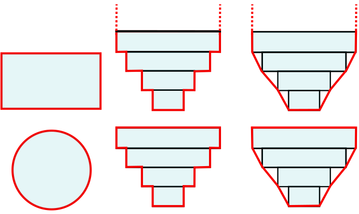
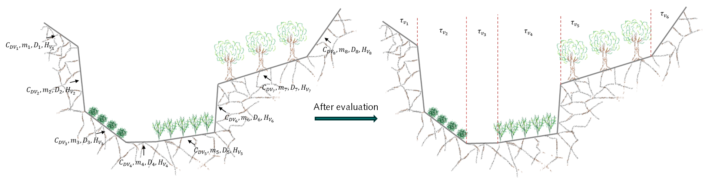
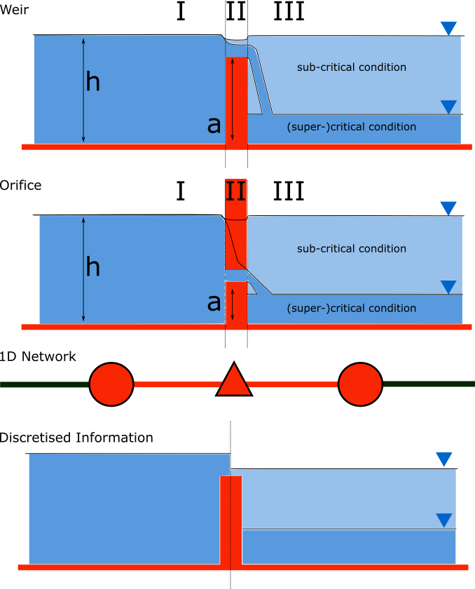

.. _onedee_flow:

1D Flow
==========

3Di offers the possibility to simulate 1D flow. This means that the computed flow velocity and discharge is averaged over the full cross-sectional area. Effects of variations in depth and width are included, but flow within a segment has only one direction. A 1D element can represent, for example, a channel, a hydraulic structure or a sewer pipe. The sections below describe how 3Di deals with the computations in 1D, some specific characteristics and the several types of 1D elements that are available.

- :ref:`1d_network`
- :ref:`cross_section_of_1d_element`
- :ref:`1d_momentum_equation`
- :ref:`1d_advection`
- :ref:`1d_friction`
- :ref:`1d_vegetation`
- :ref:`1Dpressurized`
- :ref:`channelflow`
- :ref:`weirs_and_orifices`
- :ref:`pump`

.. _1d_network:

1D Network
----------

In the most abstract form, a 1D network can be viewed as a combination of nodes and lines. Such a network is translated to a grid, as described in :ref:`1dgrid`. The nodes and the connections have their own characteristics, like cross-section shapes, reference levels etc. Based on those, cross-sectional areas, storage and flow is computed.

.. figure:: image/1dnetworkabstract.png
   :figwidth: 400 px
   :alt: abstract_1D_networks

   Example of a 1D network

.. _cross_section_of_1d_element:

Cross-section shapes
--------------------

Cross-sections in 1D can be open or closed. In open cross-sections, the width at the highest point in the cross-section definition is extrapolated straight up (red dashed lines in the figure below). In closed cross-sections, if the water level rises above the top of the cross-section, the volume and wet cross-sectional area remain the same, and the flow becomes pressurized. See :ref:`1Dpressurized`.

YZ cross-sections can be asymmetrical. Note that because 1D flow is width-averaged, only the width at each height is important; symmetrical and asymmetrical cross-section definitions will give the same results.

The table below gives an overview of the types of cross-section shapes available in 3Di.

.. list-table:: Cross-section shapes
   :widths: 1 1 4 1
   :header-rows: 1

   * - Shape
     - Value
     - Description
     - Open or closed
   * - Closed rectangle
     - 0
     - Rectangular cross-section
     - Closed
   * - Open rectangle
     - 1
     - Rectangular cross-section
     - Open
   * - Circle
     - 2
     - Circular cross-section
     - Closed
   * - Egg
     - 3
     - Egg-shaped cross-section with the narrow end at the bottom. Width:height ratio is 1:1.5.
     - Closed
   * - Tabulated rectangle
     - 5
     - Custom shape, with a width defined at each height. The width is used up to the next height/width pair without interpolation.
     - Open if width at top > 0; Closed if width at top = 0
   * - Tabulated trapezium
     - 6
     - Custom shape, with a width defined at each height. The widths are interpolated between height/width pairs.
     - Open if width at top > 0; Closed if width at top = 0
   * - YZ
     - 7
     - Custom shape, with a height (Z) defined at each distance (Y) across the channel or structure.
     - Usually open, but can be closed when first YZ pair equals last YZ pair
   * - Inverted egg
     - 8
     - Egg-shaped cross-section with the narrow end at the top. Width:height ratio is 1:1.5.
     - Closed

Some examples are shown in the figures below.

   Examples of cross-section shapes in 1D networks. Top row: Closed rectangle, Tabulated rectangle (open), Tabulated trapezium (open). Bottom row: Circle, Tabulated rectangle (closed), Tabulated trapezium (closed).

   Examples of cross-section shape 'Egg' in 1D networks. The 'Inverted egg' shape is the same, but upside-down.

.. _1d_momentum_equation:

1D momentum equation
--------------------

The flow in a 1D network is computed using the equations of conservation of mass and momentum. For this type of flow, these are known as the 1D depth-averaged shallow water equations. The momentum equation for 1D flow in non-conservative form is:

.. math::
   :name: momentum_equation_1d
   :label: 1D momentum equation

   \frac{\partial u}{\partial t}+u \frac{\partial u}{\partial s}=-g\frac{\partial \zeta}{\partial s}-\frac{\tau_f}{R\rho}-\frac{\tau_w}{H \rho}

| In which:
| :math:`u` is the cross-sectionally averaged velocity
| :math:`s` is the 1D coordinate along the network
| :math:`g` is the gravitational acceleration
| :math:`\rho` is the density of the water
| :math:`\tau_f` is the shear stress due to bottom friction
| :math:`\tau_w` is the shear stress due to wind
| :math:`H` is the water depth
| :math:`R` is the hydraulic radius

In words; in 1D, 3Di takes inertia, advection, pressure gradients, bottom friction and wind shear stresses into account. This yields for almost all elements in a 1D network. However, there are, for example, some differences in the computation of advection and the effect of wind stress for specific 1D elements. This will be explained in detail in the following sections.

.. _1d_advection:

Advection in 1D domain
----------------------

The second term on the left-hand side of equation :ref:`momentum_equation_1d` :math:`u \frac{\partial u}{\partial s}` represents the advective term. Based on the spatial gradient of the velocity, it represents the transport of momentum. Advective terms can be numerically solved in various ways: implicit/explicit central difference method, first/second order upwind difference method, among others. Although all are mathematically correct and consistent, they all have their own advantages and disadvantages. They differ in their computational cost, accuracy, time step sensitivity, robustness and/or stability. Depending on the application, some of these characteristics are more pronounced than others. 

All these methods are consistent under smooth conditions, but under certain conditions they can result in very different solutions, some even physically incorrect (:cite:t:`Stelling2003`). Exemplary are the results near sudden bed transitions or channel expansions or contractions. At those locations, there are large gradients in the velocity field. Under these circumstances the 1D momentum equation is not adequate. The vertical flow developed at the edge of these sudden transitions is at a scale too small to be resolved by large-scale models and more importantly, 3-dimensional approximations are required to model such complex flows. However, with applying correct conservation properties, accurate solutions can be achieved. Below, those that are used in 3Di are explained.

3Di benefits from two main methods, both of which have been studied to be efficient and accurate. The first method is derived based on the momentum conservative form of equation :ref:`momentum_equation_1d`.

.. math::
   \frac{\partial (Hu)}{\partial t}+\frac{\partial (Hu^2 + \frac{1}{2}gH^2)}{\partial s}+c_{f}u=gH\frac{\partial d}{\partial s}

For positive flow direction, the advection approximation of above equation yields a simple, first-order accurate, expression. In the discrete format, it is given by:

.. math::
   u\frac{\partial u}{\partial s} = \frac{q_{i-\frac{1}{2}}+q_{i+\frac{1}{2}}}{H_{i}+H_{i+1}} \frac{u_{i+\frac{1}{2}}-u_{i-\frac{1}{2}}}{ds}
   
The second method is derived based on the energy-head conservation form of equation :ref:`momentum_equation_1d`:

.. math::
   \frac{\partial u}{\partial t}+\frac{\partial (\frac{1}{2}u^2+g\zeta)}{\partial s}+c_{f}\frac{u|u|}{h}=0

For positive flow direction, the advection approximation of above equation yields a first-order expression. In the discrete format, it is given by:

.. math::
   u\frac{\partial u}{\partial s} = \frac{u_{i-\frac{1}{2}}+u_{i+\frac{1}{2}}}{2} \frac{u_{i+\frac{1}{2}}-u_{i-\frac{1}{2}}}{ds}
   
All discretisation schemes produce errors. These errors can be observed in the results as extra or diminishing energy/momentum losses. In case of, for example, a channel flow, these losses would be translated in an increase in the backwater curve. This is in such case an artificial backwater curve. Therefore, it is important to examine the amount of energy losses due to numerical errors arising with different advection methods (artificial backwater). In case of an energy-conservative scheme, as the approach would suggest, the total energy head loss is zero. Then, the advection term has no contribution to the artificial backwater. This is a stable method without creating any numerical errors. However, it also generates no head loss in case it is expected, e.g., in sudden expansions. The momentum-conservative method, on the other hand, always produces a minimum amount of backwater. In case of sudden expansions, the head loss generated by this method is in line with expectations, however application of this principle at strong contractions would increase the energy head. This is wrong from the physical point of view and might affect the stability. 3Di supports a momentum-conservative method, a energy-conservative method and (as a default) a combined approach. In this default option, a momentum-conservative method is applied except at sudden contractions. This combination ensures stability and realistic results.

.. _1d_friction:

Friction in the 1D domain
-------------------------

3Di calculates the bottom friction or wall friction in the 1D-domain by integrating the shear stress over the cross-sectional area and over the length of the 1D element:

.. math::

   F_{f} = \rho \iint c_f u^2 dn ds =  \rho \int \frac{A^3 u^2 g}{K_{tot}} \; ds

| where: 
| :math:`u`: flow velocity
| :math:`c_f`: dimensionless roughness coefficient
| :math:`n`: Cross-flow direction
| :math:`s`: Along-flow direction
| :math:`K_{tot}`: Total conveyance factor

The conveyance factor is a measure of the flow capacity of a channel. The factor combines geometry and roughness information. There are two options to determine this factor. Both methods evaluate the friction based on the geometry and roughness of the section using either Chézy or Manning formulations for the roughness. In 3Di, friction types are distinguished as Chézy, Manning (for the 1st method) and Chézy with conveyance, Manning with conveyance (for the 2nd method).

Single section method
^^^^^^^^^^^^^^^^^^^^^

This method is suitable for closed, open, and semi-open sections. It assumes uniform roughness and velocity over the domain and therefore works best for relatively uniform cross-sections. This method considers the cross-section of the 1D element as a whole.  

In the single section method, the conveyance factors are defined as:

.. math::
   :label: Conveyance Factor

   \text{Chézy} \quad K_{tot} = A C R^\frac{1}{2} \\
   \text{Manning} \quad K_{tot} = \frac{1}{n} A R^\frac{2}{3}  \\
   R = \frac{A}{P}

with: 

| :math:`C`: Chézy coefficient
| :math:`n`: Manning coefficient
| :math:`A`: Cross-sectional area
| :math:`P`: Wetted perimeter

.. _conveyance_method:

Conveyance method
^^^^^^^^^^^^^^^^^

The *conveyance method* (or *compound section method*), suitable for open sections only, allows for variations in the cross-flow direction. This method divides the channel cross-section into several sub-sections depending on the channel's depth. This way, the variations in velocity related to the depth and roughness of the channel is properly taken into consideration. 

The conveyance factor considers the depth variations in the different depth sections. The conveyance factor reflects the transport capacity of the channel. Assuming uniformity of the ratio between wetted perimeter and cross-sectional area, in applications with strong depth variations over the cross-section, the flow capacity can be underestimated. In this method, the total conveyance factor of the section is the sum of each sub-section’s conveyance factor. In this way, the variation in depth and roughness throughout the cross-section can be taken into consderation. In 3Di, the separation lines between the sub-sections are considered vertical. 

   Single Section Method vs Compound Section (Conveyance) Method

In 3Di, the conveyance method can be applied with single or variable roughnesses. In case of the single roughness, one roughness value is assigned to the whole cross-section. This can be used with cross-section shapes *Tabulated rectangle* and *Tabulated trapezium*. On the other hand, different roughness values can be assigned to the sub-sections to account for the variable roughness along the cross-section. This can be used with the cross-section shape *YZ*.

.. _1d_vegetation:

Vegetation in the 1D domain
---------------------------

In addition to friction, natural or planted vegetation plays a significant role in the hydrualic resistance of the flow. The overall head loss along a channel can strongly increase with the presence of vegetation. The way 3Di calculates the effect of vegetation on the flow in the 1D domain is very similar to :ref:`flow_with_vegetation`. 

The effect of vegetation is modelled as the equivalent shear stress due to vegetation (:cite:t:`Baptist2007`,). The total shear stress is then the superposition of the surface and vegetation-induced shear stresses, which eventually alters the uniform flow velocity. This method uses vegetation characteristics, namely stem diameter, density, height, and drag coefficient, to quantify the vegetation-induced shear stress :math:`\tau_v` as:

.. math::

   \tau_v = \frac{1}{2}C_{DV} m D min[H_v, H]u^2  \label{eq:veggie_drag_baptist} 
    
| with: 
| :math:`u`, the flow velocity (in flow direction)
| :math:`H`, the water depth
| :math:`H_v`, the relative vegetation height
| :math:`D`, the stem diameter
| :math:`m`, the number of stems per square meter 
| :math:`C_{DV}`, The vegetation drag coefficient 

3Di allows for defining single vegetation properties for the cross-section shapes *Tabulated rectangle* and *Tabulated trapezium* (see :ref:`cross-section_shape`). For cross-sections with a *YZ* shape, different vegetation parameter values can be set for each segment in the cross-section, to represent the spatial distribution of vegetation across a channel (see the figure below). When generating the model, 3Di analyzes the cross-section and divides it into several sub-sections according to the slope of the segments. The details about 1D vegetation entries can be found in :ref:`cross_section_location`.

   User-defined vegetation properties for each segment of a YZ cross-section, and how 3Di interprets it.

.. _1Dpressurized:

Pressurized flow
----------------

In 1D elements with closed cross-sections, flow may become pressurized. The way 3Di deals with this is similar to how 3Di deals with the non-linear relations in 2D cells (e.g. between volume and water level). :ref:`subgridmethod` allows 2D cells to be dry, wet or *partly wet*, creating a non-linear volume-water level relation. This was solved with a highly efficient method. However, there are some requirements for such system to be solved. One of these requirements is violated when the surface area decreases for increasing water levels, as in pipes that are more than half full (see the Figure below). Therefore, a new method had to be introduced to solve such a non-linear system of equations. This method is based on the *nested Newton* method (:cite:t:`Casulli2013`).

.. figure:: image/b1_5.png
   :scale: 50%
   :alt: open_closed_crosssections

   Examples of cross-sectional areas. An open and closed cross-sectional area

Because 3Di uses this method, not only flooding and drying is automatically accounted for, but also pressurized flow can be taken into account. One of the advantages is that from the moment the pipe is full (and the volume can no longer increase), the water level can still rise and the same flow equations are still valid. From this point forward, the 'water level' in the pipe represents a pressure. This makes 3Di calculations very stable in transitions between pressurized and non-pressurized flow, without the need for Preissmann slots or other workarounds.

This works the same for flow through all types of structures with closed cross-sections, includings weirs and orifices.

.. _channelflow:

Channels, culverts and pipes
----------------------------
Flow through channels, culverts and pipes is calculated with the :ref:`1d_momentum_equation`.

The :ref:`channel`, :ref:`culvert` or :ref:`pipe` in the schematisation is converted to multiple flowlines in the computational grid, see :ref:`techref_calculation_point_distance`.

Channels, culverts and pipes can exchange with the 2D domain (see :ref:`1d2d_exchange`). The figure below illustrates this for a channel network.

.. figure:: image/b_channel_network.png
   :align: center

   Example network of connected channel sections and 2D quadtree with channel sections in blue, 1D2D connections in orange and the 2D quadtree in gray

The difference between channels, culverts and pipes is the way the inputs are specified (see :ref:`1d_objects`). Culverts and pipes have the same cross-section along their whole length, while channels can have variable cross-sections. For culverts and pipes, the bottom level is specified only at the start and end (as invert levels), and are linearly interpolated from start to end. For channels, the bottom levels can be defined at multiple locations along the length of the channel.

Channels will generally have open cross-sections, but 3Di allows to assign closed cross-sections to channels, effectively making the channel a pipe. Inversely, pipes and culverts will generally have closed cross-sections, but 3Di allows to assign open cross-sections to pipes and culverts, effectively making them a channel.

Culverts can connect parts of 1D networks and allow flow under roads or other obstacles. In contrast to :ref:`weirs_and_orifices`, the flow behaviour in a culvert is assumed to be determined by shape and much less dominated by entrance losses. Culverts can be used for longer sections of pipe-like structures and do not have to be straight. Shorter, straight culverts are best modelled as an orifice. The energy loss caused by the change in flow velocity at the entrance and exit of culverts are accounted for in the :ref:`1d_momentum_equation`. Any additional energy loss can be accounted for using the discharge coefficients, see :ref:`culvert`.

.. _weirs_and_orifices:

Weirs and Orifices
------------------

Weirs are generally used to maintain and control the water level. Orifices connect two parts of channel networks. Both structures force the flow to converge strongly at the entrance and to diverge behind the structure. At the converging part of the flow, the assumption of conservation of momentum in 1D is invalid. Locally at the structure, conservation of energy is much more suited. The formulations for the flow over the weir and through the orifice are therefore based on Bernoulli's principle. The computations of the flow of both structures follow the same reasoning. In the explanation below, the focus is on an open water rectangular weir, but similar steps are taken for structures with different open/closed cross-sections.

For a weir in open water the energy head balance reads:

.. math::

   h_I+\frac{u_I^2}{2g}=h_{II}+a+\frac{u_{II}^2}{2g}

where :math:`h` is the local water depth, :math:`u` the local cross-sectionally averaged velocity, :math:`g` the gravitational acceleration  and :math:`a` the height of the crest. The sub-scripts refer to the flow domains, indicated in the figure below.

   Illustration of short crested weir and orifice under sub- and (super-)critical conditions; a simplified view of the 1D network and a sketch of the available discretized information.

In case of structures with closed profiles, in the equation of the energy balance :math:`h` is not the water depth, but the energy height. For structures having closed profiles, the transition of water depth to energy height is automatically taken care of in case the area fills with water.

For robustness, 3Di schematizes structures as connections between two nodes, as can be seen in the third panel of the figure. This assumption implies that the water level on the location of the structure is unknown. To compute accurately the discharge over the structure, a difference is made between long crested and short crested structures. Both resulting formulations are based on Bernoulli's principle, but for long crested structures, frictional losses are computed separately. The methods to resolve the flow over these structures, ensures numerical stability without time step dependence.

Short crested
^^^^^^^^^^^^^

The discharge over the structure is computed based on the effective cross-sectional area :math:`A_{eff}` and the velocity over the structure :math:`u_{II}`. Two states of the flow can occur over the structure: sub- and (super)-critical flow. For both states, different assumptions are valid. However, for both states it is assumed that :math:`u_I` is negligible compared to :math:`u_{II}`.

In case of (super-)critical flow, the downstream waterlevel does not affect the flow over the structure, as is the case under sub-critical conditions. The fourth panel of the figure shows the information known in a discretized world. In case the flow is critical, the water depth at the crest can be determined using the upstream waterlevel and the definition for critical flow:

.. math::
   h_{cr}= \frac{2}{3}(h_I-a) = h_{II}

The critical velocity over the structure is given by:

.. math::
   u_{II}= C_1 \sqrt{\frac{2}{3} g (h_I-a)}

:math:`C_1` is a loss coefficient, which can be set depending on the type and the shape of the structure itself and the entrance. In this case, the effective cross-sectional area is based on the critical water depth. For a simple rectangular cross-section:

.. math::
   A_{eff}= C_2 W \frac{2}{3}(h_I-a)

In which :math:`C_2` is a loss coefficient due to contraction of the flow. For the total discharge in 3Di, the discharge under free flowing conditions is computed as:

.. math::
   Q_{cr} = C_1 \sqrt{\frac{2}{3} g (h_I-a)} C_2 W \frac{2}{3}(h_I-a) = C W g^{\frac{1}{2}} \left(\frac{2}{3}(h_I-a)\right)^{\frac{3}{2}}

Note, that the coefficients :math:`C_1` and :math:`C_2` are combined is the general discharge coefficient :math:`C`, which can be set by the user.

In case of sub-critical flows, the waterlevel downstream of the structure is important.  Under these conditions the flow velocity over the structure is:

.. math::
   u_{II}= C_1 \sqrt{2 g (h_{I}-h_{II}-a)}

To determine the depth at the crest, it is assumed that the water level at the crest is equal to the water level downstream. Based on that assumption, the effective cross-section (for an open rectangle cross-section) becomes:

.. math::
   A_{eff, sub}= C_2 W h_{II}
   
.. note::

   For non-rectangular cross-section shapes, the wet cross-sectional area (:math:`W h_{II}` in the equation above) is calculated differently, i.e. by filling up the cross-section to :math:`h_{II}`, measured from the deepest point in the cross-section. In :ref:`pressurized flow <1Dpressurized>` conditions, the wet cross-sectional area is maximized at the maximum cross-sectional area of the structure; in other words, it does not become larger once the whole cross-section has been filled up. This may seem obvious, but many other hydrodynamic models do not allow this, and instead require solutions like Preissmann slots. See :ref:`Pressurized flow <1Dpressurized>` for more information.

Combining these equations, results in the discharge formulation.

.. math::
   Q_{sub} = C_1 \sqrt{2 g (h_I-h_{II})} C_2 W h_{II}= C W \sqrt{2 g (h_I-h_{II})} h_{II}

Broad crested
^^^^^^^^^^^^^

For longer structures, frictional effects can become important. For the so-called broad-crested weirs and orifices an extra loss term is added to Bernoulli's equation (the term is added to the right-hand side of the  energy head balance equation at the top of this section). The extra head loss due to friction :math:`\Delta h_F` is computed as:

.. math::
   \Delta h_F= \frac{c_f L u_{II}^2}{g R}

where :math:`c_f` is the dimensionless friction coefficient, :math:`L` the length of the structure and :math:`R` is the hydraulic radius on top of the weir. The dimensionless friction coefficient can be based on either the Manning or the Chézy formulation. The frictional losses scale with the length of the weir, therefore it is of importance that the structure length is correctly set. The computational core expects that this is the geometrical distance between the two connection nodes. 

.. _pump:

Pumps
------

Pumps in 3Di drain water from one location to another location, within the model domain (:ref:`pumpstation_with_end_node`) or out of the model domain (:ref:`pumpstation_without_end_node`). The behaviour of a pump is specified by defining the start and stop levels of the pump and the pump capacity, as illustrated in the figure below. See :ref:`pumpstation_with_end_node` and :ref:`pumpstation_without_end_node` for details on how to set these parameters.

.. figure:: image/b_structures_pump.png
   :scale: 50% 
   :alt: Schematic display of a pump function

   Schematic display of a pump function

The pumped volume in the flow summary only includes the pumpstations without end nodes.

Pump capacities are often larger than the discharge to the pump, causing the pump to switch on and off frequently. This leads to strong fluctuations in water levels and pump discharge on the short term. Averaging this out, i.e. setting the pump capacity to the supply discharge, will make the simulation more balanced, with the same water system behaviour on longer time scales. This can be done by setting the :ref:`pump_implicit_ratio`.

.. todo::
   Move to section about structure control

Pumps can be used in combination with controls. You can design a control that allows the water level at different or multiple locations determine the pumps behaviour, instead of purely local water levels. However, the local availability of water will always affect the pump capacity as well. As water that is not locally at the pump cannot be drained away. This is ensured by stopping the pump when the local water level is below the stop level. Your control affects the pumps’ behaviour, within the range of conditions for which the pump is designed.

*Example*

Given a controlled pump at location X with a stop and start level of 0.0 mNAP and 2 mNAP, respectively. The trigger for the control is the water level from location A. For higher waterlevels the pump capacity is increased. However, in case the water level at X is below 0.0 mNAP, but at A in a active range, the pump will stop. The pump can only become active again for waterlevels at X above 2.0 mNAP.
