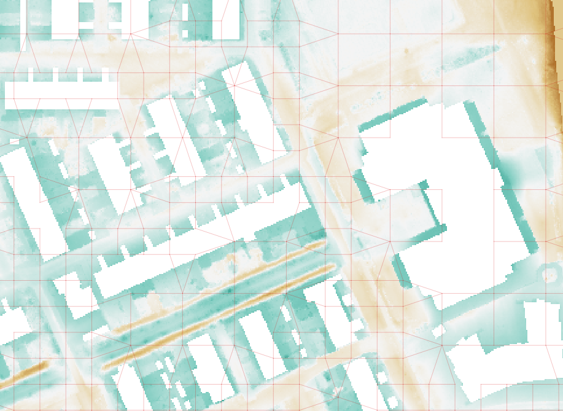

.. _rain:

Rain
====

Rain can be applied :ref:`directly to the 2D domain<2d_rain>`. To add rainfall to the 1D domain, a rainfall-runoff module is used: rain falls on a (fictional) surface, where a hydrological calcution is performed. The runoff that results from the hydrological calculation flows into the 1D domain; therefore, another name for this method is *Inflow*. Note that flow within a rainfall-runoff surface is not explicitly calculated, which is why these rainfall-runoff surfaces are also known as '0D'.

2D rain and 0D inflow can be combined in the same schematisation. See :ref:`combine_0d_2d_rain`.

Rain events can be combined in any way. Multiple rain events can follow each other or overlap. If there is overlap between the rain events, the sum of these rain events will be applied.

.. _2d_rain:

Rain in the 2D domain
---------------------

Rain on the 2D domain is always defined as an intensity (e.g. mm/h, or m/s). During the calculation, it is  automatically converted into a volume (m³), as it is scaled with the active cell surface area (the area of the cell that consists of pixels that do not have a NODATA value).

   
   It can only rain in areas where the DEM has values. The areas with NODATA values in the DEM are white.

Rain can vary both in time and space. The following combinations are possible:

* Constant in time and space, i.e. *constant rain*

* Variable in time, constant in space, i.e. *timeseries rain*

* Variable in time and space, e.g. historical or forecast rain. When using spatially variable rain, the rain intensity at the cell center is used for the entire cell.

The exact possibilities for using rain in your simulation differ per user interface. See :ref:`simulate_api_qgis_precipitation` for the possibilities in the 3Di Modeller Interface and :ref:`rain_tool_3di_live` for the possibilities in 3Di Live. The :ref:`a_api` has the most extensive options for applying 2D rain. 

.. _0d_rain:

Rainfall on 0D node (inflow)
----------------------------

.. note::
	See :ref:`howto_use_inflow` for instructions on using this in your model.

In models with 1D elements, rainfall-runoff processes can be included using '0D inflow', i.e. inflow from a surface with a specified area and hydrological parameters that determine how much runoff flows into the 1D network.  This runoff is forced on the model as a lateral discharge on a node. 0D inflow can be combined with direct rainfall on 2D cells (0D-1D-2D model) or be used with 1D only (0D-1D model). It is also possible to use 0D inflow without having a 1D network, by mapping the inflow surfaces to embedded nodes (0D-2D model).

There are two methods for incorporating inflow in a 3Di schematisation: using 'surfaces', a versatile method that gives you complete freedom in setting the inflow model parameters for each surface, and using 'impervious surfaces', with predefined parameters that follow the Dutch *NWRW* inflow model, common in urban drainage modelling in the Netherlands.

The runoff from each surface as calculated by the 3Di 0D inflow model is Hortonian infiltration excess overland flow, that relates the runoff (:math:`R`) to precipitation (:math:`P`) and infiltration (:math:`I`):

.. math::
   :label: horton_runoff

   `R = P - I`

The amount of precipitation is calculated as the rain intensity multiplied by the surface area. When using spatially variable rain, the rain intensity at the centroid of the surface is used for determining the rain intensity.

However, there is a delay between the accumulation of water on the surface (ponding) and the production of runoff. The runoff at time t :math:`Q_t` is a function of the water volume :math:`V` of water stored at the surface and outflow delay constant :math:`k_q`.

.. math::
   :label: outflow_delay

   `Q_t = k_q V_t`

The infiltration rate decays over time, and then recovers again after the rainfall event. This is described by the modified Horton infiltration equation:

.. math::
   :label: horton_infiltration

   `f_t = \frac{f_0}{1+k_d(t-1)} + \frac{f_c}{1+kt} + \frac{f_r}{1+k_r t}`

| In which:
| :math:`f_t` is the infiltration rate at time :math:`t`
| :math:`f_0` is the initial (maximum) infiltration rate
| :math:`f_c` is the equilibrium (minimum) infiltration rate that is reached once the soil has been saturated
| :math:`k_d` is the decay constant that governs how quickly the infiltration rate decreases
| :math:`k_r` is the recovery constant that governs how quickly the infiltration rate recovers

The figure below givens an overview of these parameters.

.. figure:: image/surface_runoff_parameters.png
   :alt: Parameters used to calculate runoff in the 3Di 0D inflow model

   Parameters used to calculate runoff in the 3Di 0D inflow model
