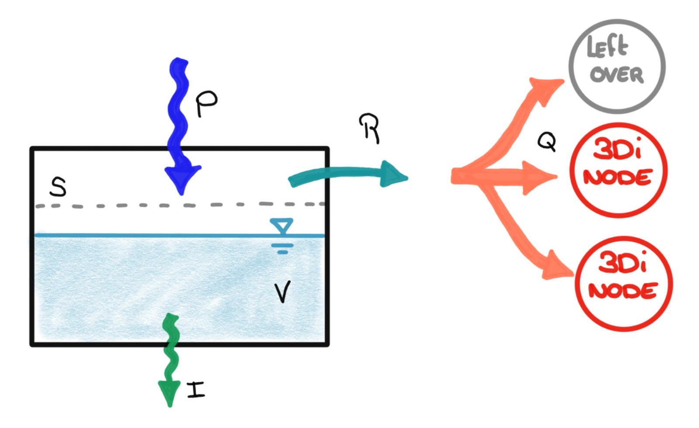
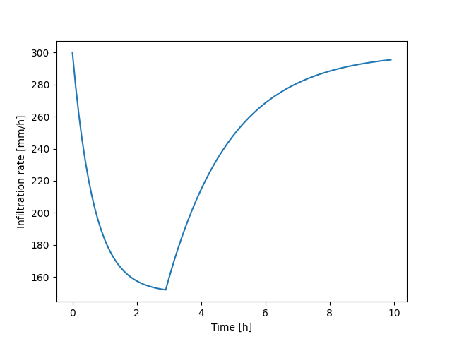

.. _rain:

Rain
====

Rain can be applied :ref:`directly to the 2D domain<2d_rain>`. To add rainfall to the 1D domain, a rainfall-runoff module is used: rain falls on a (fictional) surface, where a hydrological calcution is performed. The runoff that results from the hydrological calculation flows into the 1D domain; therefore, another name for this method is *Inflow*. Note that flow within a rainfall-runoff surface is not explicitly calculated, which is why these rainfall-runoff surfaces are also known as '0D'.

2D rain and 0D inflow can be combined in the same schematisation. See :ref:`combine_0d_2d_rain`.

Rain events can be combined in any way. Multiple rain events can follow each other or overlap. If there is overlap between the rain events, the sum of these rain events will be applied.

.. _2d_rain:

Rain in the 2D domain
---------------------

Rain on the 2D domain is always defined as an intensity (e.g. mm/h, or m/s). During the calculation, it is  automatically converted into a volume (m³), as it is scaled with the active cell surface area (the area of the cell that consists of pixels that do not have a NODATA value).

.. figure:: image/b_rainfall_nodatagrid.png
   :alt: rainnodata
   
   It can only rain in areas where the DEM has values. The areas with NODATA values in the DEM are white.

Rain can vary both in time and space. The following combinations are possible:

* Constant in time and space, i.e. *constant rain*

* Variable in time, constant in space, i.e. *timeseries rain*

* Variable in time and space, e.g. historical or forecast rain. When using spatially variable rain, the rain intensity at the cell center is used for the entire cell.

The exact possibilities for using rain in your simulation differ per user interface. See :ref:`simulate_api_qgis_precipitation` for the possibilities in the 3Di Modeller Interface and :ref:`rain_tool_3di_live` for the possibilities in 3Di Live. The :ref:`a_api` has the most extensive options for applying 2D rain. 

.. _0d_rain:

Rainfall on 0D node (inflow)
----------------------------

.. note::
    See :ref:`howto_use_inflow` for instructions on using this in your model.

In addition to the hydrological processes that are computed in the 2D domain of 3Di, it is possible to schematise some of these processes using *0D-inflow*. The 0D-inflow concept computes runoff in a simplified box-model. By defining some basic characteristics for a 'surface' such as area, storage capacity, outflow, location, and infiltration, it computes the runoff out of this box-model. In models with 1D elements, this runoff is forced onto the model as a lateral discharge on a node.

0D inflow can be combined with direct rainfall on 2D cells (0D-1D-2D model) or be used with 1D only (0D-1D model). It is also possible to use 0D inflow without having a 1D network, by mapping the inflow surfaces to embedded nodes (0D-2D model). For practical instruction how to use this in your model see :ref:`howto_use_inflow` .

The surfaces define a box that is filled by precipitation. Once the box contains water, it can leave via infiltration. In case the precipitation rate is below the infiltration rate, the box is filling up. From the moment the volume exceeds the storage capacity, an outflow is initiated. That outflow is coupled to one or multiple calculation nodes; users can define how the outflow is distributed over the nodes. The runoff is computed based on the following parameters:
| :math:`P` is the precipitation [m3/s]
| :math:`A` is the surface area [m^2]
| :math:`S` is the storage capacity [m3], is based on the surface layer thickness [mm]
| :math:`I` is the infiltration [m3/s]
| :math:`R` is the runoff [m3/s]
| :math:`k_Q` is the outflow delay constant [/min]
| :math:`Q` is the inflow into the calculation node [m3/s]
| :math:`\alpha` is the inflow distribution factor [\%]

The figure below gives an overview of these parameters. Note that the dimensions (such as outflow delay constant) are not all in SI units.

   Parameters used to calculate runoff in the 3Di 0D inflow model

The precipitation is calculated as the rain intensity multiplied by the surface area. When using spatially variable rain, the rain intensity at the location of the centroid of the surface is used.

The infiltration is computed based on *modified Horton method*. This method assumes an initial infiltration rate that decreases exponentially to an equilibrium rate when the soil becomes wetter. When the soil dries, the infiltration rate recovers exponentially to the initial infiltration rate. Mathematically, the infiltration is defined under wet conditions as:

.. math::
   :label: horton_infiltration_0D

   I = A [f_e+(f_i-f_e) e^{-k_d (t-t_w)}]

and under dry conditions as

.. math::
   :label: horton_infiltration_0D

   I = A [f_i-(f_i-f_e) e^{-k_r (t-t_d)}]

| In which:
| :math:`t` is the time [h]
| :math:`t_w` is the time when the surface becomes wet [h]
| :math:`t_d` is the time when the surface becomes dry [h]
| :math:`f_i` is the initial (maximum) infiltration rate [mm/h]
| :math:`f_e` is the equilibrium (minimum) infiltration rate [mm/h] that is reached once the soil has been saturated
| :math:`k_d` is the decay constant that governs how quickly the infiltration rate decreases [/h]
| :math:`k_r` is the recovery constant that governs how quickly the infiltration rate recovers [/h]

In the figure below, the infiltration rate is plotted. In this example, the box contains water during the first three hours and than becomes dry.

   Example of how the infiltration rate varies over time, using :math:`f_i=300 mm/h`, :math:`f_e=150 mm/h`, :math:`k_d=1.5 h^{-1}`, and :math:`k_r=0.5 h^{-1}`.

The runoff discharge is initiated when the volume (:math:`V [m^3]`) in the box model is higher than the storage capacity. The runoff discharge is defined using a delay factor as:

.. math::
   :label: outflow_delay

   R = k_Q (V-S)

The actual inflow in the 3Di nodes is computed as:

.. math::
   :label: inflow

   Q = \alpha R

in which :math:`\alpha` determines which fraction of the runoff actually reaches a specific 3Di node. In the :ref:`flow_summary` the water balance of all surfaces combined can be found.

