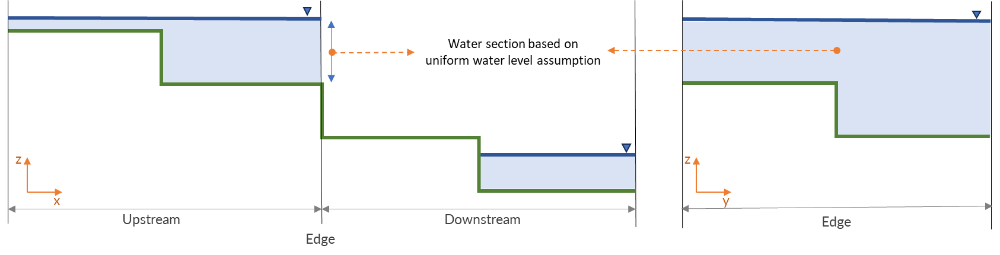
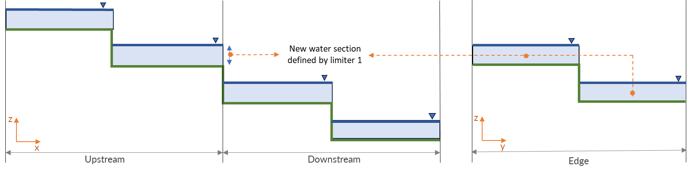
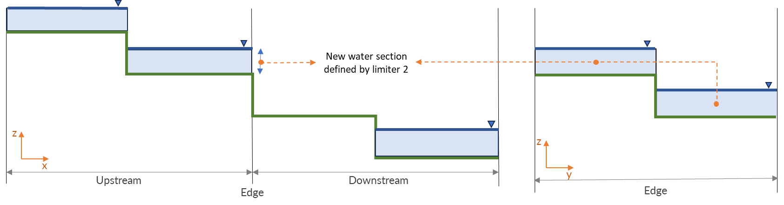
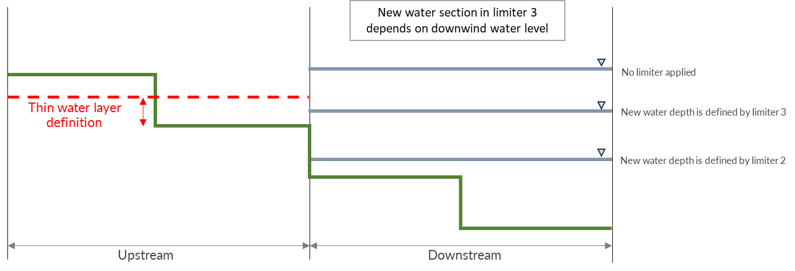

.. _simulation_settings:

Simulation settings
===================

Physical settings
-----------------

Use advection 1D
^^^^^^^^^^^^^^^^

Switch the use of advection in the 1D domain on (1) or off (0)

Use advection 2D
^^^^^^^^^^^^^^^^

Switch the use of advection in the 2D domain on (1) or off (0)

.. _numerics:

Numerical settings
------------------

There are various numerical settings that can either improve the solution under certain conditions, and some can speed up the computations and others will improve the stability. The various options are explained here.

.. _matrixsolvers:

Settings for matrix solvers 
^^^^^^^^^^^^^^^^^^^^^^^^^^^

There are several methods available to solve the matrix consisting of the unknown water levels. Depending on the application, these settings can speed up the simulation or make the solutions more accurate. As 3Di uses the so-called subgrid method, the system of equations becomes a weakly non-linear system. Therefore, we need the use of a Newton iteration method in combination with matrix solvers in order to actually solve this system of equations. The so-called nested-Newton method is needed when the application consists of closed profiles.

Newton iteration settings
"""""""""""""""""""""""""

[max_nonlin_iterations] (default = 20), [convergence_eps] (default = 1.0^-5), [use_of_nested_newton] (no default) 

Maximum number of non linear iterations (max_nonlin_iterations) is the number the computational core will try to reach the convergence value of the Newton iteration. In cases where is extensive flooding and drying of areas, this number can be raised as it might need more iterations to find the correct solution. The Newton iteration needs a value that defines convergence. Initially, 3Di requires a much lower value, but in case the system has difficulties with finding a solution, it will loosen this requirement with a maximum of the by the user set convergence_eps. 

Nested newton iterations are needed in case profiles in 1D are narrowing with height. Mathematically, in case d^2V/d\zeta^2<0. This occurs, for example, a lot in sewerage systems. For these cases, the Newton iteration method does not guarantee a solution, so the system is split in two systems that do guarantee a solution. In case 3Di cannot find a solution it will always try, whether it can find a solution using the nested Newton method. However, in case one has an application that consists of many of these profiles it is faster to tel the system that it should always used the nested Newton method (use_of_nested_newton).

Maximum Degree
""""""""""""""
[max_degree](no default)

One of the methods to solve a matrix is by Gauss-Jordan elimination, substitution. Depending on the type of network, either 1D, 2D or 1D with many bifurcations or combination of those, this method is very efficient or not. It is also possible to solve parts of the system using this method and others with the other method. The efficiency of the solver depends on the network. For 1D simulations this is a very efficient solver, for 2D simulations it is less so.

Conjugate gradient method
"""""""""""""""""""""""""
[use_of_cg] (default =20) [convergence_cg] (default = 1.0^-9) [precon_cg] (default =1) [convergence_cg] (default=1.0^-9)

This is an iterative method to solve matrices. Therefore, also a convergence definition (convergence_cg) is required. It is possible to prepare this method to make it more efficient during the simulation. The system will then be preconditioned (precon_cg), this will take time in the initializing phase, but will safe time during the simulation itself. To limit the possible amount of iterations in order to guarantee swiftness of the solver, there can be put a maximum of iterations before the convergence threshold is loosened.

CFL condition
"""""""""""""
[cfl_strictness_factor_1d] (default=1.0) [cfl_strictness_factor_2d] (default=1.0)

There is a limit to the time step, called the CFL condition. This condition is due to the chosen discretization of the equations. It defined as cdt/dx<1. C is the velocity, defined as 

.. math::
   :label: CFL-condition

   C = |U| + \sqrt(gH) 

Often it is not necessary to be so strict, so sometimes the user can set this parameter which loosens the strictness of it. Consequently, stability can decrease.

.. _pump_implicit_ratio:

Pump implicit ratio
"""""""""""""""""""
[pump_implicit_ratio] (default=1, between 0 and 1)

:ref:`pump` will be switched on or off depending on the characteristics of the pump and the local water level. For water levels between the start and stop levels of the pump, the pump will drain at maximum capacity. For an optimal pump operation, the supply of water is in balance with or larger than the pump capacity. However, in real-life applications, the pump capacity is larger than the supply. This results in a pump that switches repetitively on and off during an event. Even though, this is a real-life issue and is known from observations, one does not always want to mimic this behaviour in a simulation. This behaviour can make the analysis of your results on water levels and discharges more difficult and as this triggers wave-like phenomenon in the water levels and flow, it can cause time step reductions.   

The computational core of 3Di can make estimates of the available water to the pump and adjust the capacity based in these estimates. This will avoid the switching on/off of the pump unnecessarily. The pump capacity is not affected in cases where the supply is higher or equal to the capacity and in cases where the supply is that low that the water level should drop below the stop level. How strong this implicit behaviour is used in the simulation, can be set by the pump implicit ratio. 

A pump_implicit_ratio of 0 means the computational core does not take the supply information into account. By setting it higher than zero, this information is taken into account more strongly according to the value. So, the pump capacity is adjusted based on the (expected) available water.  

Thresholds
""""""""""
For numerical computation several tresholds are needed in the code, to avoid deficiencies due to a limited numerical accuracy. Generally this is to keep the behaviour consistent: 

In order to determine the upstream method the direction of the flow is considered. To avoid the exact 0.0 m/s point we use a threshold given by flow_direction_threshold (default=1.0^-5). 

We also use for various things a general threshold, this one is defined as general_numerical_threshold, the default is 1.0d-8. 

.. _limiters:

Limiters
^^^^^^^^

A limiter is a general term used for certain aspects in numerical schemes that limit the effect of high gradients in flow or forcing. They are used to avoid strong oscillations, instabilities in the solution and to increase the accuracy. 3Di has various limiters implemented, which can be switched on or off.

.. _limiter_gradient:

Limiter for water level gradient
""""""""""""""""""""""""""""""""

[limiter_grad_2d] [limiter_grad_1d]

The limiter on the water level gradient allows the model to deal with unrealistically steep gradients. These can occur when there are, for example, jumps in the bottom. In such case the water is not forced by the difference in water level, as this gradient is limited to the actual depth. Therefore, a limiter function is part of the discretisation scheme. This setting exists for flow in the 1D domain and 2D domains.

.. figure:: image/lim_watlev_grad.png
   :alt: Limiter for water level gradient

   Visualization of a case where the gradient is adjusted. The red dashed line indicates the outcome of the limiter function.

Function where the ratio between water depth and water level gradient prescribes the behaviour.   
   
.. math::
   :label: Limiter-function

   \phi_(m+1) = min[ 1 , H / ( \sigma_(m+1) - \sigma_m ) ]

.. _limiter_slope_cross_sectional_area:
   
Limiter for cross-sectional area
""""""""""""""""""""""""""""""""

*limiter_slope_crossectional_area_2d = 0 (default)*

The :ref:`subgridmethod` assumes that the variation in water levels is much more gradual than variations in bottom elevation or bathymetry. Within a computational cell, the water level is assumed uniform, while the bottom elevation is allowed to vary. This assumption is not valid in sloping areas where water flowss down the slope as sheet flow. In such situations, the spatial variation of the water level has the same length scales as the bottom elevation. The uniform water level assumption can lead to overestimating the wet cross-sectional area at a computational cell edge and an underestimation of the friction. This would lead to an overestimation of the discharge. Therefore, 3Di uses limiters to correct the computed cross-sectional areas and the friction. These limiters are based on the sheet flow concept; in these sloping areas, it is assumed that the water *depth* is uniform within a flow domain instead assuming the water *level* to be uniform. The way this uniform water depth is calculated, depends on the limiter type that is chosen:

   Water distribution based on uniform water level assumption showing x-z (longtidunal section) and x-y (cross-section) profiles

*limiter_slope_crossectional_area_2d = 1*

The limiter *type 1* represents an accurate redefintion of the water depth, since the water is spread over two adjacent cells. This limiter is activated in case the downstream water depth is zero. Then two options are possible. In case of a large difference in water levels, the sum of upstream and downstream volume is divided by the total maximum surface area of the two cells. When the difference is smaller, the average water level of upstream and downstream is used. This makes the scheme mathematically second order.

   Water distribution based on limiter 1 showing x-z (longtidunal section) and x-y (cross-section) profiles

*limiter_slope_crossectional_area_2d = 2*

The limiter *type 2* is a very stable upstream method to redefine the water depth at the cell edge. It is assumed that the flow behaves as a thin sheet flow. Therefore, the depth is defined as the upstream volume divided by the maximum surface area of the upstream cell. 

   Water distribution based on limiter 2 showing x-z (longtidunal section) and x-y (cross-section) profiles

*limiter_slope_crossectional_area_2d = 3, in combination with thin_layer_definition = xx [m]*

The limiter *type 3* provides a smooth transition from the default water depth to the altered one. This transition depends on the local depth and a user-defined *thin water layer*. In case the depth at the edge, based on the downstream water level, is larger than the thin water layer definition, the cross-sectional area is based on the uniform water level assumption. In case the downstream water level is below the thin water layer definition, then limiter 2 determines the cross-sectional area. Finally, if the downstream water level is within the thin water layer depth, these two types of cross-sections are weighted to define the new value (i.e., limiter type 3).

   The options of new water section based on limiter 3

.. _limiter_friction_depth:

Limiter for friction depth
""""""""""""""""""""""""""

[limiter_slope_friction_2d] default = 0

In order to take high resolution depth and roughness variations into account to determine the friction, an estimate is made of the effective frictional depth. To determine this, the actual depth is needed. Similar to the limiter for the cross-sectional area, the actual depth in sloping areas is overestimated. In such case not only the depth to determine the cross-sectional area can be adjusted, but also the depth to determine the effective frictional depth. The friction can therefore be underestimated in sloping areas. Therefore, the same limiter can be used to determine the effective frictional depth by switching this limiter on. This limiter is obligatory in combination with the limiter_slope_crossectional_area_2d.

.. _friction_settings:

Numerical settings for friction
^^^^^^^^^^^^^^^^^^^^^^^^^^^^^^^

There are several settings that affect the friction.

Friction shallow water correction
"""""""""""""""""""""""""""""""""

[friction_shallow_water_correction]  (default =0) (possible values 0,1,2,3)

In case the friction assumptions based on the dominant friction balance structurally underestimates the friction, one can switch this setting on. This situation can occur in case the flow is mainly distributed based on continuity instead. In Figure 1, the difference between the two type of flows is shown. Such a situation occurs, for example, in a sloping area where filled canals are cutting through in cross-slope direction. When the correction is switched on, the friction is determined both in the classical way and based on averaged values of depth, velocity and roughness coefficients. The maximum friction computed by the two is used.

It is important to define a depth for which the friction is computed. When the friction shallow water correction is set to 2 or 3, it will define the depth similar to the cross-sectional area limiter. For the value 1 it will use the maximum depth at the edge of the cell.

.. figure:: image/friction_cont_dominated_flow.png
   :alt: Friction shallow water correction
   
   Upper Panel) Flow distributed based on friction dominated flow. 
   Lower Panel) Flow distributed based on continuity.

Friction averaging
""""""""""""""""""

[frict_avg] (default = 0)

The roughness coefficient will be averaged within one cell.

Minimum friction velocity
"""""""""""""""""""""""""

minimum_friction_velocity [float], (default = 0.01 m/s)

In case a cell is flooded, there is a moment that initially there is no water, therefore no friction as the velocity is zero. Followed by a moment that there is a velocity. To assure a smooth transition and to avoid extreme accelerations of the flow, we define a sort of minimum amount of friction based on this velocity. Generally this is important only when a cell is flooded. 

Other numerical settings
^^^^^^^^^^^^^^^^^^^^^^^^

Preissman slot
""""""""""""""

[preissmann_slot ] (default= 0.0 m^2)

A preissmann slot is often used to model flows in pipes. When the pipes are not completely filled, such flows can be modelled as free surface flows. However, when the discharges increase, the pipes are filled and the flow can become pressurised. Not all hyrdodynamic models are suited for these kind of flows. Therefore, to mimic the effects of pressurised flows, the water level can be allowed to rise higher than the upper limit of the cross section. In order to allow this, a narrow tube is added on top of the pipe (Figure 2). These tubes are generally quite narrow to allow the water level to rise, at a minimum cost of extra added volume. In 3Di this is not necessary, however it can be added to circular tubes. This can increase the stability at larger time steps. The way flow is computed in pipes is described here.

.. TODO:  (To add, test results flow with and without preissman slot.)

.. figure:: image/preissmanslots_schematisch.png
   :alt: Preissman slot

   Upper Panel) Flow through a half empty pipe. 
   Middle Panel) Pressurised flow through a pipe with a preissman slot. 
   Lower Panel) Pressurised flow through a pipe with a virtual water level (red).

Integration method
""""""""""""""""""

[integration_method] (default=0)

There are various ways to discretise the equation. At the moment only first order semi implicit is supported and tested. 

Timestep settings
-----------------

Time step
^^^^^^^^^

The simulation time step that 3Di will use if timestep reduction is not required.

Minimum time step
^^^^^^^^^^^^^^^^^

The smallest value that 3Di will reduce the time step to when applying timestep reduction. Setting this too high is not recommended.

Maximum time step
^^^^^^^^^^^^^^^^^

When using time step stretch, the 3Di will use larger time steps when a stationary condition has been reached. The time step will not become larger than maximum time step.

Use time step stretch
^^^^^^^^^^^^^^^^^^^^^

When switched on (1), once flow conditions are stationary, the time step will become larger (but no larger than *maximum time step*).

Output time step
^^^^^^^^^^^^^^^^

The time step for writing results to the :ref:`3dinetcdf`.

Aggregation settings
--------------------

See :ref:`aggregation_settings`.

