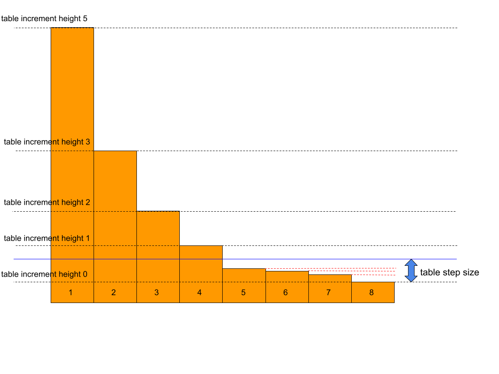

.. _subgridmethod:

Subgrid method
==============

Flow is strongly affected by the bathymetry. To simulate flow accurately, information on the bathymetry is crucial. To illustrate the importance of a well-described bathymetry, consider the three flows in a flume shown in the Figure below. While the bathymetry differs only slightly, the flow behaves completely different.

Nowadays, detailed bathymetry information becomes more and more available. However, it is difficult to take detailed grid information into account, without a strong increase in computational cost. In search of an optimal balance between computational cost and accuracy, the so-called subgrid method (:cite:t:`Casulli2009`, :cite:t:`Casulli2011`, :cite:t:`Stelling2015`, :cite:t:`Volp2013`) was developed and implemented in 3Di.

.. figure:: image/b1_3.png
   :figwidth: 600 px
   :alt: bathymetry variations example

   Examples of flow in a flume, where a slight change in bathymetry strongly affects the flow.

The basic idea behind the subgrid method is that water levels vary much more gradually than the bathymetry. In hydrodynamic computations, water levels are assumed to be uniform within a computational cell. Traditionally, this is also assumed for the bathymetry within such a cell. The subgrid-based approach allows the bathymetry to vary within one computational cell, while the water level remains uniform. In 3Di two grids are defined; a high resolution subgrid and a coarse(r) computational grid. All input data, such as the bathymetry, roughness and infiltration rates can be defined on the high resolution grid, while the computations are performed on the coarse computational grid. Volumes and cross-sectional areas are determined using the high resolution bathymetry information. The variation of the bathymetry within a computational cell means that a cell can be dry, wet or partly wet (see the Figure below). This approach has two implications:

- The volume has a non-linear relation with the water level, because when the water level rises, the wet surface area increases as well. Such a system can be solved using a Newton iteration to compute the volumes at the next time step.

- As we are allowed to have a non-linear relation between water level and volume, 3Di can deal automatically with flooding and drying. No artificial thresholds are necessary.

.. figure:: image/b1_4.png
   :figwidth: 400 px
   :alt: subgrid_bathymety_cell

   An example of a computational cell with a bathymetry defined on the subgrid.

.. _subgrid_tables:

Subgrid tables
--------------

The high resolution subgrid data is compressed in tables that allow fast access during the simulation. These tables describe the relation between water level and the following variables: 

* Volumes per computational cell (1D, 2D)
* Cross-sectional area per half of cell face (2D)
* Friction parameters per waterlevel (2D)
* Infiltration rates (2D)
* Interception rates (2D)
* Interflow volumes per computational cell (2D)
* Groundwater volumes per computational cell (2D)

This relation is specific for each cell, node or, in case of cross-sectional area, flowline. When the cell is partially wet, the relation between water level and the other variables is non-lineair. The subgrid tables describe this non-linear relation using entries that contain a water level and e.g. (for volumes) the total water volume in the cell at that water level. Once the cell is completely wet, all relations become linear again (e.g. one cm rise in water level will always yield the same rise in volume), so the last entry in the subgrid tables is the highest point in the cell or cross-section.

Subgrid table settings
^^^^^^^^^^^^^^^^^^^^^^

Higher vertical precision in the description of the relations mentioned above requires subgrid tables with many entries. Such large tables may reduce the computational speed, and require a large data storage. 3Di uses a method that minimizes the number of entries in the subgrid tables. The application of this method can be further tuned by setting the *Table step size*, the *Maximum table step size*, and the *Table step size 1D*. These allow you to balance the vertical precision against computational speed and data storage.

In the 2D domain, the *Table step size* is used as a minimum increment height between successive table entries. For example, if the *Table step size* is 0.1 m, and we have previously found a
table increment at pixel height 1.5 m, the pixel values that are considered for the next table increment have to be at least 1.6 m and the water level / volume relation between 1.5 and 1.6 m is assumed linear. Decreasing the *Table step size* will increase numerical precision at the cost of computational speed. For simulations with extensive flooding and drying, it can be advantageous to increase the *Table step size*, thereby
increasing the linearization of the system and simplifying the mathematical equations.

The maximum distance between height increments is determined by the pixel values. This way, we prevent generating height increments for which each subsequent table entry would
only linearly increase with respect to the previous table entry, thereby omitting an opportunity for data reduction and gain in computational speed. The exceptions are 
tables with a non-linear relation regarding water depths, for example for friction tables. Interpolation between table entries that are too far apart will cause a loss in numerical
precision due to the non-linear friction profile. 3Di can be forced to use a *Maximum table step size*; if not set, the maximum table step size is 100 × the table step size.

   2D table increments. Pixel height for node 8 is the first increment height in the table, pixel heights for pixels 6, 7, and 8 are below the table step size with respect to the
   pixel height of node 8 and are therefore skipped. Pixel heights for pixels 1, 2, 3, and 4 are above the previous table increment height + table_step_size, and are therefore
   in the table for this cell.  

In the 1D domain, the table step size is used as a fixed increment height between table entries, as opposed to the dynamic increment heights for the 2D tables. For the 1D domain, a smaller minimum table step size is often required. This can be achieved by setting the *Table step size 1D*. If the *Table step size 1D* is not set, the *Table step size* is used for both the 2D and the 1D domain.

.. figure:: image/table_1d_increments.png
   :scale: 40 %
   :align: center
   :alt: Table increments 1D

   1D table increments. Fixed distance between increments.