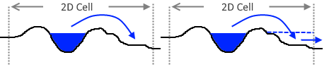
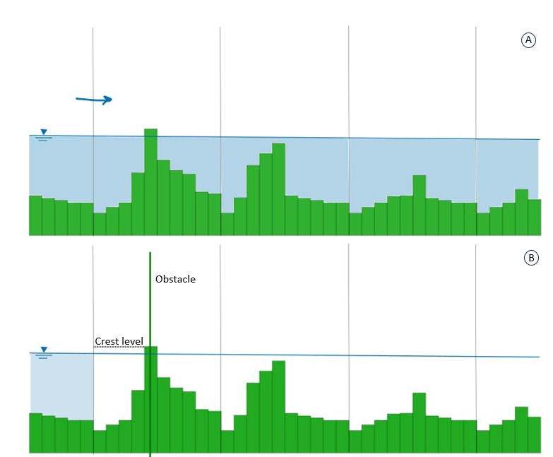

.. _surface_flow:

2D Surface flow
===============

The 2D surface flow is based on the 2D depth-averaged shallow water equations. These equations are based on the conservation of momentum. 3Di considers the various processes; inertia, advection, pressure and friction for computing the horizontal flow.

The methods that 3Di uses to deal with the flow in the 2D domain are thoroughly described and published in :cite:t:`Casulli2009`, :cite:t:`Casulli2011`, :cite:t:`Stelling2015`, and :cite:t:`Volp2013`.

 .. TODO: Extend

.. _surface_flow_cross_sections:

Cross-sections and exchange levels
----------------------------------

The cross-sectional area and exchange levels for 2D flow are based on the subgrid data. The rows of pixels on either side of the cell boundary are used for this. For each pixel pair, the maximum value is used to describe the 2D cross-section.

Note that if a narrow obstacle in the landscape does not coincide with the cell boundary, it will not affect the cross-section and exchange level. This means that water flows 'through' the obstacle, because there is always only one water level in the whole cell. This is illustrated in the figure below.

   Example of channel leaking

.. _obstacles:

Obstacles
---------
The subgrid technique used in 3Di allows for a very detailed description of the elevation. However, the subgrid technique does not recognize all narrow elements within a cell as blocking. Only when these are located at the cell edges they are detected and will block flow. When an element can be defined as narrow depends on the dimensions of the computational cell. Examples of narrow elements can be levees, residential blocks or quay walls. There are several methods for dealing with these elements. One can always refine the computational grid, however, this can be unnecessarily give an increase in the computation cost, but blocking a flow can be essential for a correct result. 3Di offers two different methods to achieve this. It can either be done by general obstacle detection, or by adding an obstacle at a specific location. To elaborate, when using general obstacle detection, the modeler only gives an obstacle height, which the 3Di computational core uses to determine obstacle locations itself. Using the latter method, a modeler can add an obstacle with a specific location and height.

In practice these two methods can have a different outcome. The explicitly defined obstacles are much stricter in closing 2D flow lines. For some situations this is necessary, however it can also result in an ‘angular’ flow domain which might result in additional friction. The ‘general’ obstacle detection is on the other hand, not always strict enough, but it does not require any work of the modeler. Moreover, it is also possible to use both options in one model. In this case, when both methods block a flow line, the explicitly defined obstacle is dominant over the general approach.

If the model wishes to include an obstacle that may not be detected by the computational grid or doesn't exist in the elevation model it can be given explicitly. These obstacles are given by a line segment and an elevation. These lines and elevations are placed over the quadtree. The routine checks which 2D links cross the obstacle line. For those links that are crossed the obstacle height is used instead of the elevation height for Flow computation. The figure below shows an example of an obstacle line in green.

.. figure:: image/b6_gridwithobstacles.png
   :scale: 50%
   :alt: virtual_conservation_box
   :align: right

   A computational grid for 2D flow including local grid refinements. The momentum domains in x- (pink) and y-direction (blue) are indicated by the planes. The obstacle elements are given with a green line and the flow links with a dashed blue line. The flow links closed by the obstacle are marked with a thick red line.

   In sub-figure (A) the flow can freely flow from left to right as the blocking features are not on the cell edges. Sub-figure (B) shows the effect of the obstacle: it affects the exchange level of the nearest cell edge.

Friction
--------

In the 2D domain, the friction is calculated using the flow depth at each :ref:`subgrid <subgridmethod>` pixel in the :ref:`momentum domain<computational_grid_2d_domain>`. The formulations of Chézy or Manning can be used for the calculation of friction.

Water level gradients
---------------------

On flat terrain without steep steps or jumps in elevation, the water level gradient is simply determined by the difference in water level over the x-axis or y-axis distance between the cell centers.

If there are steep steps in the terrain, a :ref:`limiter_gradient` may be used to correctly calculate the water level gradient.

Sloping terrain
---------------

Calculating 2D flow on sloping terrain requires some special attention. If the default approach is used, the wet cross-sectional area will be overestimated, and the friction will be underestimated. 3Di offers elegant solutions for this, in the form of :ref:`limiters<limiter_slope_cross_sectional_area>`.

.. _flow_with_vegetation:

Vegetation
----------

Vegetation in a water course strongly affects the flow, as the vegetation exerts a *drag force* on the flowing water. In 3Di, this drag force can be calculated from the characteristics of the vegetation that is present in the water course.

Two key aspects of the vegetation formulation used in 3Di are important to understand well. First, how vegetation exerts a drag force on the flowing water and how this differs from shear stresses such as bottom friction. Secondly, the importance of high resolution variations of the flow due to the varying vegetation characteristics.

.. figure:: image/b_veggie_velocity_profile.png
   :scale: 20%
    
   Vertical velocity profiles altered by vegetation.

The 3Di computational core solves a force balance for the momentum domains. Different types of forces act differently on a fluid. For example, gravity is a body force, whereas bottom friction is due to a shear stress acting on a surface. Bottom friction alters the vertical velocity profile to a profile that can be described by a logarithmic function. Vegetation exerts a drag force on the water throughout the vertical profile. This drag scales with a representative vertical plane. The drag applies to the whole vertical profile if the vegetation is emerging, or, to a part of the vertical profile if the vegetation is submerged.

Only few formulations describe the vegetation drag under both emerged and submerged conditions (:cite:t:`VargasLuna2015`). However, for flooding conditions, high water forecast or tidal applications, it is crucial to be able to deal with these transitions. This is why 3Di uses the formulation of :cite:t:`Baptist2007`, which uses the plant characteristics plant height, stem diameter, and stem density to determine the representative vertical plane.

The formulation assumes that the interaction between water and plants works one way only, i.e. the vegetation affects the flow, but the flow does not bend or otherwise affect the vegetation. This helps to limit the number of required input parameters; these types of effects may be accounted for in the drag coefficient.

Vegetation often has high spatial variability and it is important to capture this variability at a high level of detail, for various reasons. First of all, flow finds the route of least resistance. The patchiness of vegetation allows the water to find specific routes, allowing to fill up or drain certain areas much quicker than would be expected by uniform vegetation fields.

Secondly, vegetation drag is larger when the representative vertical plane is larger (i.e., vegetation is present in a larger part of the vertical profile). This is illustrated in the figure below; while the water level can be assumed to be constant within the cell, the bathymetry and the plant height vary on a much smaller scale. Some pixels have high plants, but are dry and so do not contribute to the drag; other pixels have low bottom levels and low plants, and also have a small contribution to the drag. Pixels with a large water depth and high plants (covering the entire water depth) contribute a lot to the total drag in the computational cell. To accurately calculate this vertical plane, the bottom elevation, plant characteristics and water level all need to be taken into account at a high resolution.

.. figure:: image/b_rekencel_veggie.png
    :scale: 80%

    A 3Di computational cell, including the subgrid bathymetry and the vegetation patches.

:cite:t:`Baptist2007` describes the effect of the vegetated area on the flow as a shear stress that scales with the vertical plane (instead of with the horizontal plane as in bottom friction or wind shear). It is a function of the flow velocity and vegetation characteristics:

.. math::

   \tau_v = \frac{1}{2}C_{DV} m D min[H_v, H]|U|u  \label{eq:veggie_drag_baptist} 
    
| In which: 
| :math:`U` , the velocity vector with :math:`(u,v)` the velocity components in :math:`x,y`-direction
| :math:`H` the water depth
| :math:`H_v` the relative vegetation height
| :math:`D` the stem diameter
| :math:`m` the number of stems per square meter 
| :math:`C_{DV}` The vegetation drag coefficient 

The final four parameters of the equation are all input parameters that are used for 2D flow with vegetation. These are described in detail in :ref:`vegetation_drag`. They can be defined as raster values and as global values. The parameters that describe the vegetation characteristics are defined at the subgrid resolution. The high resolution information is used in the computation of the drag in several ways. In the first place, to determine the correct vertical plane that enforces the drag, the vegetation height is combined with high resolution bathymetry information. This ensures that only the vegetation in the wet domain contributes to the force balance and that the correct vertical plane is defined. Moreover, knowing that the bathymetry and the drag significantly changes within a momentum domain, means that the velocity within such a domain varies as well. Based on this, an estimate is made of the high resolution velocity variation (similar to how this is implemented for bottom friction, see Volp et al. 2013. This formulation uses the vegetation characteristics, the bottom roughness and the bathymetry variations. This results in very accurate results, even when using coarse computational cells.

This formulation was deliberately chosen to be generally applicable to a large range of plant species, using a limited number of input parameters. It can be used for aquatic species, herbaceous species (grasses, grains, reeds), and woody species (shrubs and trees). The equation is applicable to both submerged and emergent vegetation, and transitions between these situations during the simulation. It does not apply not to free-floating plants.

Further details of the way 3Di calculates flow through vegetation will be described in a paper to be sumbitted to the Journal of Hydraulic Engineering.
