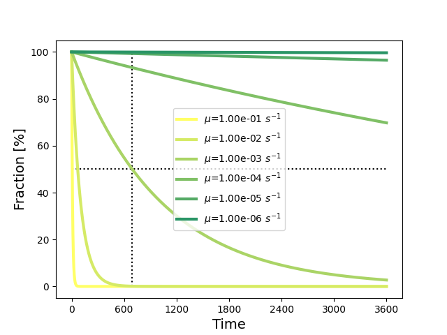

.. _water_quality:

Water quality and the transport of substances
---------------------------------------------

The water quality module of 3Di simulates the transport, spreading, and age of substances. This module provides insights into water origin, water distribution, and water quality. The principles that guarantee volume conservation in the hydrodynamic model are extended naturally to the water quality module. This ensures that substances can travel between surface water and groundwater, (in/ex)filtrate into the sewer system, and return to the open water network.

- Substances can enter the model domain as concentrations in initial water, boundary conditions, laterals, rain, leakage, surface sources and sinks. This applies to the entire model domain (1D, 2D, and groundwater).

- Each forcing can contain concentrations of one or multiple substances

- The water quality module can also be used to trace water throughout the system. Water can then be labelled as a fraction or a percentage. 

- The :ref:`output of water quality simulations<wq_netcdf>` is in NetCDF format; the file has the same structure as hydrodynamic results (results_3di.nc).

- Some characteristics can be set per substance, these are introduced in the sections below.

The transport processes are governed by equations based on the advective-diffusion equation, with an added decay term. It is assumed that substances are passive. This means they do not interact with each other and do not influence the density of the flow. Naturally, full mass conservation of substances is assumed. The advective-diffusion equation is:

.. math::

    \frac{dVc}{dt} \bigg|_i = 
    \sum_{l}^{\lambda_{i:in}} Q_{l} c_{l} 
    - \sum_{l}^{\lambda_{i:out}} Q_{l} c_{l} 
    + \sum_{k}^{\gamma_{i:in}} S_{k} c_{k} 
    - \sum_{k}^{\gamma_{i:out}} S_{k} c_{k} 
    + \sum_{l}^{\lambda_{i:all}} \nu A_l \frac{c_{l:up} - c_{l:down}}{\Delta x_l} 
    - \mu V c \bigg|_i

In this equation:
- :math:`V` and :math:`c` represent the volume and concentration within a domain :math:`i`.
- :math:`Q_l` denotes the incoming and outgoing fluxes.
- :math:`S_k` includes all source and sink terms in the domain, each with their respective concentrations.
- The diffusion coefficient is :math:`\nu`, while :math:`A_l` and :math:`\Delta x_l` represent the cross-sectional area and the grid spacing.
- The decay of a substance is determined by :math:`\mu`.

In the sections below, the specific aspects of the various terms and the methods used to solve these equations are explained in more detail.

.. warning::

    You cannot add multiple laterals to a single node or cell if they have different substance concentrations. This will be resolved in the near future.

.. _diffusion:

Dispersion and diffusion
========================

The transport of substances cannot be adequately described by considering the average flow only. Imagine adding a bit of lemonade to a glass of water. Even though there is no flow, it will spread throughout the glass. This spread is caused by the processes of dispersion and diffusion. There are subtle differences between (molecular) diffusivity and dispersion. The most important difference is the spatial scale on which they act. In some applications, these differences are important. However, when dealing with the simulation of transport of substances for environmental applications, the scales collapse to the scale of a computational cell. On this scale, what matters is the *cumulative* effect of these processes. There are various methods to incorporate this effect.

In the context where the shallow water equations are used to simulate the flow, these effects are often included by using the concept of *horizontal eddy viscosity* (:math:`\nu`). It allows for the spreading of a substance due to flow that exists on a smaller scale than the average flow. Such flow is gradient-driven, meaning it occurs if there is a spatial gradient in concentration. 

The eddy viscosity is generally determined by calibration, because, in a numerical model, the grid resolution is a crucial factor determining the scales and processes captured. In principle, the eddy viscosity is proportional to the computational grid resolution (see [Saichenthur_2022]_). In the table below are some value ranges listed, to give you an idea of the correct values.

Keep in mind that the spreading of a substance is affected by this diffusion term, but that spreading also inherently occurs due to numerical methods. Therefore, one might want to limit this extra spreading-effect. This can be done by minimising the physical diffusion, switching on specific limiters (we will add more information on this soon) and/or allow differences in values per substance. 

Typical eddy viscosity values for various environments
^^^^^^^^^^^^^^^^^^^^^^^^^^^^^^^^^^^^^^^^^^^^^^^^^^^^^^

+----------------------------------------------+-----------------------------------+------------------------------------------------------------------------------------------------------+
| **Environment**                              | **Typical Eddy Viscosity**        | **Description**                                                                                      |
+==============================================+===================================+======================================================================================================+
| Shallow Coastal Waters                       | 1 - 10 m\ :sup:`2` /s             | Moderate turbulence, shallow water near coasts.                                                      |
+----------------------------------------------+-----------------------------------+------------------------------------------------------------------------------------------------------+
| Rivers                                       | 0.1 - 1 m\ :sup:`2` /s            | Lower turbulence, confined river channels.                                                           |
+----------------------------------------------+-----------------------------------+------------------------------------------------------------------------------------------------------+
| Larger Rivers and Estuaries                  | 1 - 10 m\ :sup:`2` /s             | Moderate mixing, influenced by tidal action.                                                         |
+----------------------------------------------+-----------------------------------+------------------------------------------------------------------------------------------------------+
| Lakes and Reservoirs                         | 0.01 - 0.1 m\ :sup:`2` /s         | Still water bodies with low turbulence.                                                              |
+----------------------------------------------+-----------------------------------+------------------------------------------------------------------------------------------------------+
| Lakes (moderate winds)                       | 0.1 - 1 m\ :sup:`2` /s            | Presence of wind-induced turbulence.                                                                 |
+----------------------------------------------+-----------------------------------+------------------------------------------------------------------------------------------------------+
| Coastal Zones                                | 10 - 100 m\ :sup:`2` /s           | High turbulence in tidal flows and coastal currents.                                                 |
+----------------------------------------------+-----------------------------------+------------------------------------------------------------------------------------------------------+
| Numerical Model Calibration                  | Proportional to mesh size         | Often calibrated to mesh/grid size to control numerical stability.                                   |
|                                              | :math:`\Delta x^2`                |                                                                                                      |
+----------------------------------------------+-----------------------------------+------------------------------------------------------------------------------------------------------+

Some more details why calibrating might be essential
^^^^^^^^^^^^^^^^^^^^^^^^^^^^^^^^^^^^^^^^^^^^^^^^^^^^

The numerical results of the transport equation are very sensitive to numerical diffusion, as there are limited sources of natural diffusion, at least not as dominant as they appear in applications suitable for the 2D (or 1D) shallow water equations. In 3Di, we aim to minimize these grid dependencies, but achieving this requires some understanding of numerical diffusion.

One can prove that the numerical error (:math:`E`) in solving such an advection equation is:

.. math::

   E=-\frac{u}{2}\frac{\partial^2 c}{\partial x^2}\left(u\Delta t-\Delta x\right)

This implies that the actual equation that is solved is:

.. math::

   \frac{\partial c}{\partial t}=-u\frac{\partial c}{\partial x}-\frac{u}{2}\left(u\Delta t-\Delta x\right)\frac{\partial^2 c}{\partial x^2}

Thus, the :math:`E` makes an advection-diffusion equation out of an advection equation, with a viscosity of:

.. math::

   \nu_{num} = -\frac{u}{2}\left(u\Delta t-\Delta x\right)

This diffusivity is solely related to the numerical schematisation, therefore it is referred to as the numerical diffusivity coefficient. This coefficient cannot be set by users, but 3Di guarantees it to be positive to ensure stability. Additionally, note that this numerical diffusivity coefficient scales with the grid resolution (:math:`\Delta x`) and the time step (:math:`\Delta t`). You can reduce the numerical diffusion coefficient by decreasing the time step and the grid size.

Considering physical diffusion, as initially introduced, an extra term is added in the transport equation. Users can set the eddy diffusion coefficient (:math:`\nu`) as shown in the table above. 3Di aims to avoid overestimating diffusive processes. The equation above shows the estimate of the numerical diffusion. Based on the amplitude of the numerical diffusion term, the local eddy diffusion coefficient :math:`\nu_l` is reduced. This results in the *effective local diffusivity coefficient*:

.. math::

   \nu_{l} = \text{MAX}[0,\nu-|u|]

The eddy diffusivity coefficient is set by users per substance. In cases where diffusion is the dominant process in flow behavior, this reduction has limited to no effect, but in dynamic flow situations with strong numerical diffusion, the diffusivity is kept within realistic limits, ensuring stability.

.. _decay_coefficient:

Decay coefficient
=================

In 3Di, substances can decay by a constant decay rate. This constant decay rate is defined by the substance property *Decay coefficient* .

To introduce the concept of a constant decay rate, an idealised case is considered. Assume a basin without any spatial flow and no source or sink terms. In such case the transport equation reduces to:

.. math::

   \frac{\partial c}{\partial t} = -\mu c

where :math:`\mu \, [s^{-1}]` is the decay rate constant, :math:`c` is the concentration and :math:`t` is the time. In case there is an initial amount of a substance, it will decay exponentially over time. The solution for such a system is:

.. math::

   c(t) = A_i e^{\mu t}

In which :math:`A_i` depends on the initial conditions.

The figure below illustrates the effect of the decay coefficient on the concentration over time.

   Decay of a substance concentration over time for different decay coefficients, and where :math:`A_i=100`. Dotted lines indicate the half-life.

.. note::
    Decay of substances is a complex biochemical process, governed by interactions between substances, and environmental conditions. If your aim is to model the full complexity of these processes, a constant decay rate may not be sufficient. 3Di results can be used as input for aquatic ecology or chemistry models that do include such complexity. In this way, you can combine the hydrodynamic accuracy of 3Di with a detailed handling of the processes specific to your application domain.

Half-life and decay rate
^^^^^^^^^^^^^^^^^^^^^^^^

Substance property databases often define the half-life of substances in water. The concept of half-life is related to constant decay rate and can be converted to it by a simple formula.

Figure :numref:`fig_decay_term` shows the results for various decay rate constants (:math:`\mu \, [s^{-1}]`). The dotted lines indicate the half-life period (:math:`t_{1/2}`) for :math:`\mu = 0.001 \, s^{-1}`. This is the time it takes to reduce the amount of substance to half. To determine a decay rate constant based on the half-life period, one can use:

.. math::

   \mu = \frac{\ln(2)}{t_{1/2}}

