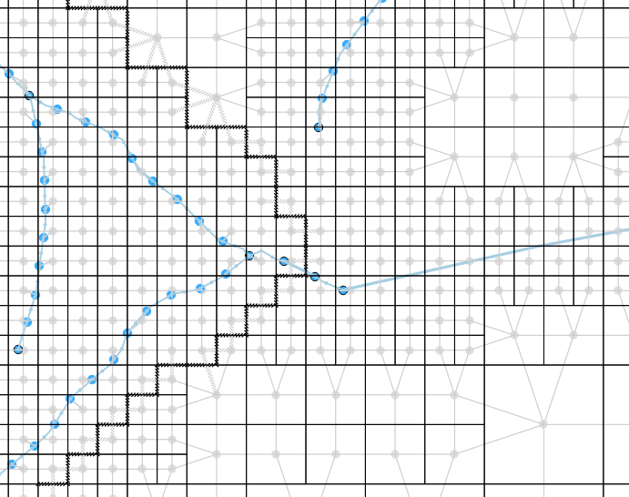

.. _checking_model:

Checking the schematisation
===================================

It is highly recommended to check your schematisation before uploading. It helps you detect and solve errors or warnings early on.

.. _schematisationchecker:

Schematisation checker
-------------------------

The *schematisation checker* checks your 3Di schematisation (.sqlite file) for completeness and consistency between tables. 
With the checker you detect most database errors before uploading the schematisation to the 3Di servers for model generation.

In order to use the *schematisation checker* follow these steps:

1. Start the Modeller Interface
2. Add a connection to the schematisation database (*Layer* -> *Data Source Manager*, Select *SpatiaLite* on the left and create a *'New'* connection or connect to an existing connection)
3. Open the *schematization checker* by opening the :ref:`3di_processing_toolbox` > 3Di > Schematisation > Check Schematisation.
4. Select the SpatiaLite connection of the schematisation database and the location where to store the output of the schematisation checker. Click *run* to run the schematisation checker. Click *open* to open the output.

The output is a comma-separated value file, which can be opened in, for example, Excel. It contains 6 columns: *id, table, column, value, description and check*:

- **id**: identification number of the row where a check encounters an error.
- **table**: the table in which the error occurs.
- **column**: the column which contains the error.
- **value**: the current value in the cell
- **description**: description of the error
- **check**: the type of check that found the error, described below

**What is checked?**

For a table of all the checks run on the schematisation, and their respective error codes, see the :ref:`current_schematisation_checks`.

.. TODO: kopje hieronder aanpassen als 3di toolbox plugin af is en zorgen dat deze uitleg dan daar staat.

Visualising computational grids
--------------------------------

3Di builds a computational grid from schematisation data (stored in spatialite and rasters). This computational grid is stored in a "gridadmin.h5" file. You can visualize these grids in the 3Di Modeller Interface.

    An example of a visualised computational grid

You can also generate the computational grid from a schematisation. This is very useful to understand how the data in your schematisation is interpreted by 3Di. It answers questions like: 

- Where is each 2D cell located? 

- With which 2D cell does this channel exchange? 

- Which cell boundaries are affected by this obstacle?

- Where are potential breaches located exactly?

Computational grid from gridadmin.h5 file
^^^^^^^^^^^^^^^^^^^^^^^^^^^^^^^^^^^^^^^^^

The processing algorithm "Computational grid from gridadmin.h5" reads the computational grid data from the .h5 file and writes it to GIS-layers in a GeoPackage. You can find it in the :ref:`3di_processing_toolbox` (Main Menu > Processing > Toolbox), under 3Di > Computational Grid. Choose a folder that contains a gridadmin.h5 file and an output location for the GeoPackage. Once the algorithm has run, the layers from the GeoPackage will be added to your project. If you do not need this data anymore after closing the 3Di Modeller Interface, you can also save to a temporary file. 

.. _computational_grid_from_schematisation:

Computational grid from schematisation
^^^^^^^^^^^^^^^^^^^^^^^^^^^^^^^^^^^^^^

The processing algorithm "Computational grid from schematisation" builds a computational grid from schematisation data (stored in spatialite and rasters). The algorithm writes this to a gridadmin.h5 file and subsequently converts that data to GIS-layers in a GeoPackage. You can find it in the :ref:`3di_processing_toolbox` (Main Menu > Processing > Toolbox), under 3Di > Computational Grid. Choose your schematisation's spatialite file and an output location for the GeoPackage. Once the algorithm has run, the layers from the GeoPackage will be added to your project. If you do not need this data anymore after closing the 3Di Modeller Interface, you can also save to a temporary file. 

Differences between locally and server-generated grids
^^^^^^^^^^^^^^^^^^^^^^^^^^^^^^^^^^^^^^^^^^^^^^^^^^^^^^

Please note that when generating the computational grid locally, some attributes will not be filled. The reason for this is that some information about the grid is generated by the routine that creates the volume tables (lookup tables that contain the relation between volume and water level, friction, etc.). This routine is run on the server, but not included in the grid building algorithm in the 3Di Modeller Interface. This applies to all attributes that are related to elevation in the 2D domain:

- Node layer: max_surface_area, bottom_level (for 2D and embedded nodes). Also note that a node's drain_level is only relevant if there is no 2D; otherwise, the exchange_level of the 1D flowline contains the relevant data. 

- Cell layer: max_surface_area, bottom_level, impervious_layer_elevation

- Flowline layer: exchange_level (for 2D en 1D/2D flowlines)

- Obstacles: exchange_level

.. _detecting_leaking_obstacles:

Detecting leaking obstacles in the DEM
--------------------------------------

Two processing algorithms are available to help you identify leaking obstacles in the DEM, such as dikes or elevated roads in the dem that are 'missed' by 3Di because they do not cover the entire edge of a calculation cell. Access them via *Main Menu* > *Processing* > *Toolbox* > *3Di* > *Computational Grid*.

	* **Detect leaking obstacles in DEM** analyses all 2D flowlines in the model domain.
	* **Detect leaking obstacles in DEM (discharge threshold)** analyses only the 2D flowlines in the model domain through which more than a specified volume of water flows during the entire simulation. It also estimates how much effect placing an obstacle would have on this volume.

