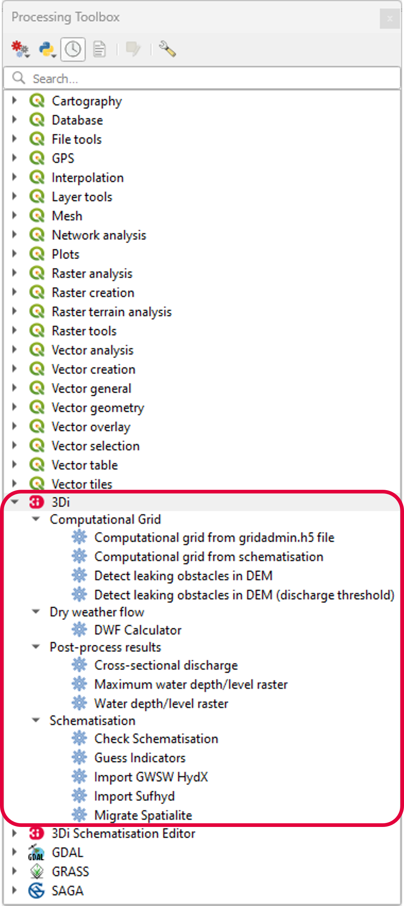

.. _mi_overview:

User interface overview
=======================

The 3Di Modeller Interface consists of five components:

1. **Main menu**
2. **Toolbar**: the :ref:`schematisation_editor_toolbar`, a button to open the :ref:`models_simulation_panel`, and the :ref:`results_analysis_toolbar` are already added to the toolbar.
3. **Panels**: the :ref:`3di_processing_toolbox` QGIS Processing Toolbox.
4. **Map canvas**
5. **Status bar**

.. todo: 

	This image needs to be updated once the modeller interface is updated with the new results analysis tool!

.. figure:: image/i_overview_modeller_interface.png
   :alt: 3Di Modeller Interface

   Overview of the 3Di Modeller Interface.

.. _schematisation_editor_toolbar:

3Di Schematisation Editor toolbar
---------------------------------

.. figure:: image/d_schematisation_editor_options.png
   :alt: Menu of the schematisation editor

   3Di Schematisation Editor toolbar

* **Open geopackage**: Loads your schematisation in the Modeller Interface, directly from the geopackage.
* **Load from Spatialite**: Load your schematisation in the Modeller Interface, by loading the data from the spatialite into a geopackage. The Schematisation Editor automatically performs the transformation and saves the *.gpkg*-file in the same folder and with the same name as the spatialite.
* **Save to Spatialite**: Saves the data back to the spatialite from which you loaded it. Do not forget to save your changes to the spatialite *before* uploading the spatialite to a new revision!
* **Save As**: Gives you the option to select another spatialite to save your data to. 
* **Remove 3Di Model**: Removes the schematisation layers from your project. 

To start working with the Schematisation Editor, the data from the spatialite has to be loaded into a geopackage.
This is easily done by using the **Load from Spatialite** button. The Schematisation Editor automatically performs the transformation and saves the *.gpkg*-file in the same folder and with the same name as the spatialite.
 
Once you are finished with editing the schematisation, the changes have to be saved back to the spatialite.

**Save to Spatialite** will save the data back to the spatialite from which you loaded it. **Save As** gives you the option to select another spatialite to save your data to. 
Do not forget to save your changes to the spatialite *before* uploading the spatialite to a new revision!

Schematisations can also be opened directly from the geopackage, using the **Open 3Di Geopackage** option. 

The **Remove 3Di Model** button removes the schematisation layers from your project. 

.. _models_simulation_panel:

3Di Models and Simulations panel
----------------------------------

Activate the 3Di Models and Simulation panel by clicking the pictogram (|modelsSimulations|) in the toolbar. 

.. figure:: image/i_overview_models_sim_panel.png
   :alt: Overview interface Models and Simulation panel

* **User:** Log in by clicking on the arrow and Log out by clicking on the cross.
* **Schematisation:** Load an existing schematisation of your organization. 
* **Revisions:** Shows the revision of the currently loaded schematisation.
* **Download:** Download schematisations that belong to your organization.
* **Upload:** Upload your schematisation to your organization.
* **New:** Create a new schematisation.
* **Simulate:** Run a simulation with a 3Di model.
* **Results:** Download results of simulations run by your organization in the past 7 days.
* **Manage:** Redirects you to the :ref:`3Di Management <management_screens_what_is>`, where you can manage your schematisations, revisions and simulations.

.. _models_simulation_settings:

3Di Models and Simulations settings
-----------------------------------

Access the 3Di Models and Simulation settings dialog by clicking *Main menu* > *Plugins* > *3Di Models and Simulations* > *Settings*.

.. figure:: image/i_overview_models_sim_setting.png
   :alt: Overview interface Models and Simulation Settings

* **Base API URL:** The Base API URL is in most cases https://api.3di.live.
* **Uploads processing timeout:** If uploading data for a simulation (such as initial water levels or laterals time series) takes longer than the value specified here (in seconds), 3Di Models & Simulations will stop trying to initialize the simulation. Default value is 900 s.
* **Working directory:** Set the local working directory. In this directory all your schematisations and results will be stored.
* **API Key:** Set you personal API Key. Click :ref:`here <setting_up_models_and_simulations>` for more information on how to obtain one.
* **Use defaults:** Sets the default Base API URL, Uploads processing timeout and Working directory

.. _results_analysis_toolbar:

3Di Results Analysis toolbar
----------------------------
.. todo::
   
   describe the 3Di Results Analysis toolbar, include this thing about log file somewhere in that description:
   .. _logfile:
   Log file
   --------
   
   Clicking the (|loggingtoolbar|) saves the logging of your results analysis to your computer. By clicking the underlined path to the text file in the pop-up windows you can open the log file. This can provide helpful information about what went wrong in case of an error.
   
   Also, it can be send as an attachment to our :ref:`servicedesk` at servicedesk@nelen-schuurmans.nl in case of errors.

.. _temporal_controller:

Temporal controller
-------------------

When you load your results the Temporal Controller will automatically appear at the top of your screen (if it was not already visible). With the Temporal Controller you can see and analyse the results through time. The Temporal Controller is a native feature of QGIS and can also be utilised in combination with other results tools. To use this tool, you first need to click the |closed_eye| in front of the desired results in the *Results Manager*. If you have loaded more than one set of results, the |opened_eye| shows the set that is used in the visualisation. Click the |opened_eye| again to stop visualisation of the results.

The results are visualised on the flowlines, 1D nodes and 2D computational cells (see :ref:`3dinetcdf` for more information on the possible flow-variables).

1) Pause or play the animation of the results through time.
2) Skip to next frame.
3) Skip to last frame.
4) Move the slider to visualise the results at different timesteps.
5) Check to automatically reset and repeat the animation endlessly when running the animation.
6) The temporal range that is used for the visualisation. Note that the default range that is shown is the range used in the simulation.
7) The steps per frame. Here the steps frame are shown every 300 seconds. Note that this shouldn't be smaller than the used output timestep in the simulation.
8) The units that correspond to the number of steps [6].
9) Export the results as png's for every or any timestep.

.. image:: /image/i_temporal_controller.png
	:alt: Temporal Controller panel

.. |temporalcontroller| image:: /image/i_temporal_controller.png
	:scale: 90%

.. _3di_processing_toolbox:

3Di Processing Algorithms
-------------------------

Many 3Di related actions can be performed by running a Processing Algorithm. These can be found in the (QGIS native) Processing Toolbox. To open the processing toolbox from the main menu, click *Processing* > *Toolbox*. Alteratively, you can click |processing_toolbox_icon| in the attributes toolbar or use the keyboard shortcut CTRL + ALT + T. Scroll down to the sections *3Di* and *3Di Schematisation Editor* to find the 3Di-specific processing algorithms. 

.. |processing_toolbox_icon| image:: /image/pictogram_processing_toolbox.png

.. |modelsSimulations| image:: /image/pictogram_modelsandsimulations.png
    :scale: 90%

.. |closed_eye| image:: /image/pictogram_temporal_controller_load_results_closed_eye.png
	:scale: 100%
	
.. |opened_eye| image:: /image/pictogram_temporal_controller_load_results_opened_eye.png
	:scale: 100%