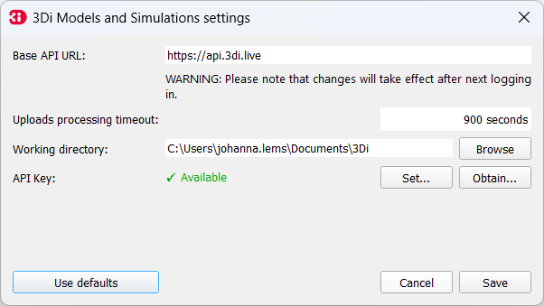

.. _mi_overview:

Overview of the Modeller Interface
===================================

The main GUI consist of five components:

1. **Menu Bar**: the 3Di Plugins can be reached from the Plugins menu.
2. **Toolbar**: the :ref:`models_simulation_plugin`, the :ref:`schematisation_editor` and the :ref:`3di_results_manager` are already added to the toolbar.
3. **Panels**: the :ref:`3di_processing_toolbox` and the :ref:`schematisation_editor` can be reached via the QGIS Processing Toolbox. The :ref:`models_simulation_plugin` and :ref:`3di_results_manager` can also be activated as a panel.
4. **Map View**
5. **Status Bar**

.. todo: 

	This image needs to be updated once the modeller interface is updated with the new results analysis tool!

.. figure:: image/i_overview_modeller_interface.png
   :alt: 3Di Modeller Interface

   An overview of the Modeller Interface.

.. _schematisation_editor_toolbar:

3Di Schematisation Editor toolbar
---------------------------------

.. figure:: image/d_schematisation_editor_options.png
   :alt: Menu of the schematisation editor

   3Di Schematisation Editor toolbar

* **Open geopackage**: Loads your schematisation in the Modeller Interface, directly from the geopackage.
* **Load from Spatialite**: Load your schematisation in the Modeller Interface, by loading the data from the spatialite into a geopackage. The Schematisation Editor automatically performs the transformation and saves the *.gpkg*-file in the same folder and with the same name as the spatialite.
* **Save to Spatialite**: Saves the data back to the spatialite from which you loaded it. Do not forget to save your changes to the spatialite *before* uploading the spatialite to a new revision!
* **Save As**: Gives you the option to select another spatialite to save your data to. 
* **Remove 3Di Model**: Removes the schematisation layers from your project. 

To start working with the Schematisation Editor, the data from the spatialite has to be loaded into a geopackage.
This is easily done by using the **Load from Spatialite** button. The Schematisation Editor automatically performs the transformation and saves the *.gpkg*-file in the same folder and with the same name as the spatialite.
 
Once you are finished with editing the schematisation, the changes have to be saved back to the spatialite.

**Save to Spatialite** will save the data back to the spatialite from which you loaded it. **Save As** gives you the option to select another spatialite to save your data to. 
Do not forget to save your changes to the spatialite *before* uploading the spatialite to a new revision!

Schematisations can also be opened directly from the geopackage, using the **Open 3Di Geopackage** option. 

The **Remove 3Di Model** button removes the schematisation layers from your project. 

.. _models_simulation_panel:

3Di Models and Simulations panel
----------------------------------

Activate the 3Di Models and Simulation panel by clicking the pictogram (|modelsSimulations|) in the toolbar. 

.. figure:: image/i_overview_models_sim_panel.png
   :alt: Overview interface Models and Simulation panel

* **User:** Log in by clicking on the arrow and Log out by clicking on the cross.
* **Schematisation:** Load an existing schematisation of your organization. 
* **Revisions:** Shows the revision of the currently loaded schematisation.
* **Download:** Download schematisations that belong to your organization.
* **Upload:** Upload your schematisation to your organization.
* **New:** Create a new schematisation.
* **Simulate:** Run a simulation with a 3Di model.
* **Results:** Download results of simulations run by your organization in the past 7 days.
* **Manage:** Redirects you to the :ref:`3Di Management <management_screens_what_is>`, where you can manage your schematisations, revisions and simulations.

.. _models_simulation_settings:

3Di Models and Simulations settings
-----------------------------------

Access the 3Di Models and Simulation settings dialog by clicking *Main menu* > *Plugins* > *3Di Models and Simulations* > *Settings*.

* **Base API URL:** The Base API URL is in most cases https://api.3di.live.
* **Uploads processing timeout:** If uploading data for a simulation (such as initial water levels or laterals time series) takes longer than the value specified here (in seconds), 3Di Models & Simulations will stop trying to initialize the simulation. Default value is 900 s.
* **Working directory:** Set the local working directory. In this directory all your schematisations and results will be stored.
* **API Key:** Set you personal API Key. Click :ref:`here <setting_up_models_and_simulations>` for more information on how to obtain one.
* **Use defaults:** Sets the default Base API URL, Uploads processing timeout and Working directory

.. todo::
   
   describe the 3Di Results Analysis toolbar, include this thing about log file somewhere in that description:
   .. _logfile:
   Log file
   --------
   
   Clicking the (|loggingtoolbar|) saves the logging of your results analysis to your computer. By clicking the underlined path to the text file in the pop-up windows you can open the log file. This can provide helpful information about what went wrong in case of an error.
   
   Also, it can be send as an attachment to our :ref:`servicedesk` at servicedesk@nelen-schuurmans.nl in case of errors.

.. _mi_technical_setup:

Technical setup
---------------

The 3Di Modeller Interface is a preconfigured QGIS. It consists of the latest Long-Term Release (LTR) of QGIS, 3Di-specific plugins, third-party plugins, and some preconfigured settings.

Plugins
^^^^^^^

The following 3Di-specific plugins are included in the 3Di Modeller Interface. If any user interface component that the documentation refers to is missing, you most probably need to activate the plugin that provides the component: *Main menu* > *Plugins* > *Manage and Install Plugins...* > Check the box of the plugin that you need. 

*3Di Models and Simulations* takes care of all communication with the 3Di API, performing tasks like creating new schematisations, uploading and downloading schematisation revisions, starting simulations, and downloading simulation results. It provides two user interface components: the 3Di Models & Simulations panel, and the 3Di Models & Simulations settings dialog.

.. note:: 
   The first time you use the 3Di Models and Simulations plugin, you need to :ref:`fill in some settings <setting_up_models_and_simulations>`.

*3Di Schematisation Editor* allows you to view and edit schematisations. Its functionalities are provided through two user interface components: the 3Di Schematisation Editor toolbar, and the processing algorithms in the 3Di Schematisation Editor section of the Processing Toolbox. Note that a great deal of what this plugin does is integrated with QGIS features, such as attribute forms with special features, automatically setting snapping options, et cetera. The 3Di Schematisation Editor also provides a number of expressions, available in the expression builder.

*3Di Results Analysis* provides all the tooling required for visualising and analysing computational grids and simulation results. Its features are available through the 3Di Results Analysis toolbar and the processing algorithms in the 3Di section of the Processing Toolbox. 

*3Di Customisations* makes some changes to the look of the user interface.

!!!!!!!!!!!!!!!!!!!!!!!!!!!!!!!!!!!!!!!!!!!!!!!!!!!!!!!!!!!!!!!!!!!!!!!!!!!!

.. |modelsSimulations| image:: /image/pictogram_modelsandsimulations.png
    :scale: 90%

