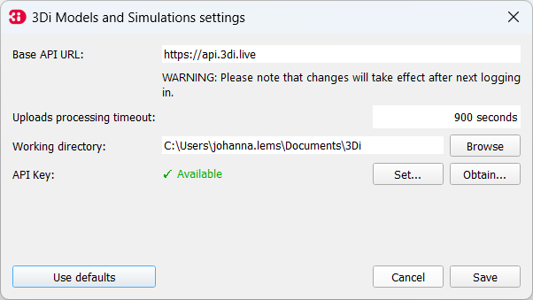
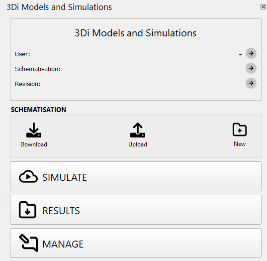

.. _models_simulation_plugin:

3Di Models and Simulations Plugin
==================================

The 3Di Models and Simulations plugin consists of two parts: :ref:`models_simulation_settings` and :ref:`models_simulation_panel`. An overview for each of these is given below.

.. note:: 
   The plugin comes pre-installed with the Modeller Interface. But when you use the plugin for the first time you need to set it up. Follow these :ref:`instructions <setting_up_models_and_simulations>` to do this.

Functionality
--------------

With this plugin, you can:

* Create new schematisations.
* Generate a 3Di model based on a schematisation.
* Edit existing schematisations.
* Download and access existing schematisations.
* Upload new revisions of a schematisation.
* Initiate simulations.
* Download simulation results.
* Analyze and interpret simulation results.

|

.. _models_simulation_settings:

3Di Models and Simulation Settings
----------------------------------

You can activate the 3Di Models and Simulation Settings by clicking on 'Plugins' in the menubar > '3Di Models and Simulations' > 'Settings'.

Overview GUI
^^^^^^^^^^^^^^

* **Base API URL:** The Base API URL is in most cases https://api.3di.live.
* **Uploads processing timeout:** 
* **Working directory:** Set the local working directory. In this directory all your schematisations and results will be stored.
* **API Key:** Set you personal API Key. Click :ref:`here <setting_up_models_and_simulations>` for more information on how to obtain one.
* **Use defaults:** Sets the default Base API URL, Uploads processing timeout and Working directory

.. VRAAG: kloppen deze knoppen? wat doet de uploads processing timeout?

|

.. _models_simulation_panel:

3Di Models and Simulation panel
----------------------------------
You can activate the 3Di Models and Simulation panel by clicking on 'Plugins' in the menubar > '3Di Models and Simulations' > '3Di Models and Simulations', or by clicking on the pictogram (|modelsSimulations|) in the toolbar. 

Overview GUI
^^^^^^^^^^^^^^^

* **User:** Log in by clicking on the arrow and Log out by clicking on the cross.
* **Schematisation:** Loads an existing schematisation of your organization. 
* **Revisions:** Shows you the revision of the loaded schematisation.
* **Download:** Download schematisations that belong to your organization.
* **Upload:** Upload your schematisation to your organization.
* **New:** Create a new schematisation.
* **Simulate:** Simulate a 3DI model.
* **Results:** Download results of simulations run by your organization in the past 7 days.
* **Manage:** Redirects you the the :ref:`Management Portal <management_screens_what_is>`, where you can manage your schematisations and revisions.

.. |modelsSimulations| image:: /image/pictogram_modelsandsimulations.png
    :scale: 90%