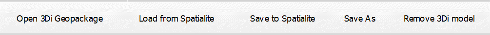
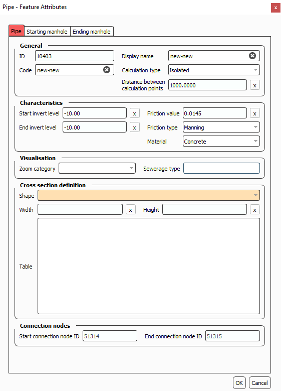
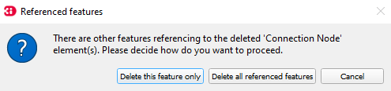

.. _schematisation_editor:

3Di Schematisation Editor
==========================

The 3Di Schematisation Editor is a powerful tool that simplifies the process of building and editing schematisations. It automates certain tasks of the regular workflow, which enables the user to build schematisations faster while reducing the chance of making errors. 

The plugin comes pre-installed with the Modeller Interface and may need to be :ref:`updated <updating_plugin_schem_editor>`.

Functionality
--------------
The main advantages of the Schematisation Editor are:

* Directly edit all layers of your schematisation, using all native QGIS functionality for editing vector features.
* Quickly add features to your schematisation with the "magic" editing functionality for 1D layers. For example: existing connection nodes are used when drawing a pipe between them, new connection nodes and manholes are created when a new pipe is digitized, etc.
* Easily move nodes and all connected lines using the smartly pre-configured snapping and topological editing settings.
* Easily move the start or end of pipes, channels, culverts, orifices, weirs, pumps. Connection node id's will be automatically updated for you.
* Get a complete overview of your schematisation: all rasters that are part of your schematisation are added to the QGIS project when the schematisation is loaded.
* Spot the tiniest local variation in elevation with the hillshade layer that is automatically added on top of your DEM.
* Visualize the mapping of (impervious) surfaces to connection nodes and change them by updating the geometries.
* Easily navigate through your schematisation: layers in the layer panel are neatly grouped together in collapsed groups.

NOTE

In the regular workflow, schematisation data is stored in a *spatialite (.sqlite)* . The Schematisation Editor stores this data in a *geopackage (.gpkg)*. The database *schema* (the names and data types of tables and columns) of this geopackage also differs from the spatialite database schema. The Schematisation Editor loads the data from the spatialite into a geopackage; you make your edits in the geopackage, and when you have finished editing, save your changes to the spatialite.

Currently, the Schematisation Editor is released as 'experimental' plugin. In a future release, we expect to replace the spatialite by the geopackage entirely (for editing as well as uploading), so that this loading and saving will no longer be necessary. Functionality for viewing and editing schematisations will be removed from the 3Di Toolbox plugin. The Schematisation Editor will remain 'experimental' until this has been completed.

Overview of the Schematisation editor
--------------------------------------
The plugins option menu is 

Loading & Saving
^^^^^^^^^^^^^^^^
Once the Schematisation Editor has been installed successfully, the option menu shown in the figure should be visible in the plugin toolbar.

   The Schematisation Editor options menu.

To start working with the Schematisation Editor, the data from the spatialite has to be loaded into a geopackage.
This is easily done by using the **Load from Spatialite** button. The Schematisation Editor automatically performs the transformation and saves the *.gpkg*-file in the same folder and with the same name as the spatialite.
 
Once you are finished with editing the schematisation, the changes have to be saved back to the spatialite.

**Save to Spatialite** will save the data back to the spatialite from which you loaded it. **Save As** gives you the option to select another spatialite to save your data to. 
Do not forget to save your changes to the spatialite *before* uploading the spatialite to a new revision!

Schematisations can also be opened directly from the geopackage, using the **Open 3Di Geopackage** option. 

The **Remove 3Di Model** button removes the schematisation layers from your project. 

Creating new features (digitizing)
^^^^^^^^^^^^^^^^^^^^^^^^^^^^^^^^^^^^
General
--------

To add a feature:

#) Select the layer in the Layers panel.
#) Press the 'Toggle Editing' button (|toggleEditing|).
#) Click on 'Add Point-' (|addPoint|), 'Add Line-' (|addLine|) or 'Add Polygon Feature' (|addPoly|), depending on what kind of feature you want to add.
#) Left click on the map to add a Point feature. When adding Line or Polygon features, add multiple locations by left clicking and finish by right clicking.
#) Fill in the Attribute Form. The orange fields are required to fill in. The other fields are optional. Press OK to finish the process.
#) When you are finished with adding the features, disable 'Toggle Editing' and save your schematisation to spatialite.

Please check out the :ref:`3di_feature_notes` below for information to correctly add 3Di features to the schematisation.

   An example of the Feature Attribute window when adding a pipe.

.. _3di_feature_notes:

Notes on the 3Di Features
-------------------------

* **Channel** - A channel can exist of 2 or more vertices. The *connection nodes* and the *Cross Section Location* are added automatically. Do not forget to fill in the required Feature Attributes for the Cross Section Location.

* **Cross Section Location** - Should be placed on top of a channel vertex, (not on the start or end vertex).

* **Culvert** - The culvert can also exist of 2 or more vertices and the *connection nodes* are added automatically.

* **Orifice** - An orifice can only consist of 2 vertices. The *connection nodes* are added automatically.

* **Pipe** - To draw a single pipe, the geometry must have exactly 2 vertices. A line with more than 2 vertices will be split into several pipes. Check out the tip below to add a trajectory of multiple pipes.

* **Pump** - The geometry of a pump must have exactly 2 vertices. The *connection nodes* are added automatically. For external pumps, which pump water out of the model domain, the *Pumpstation (without end node)* should be used. For internal pumps, which pump water between two nodes within the model domain, the *Pumpstation (with end node)* should be used.

* **Weir** - The weir consists of exactly 2 vertices, and the *connection nodes* are added automatically.

* **(Impervisous) Surfaces** - First draw the (impervious) surface polygon(s), then add (impervious) surface map lines. These should start on the impervious surface polygon and end at the connection node to which it is mapped.

.. tip::
    In order to digitize **a trajectory of multiple pipes**, first digitize the manholes, fill in the bottom levels, and then draw the pipe trajectory over these manholes by adding a vertex at each of the manholes. 
    The pipes that are generated will use the manhole's bottom levels as invert levels and the *connection nodes* and *manholes* will be added automatically.

Pasting features from external data sources
^^^^^^^^^^^^^^^^^^^^^^^^^^^^^^^^^^^^^^^^^^^^
Features can be copy-pasted from external data sources into the schematisation editor. 
Check out the `QGIS Documentation <https://docs.qgis.org/3.22/en/docs/user_manual/working_with_vector/attribute_table.html>`__ for how to work with the attribute table.

.. Note::
    Please note that when pasting features from external sources, the above mentioned perks of the Schematisation Editor will not be applied to the features. 

Editing feature attributes
^^^^^^^^^^^^^^^^^^^^^^^^^^^^
There are two options to edit feature attributes:

    #) Via the attribute table.

    #) Select the desired feature layer, enable the 'Identify Feature' option (|idendifyFeature|), and select a feature on the map. This will open a window with not only all feature attributes of the feature, but also the feature attributes of all related features. These can be found in the other tabs within the window.

Editing feature geometries
^^^^^^^^^^^^^^^^^^^^^^^^^^
For editing the geometries of features, the 'Vertex tool' can be used, see the `QGIS documentation <https://docs.qgis.org/3.22/en/docs/user_manual/working_with_vector/editing_geometry_attributes.html?highlight=vertex%20tool#vertex-tool>`__.
On top of the standard QGIS functionalty, the Schematisation Editor provides extra functionalities:

    - When moving a node, all connected features will move along.
    
    - Changing the start/end vertex of a line feature (e.g. pipe, channel, culvert, orifice, weir, pump (impervious) surface map) allows you to connect the line to another connection node.

Deleting features
^^^^^^^^^^^^^^^^^
For the general documentation on deleting features, check out the `QGIS documentation <https://docs.qgis.org/3.22/en/docs/user_manual/working_with_vector/editing_geometry_attributes.html?highlight=vertex%20tool#deleting-selected-features>`_.
When following those steps in the Schematisation Editor, one will be prompted the following screen:

   Deleting features options

When selecting 'Delete this feature only', only the selected features will be deleted. This will result in an invalid schematisation, but can come in handy if a part of the model has to be deleted.

When selecting 'Delete all referenced features', all connected features will also be deleted. Your schematisation will most likely still be valid when using this option.

.. |toggleEditing| image:: /image/d_toggle_editing.png

.. |addPoint| image:: /image/d_addpoint.png

.. |addLine| image:: /image/d_addline.png

.. |addPoly| image:: /image/d_addpolygon.png

.. |idendifyFeature| image:: /image/d_identify_features.png

