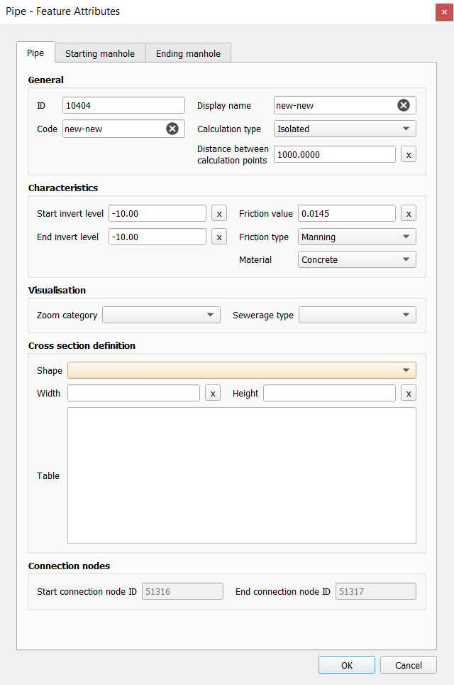

.. _schematisation_editor:

3Di Schematisation Editor plugin
================================

The 3Di Schematisation Editor is a powerful tool that simplifies the process of building and :ref:`editing schematisations <edit_schematisation>`. It automates certain tasks of the regular workflow, which enables the user to build schematisations faster while reducing the chance of making errors. 

The plugin comes pre-installed with the Modeller Interface and may need to be :ref:`updated <updating_plugin_schem_editor>`.

Functionality
-------------

The Schematisation Editor offers several key advantages:

* Seamless Integration: Load your schematisation from both a Geopackage and a Spatialite into the Modeller Interface effortlessly.
* Enhanced Visualization: Experience improved visualization of your schematisation. Gain a clearer understanding of the data by effectively presenting all relevant information.
* Streamlined Editing: Enjoy a streamlined editing process as your edits are directly incorporated into all appropriate layers of your schematisation. This ensures consistency and saves time by eliminating the need for manual adjustments.
* Convenient Saving: Easily save your edits to a Spatialite database, allowing for efficient data storage and retrieval. Your modifications are securely preserved for future use and analysis.

.. Note::  
    * In the regular workflow, schematisation data is stored in a *spatialite (.sqlite)* . The Schematisation Editor stores this data in a *geopackage (.gpkg)*. The database *schema* (the names and data types of tables and columns) of this geopackage also differs from the spatialite database schema. The Schematisation Editor loads the data from the spatialite into a geopackage; you make your edits in the geopackage, and when you have finished editing, save your changes to the spatialite. 
    
    * Currently, the Schematisation Editor is released as 'experimental' plugin. In a future release, we expect to replace the spatialite by the geopackage entirely (for editing as well as uploading), so that this loading and saving will no longer be necessary. Functionality for viewing and editing schematisations will be removed from the 3Di Toolbox plugin. The Schematisation Editor will remain 'experimental' until this has been completed.

Overview of the Schematisation editor toolbar
---------------------------------------------

   The Schematisation Editor options menu.

* **Open geopackage**: Loads your schematisation in the Modeller Interface, directly from the geopackage.
* **Load from Spatialite**: Load your schematisation in the Modeller Interface, by loading the data from the spatialite into a geopackage. The Schematisation Editor automatically performs the transformation and saves the *.gpkg*-file in the same folder and with the same name as the spatialite.
* **Save to Spatialite**: Saves the data back to the spatialite from which you loaded it. Do not forget to save your changes to the spatialite *before* uploading the spatialite to a new revision!
* **Save As**: Gives you the option to select another spatialite to save your data to. 
* **Remove 3Di Model**: Removes the schematisation layers from your project. 

To start working with the Schematisation Editor, the data from the spatialite has to be loaded into a geopackage.
This is easily done by using the **Load from Spatialite** button. The Schematisation Editor automatically performs the transformation and saves the *.gpkg*-file in the same folder and with the same name as the spatialite.
 
Once you are finished with editing the schematisation, the changes have to be saved back to the spatialite.

**Save to Spatialite** will save the data back to the spatialite from which you loaded it. **Save As** gives you the option to select another spatialite to save your data to. 
Do not forget to save your changes to the spatialite *before* uploading the spatialite to a new revision!

Schematisations can also be opened directly from the geopackage, using the **Open 3Di Geopackage** option. 

The **Remove 3Di Model** button removes the schematisation layers from your project. 

Creating new features (digitizing)
^^^^^^^^^^^^^^^^^^^^^^^^^^^^^^^^^^^^
General
--------

To add a feature:

#) Select the layer in the Layers panel.
#) Press the 'Toggle Editing' button (|toggleEditing|).
#) Click on 'Add Point-' (|addPoint|), 'Add Line-' (|addLine|) or 'Add Polygon Feature' (|addPoly|), depending on what kind of feature you want to add.
#) Left click on the map to add a Point feature. When adding Line or Polygon features, add multiple locations by left clicking and finish by right clicking.
#) Fill in the Attribute Form. The orange fields are required to fill in. The other fields are optional. Press OK to finish the process.
#) When you are finished with adding the features, disable 'Toggle Editing' and save your schematisation to spatialite.

Please check out the :ref:`3di_feature_notes` for information to correctly add 3Di features to the schematisation.

   An example of the Feature Attribute window when adding a pipe.

Pasting features from external data sources
^^^^^^^^^^^^^^^^^^^^^^^^^^^^^^^^^^^^^^^^^^^^
Features can be copy-pasted from external data sources into the schematisation editor. 
Check out the `QGIS Documentation <https://docs.qgis.org/3.22/en/docs/user_manual/working_with_vector/attribute_table.html>`__ for how to work with the attribute table.

.. Note::
    Please note that when pasting features from external sources, the above mentioned perks of the Schematisation Editor will not be applied to the features. 

Editing feature attributes
^^^^^^^^^^^^^^^^^^^^^^^^^^^^
There are two options to edit feature attributes:

    #) Via the attribute table.

    #) Select the desired feature layer, enable the 'Identify Feature' option (|identifyFeature|), and select a feature on the map. This will open a window with not only all feature attributes of the feature, but also the feature attributes of all related features. These can be found in the other tabs within the window.

.. |identifyFeature| image:: /image/pictogram_identify_features.png

Editing feature geometries
^^^^^^^^^^^^^^^^^^^^^^^^^^
For editing the geometries of features, the 'Vertex tool' can be used, see the `QGIS documentation <https://docs.qgis.org/3.22/en/docs/user_manual/working_with_vector/editing_geometry_attributes.html?highlight=vertex%20tool#vertex-tool>`__.
On top of the standard QGIS functionalty, the Schematisation Editor provides extra functionalities:

    - When moving a node, all connected features will move along.
    
    - Changing the start/end vertex of a line feature (e.g. pipe, channel, culvert, orifice, weir, pump (impervious) surface map) allows you to connect the line to another connection node.

Deleting features
^^^^^^^^^^^^^^^^^
For the general documentation on deleting features, check out the `QGIS documentation <https://docs.qgis.org/3.22/en/docs/user_manual/working_with_vector/editing_geometry_attributes.html?highlight=vertex%20tool#deleting-selected-features>`_.
When following those steps in the Schematisation Editor, one will be prompted the following screen:

   Deleting features options

When selecting 'Delete this feature only', only the selected features will be deleted. This will result in an invalid schematisation, but can come in handy if a part of the model has to be deleted.

When selecting 'Delete all referenced features', all connected features will also be deleted. Your schematisation will most likely still be valid when using this option.

.. |toggleEditing| image:: /image/pictogram_toggle_editing.png

.. |addPoint| image:: /image/pictogram_addpoint.png

.. |addLine| image:: /image/pictogram_addline.png

.. |addPoly| image:: /image/pictogram_addpolygon.png

The Schematisation editor toolbox can be reached by clicking on 'Processing' in the menubar > 'Toolbox' > '3Di Schematisation Editor'.

Here you can find the option 'Generate exchange lines' under the option '1D2D'. This processing algorithm generates exchange lines for (a selection of) channels. The resulting exchange line's geometry is a copy of the input channel's geometry, at user specified distance from that channel (the GIS term for this is 'offset curve'). The resulting exchange lines is added to the exchange line layer, and the attribute 'channel_id' refers to the channel it was derived from.

* Input channel layer: Usually this is the Channel layer that is added to the project with the 3Di Schematisation Editor. Technically, any layer with a line geometry and the fields 'id' and 'calculation_type' can be used as input.
* Distance: Offset distance in meters. A positive value will place the output exchange line to the left of the line, negative values will place it to the right.
* Exchange lines layer: The layer to which the results are written. Usually this is the 'Exchange line' layer that is added to the project with the 3Di Schematisation Editor. Technically, any layer with a line geometry and the field 'channel_id' can be used.