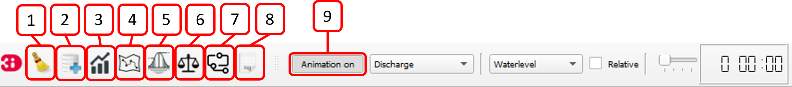
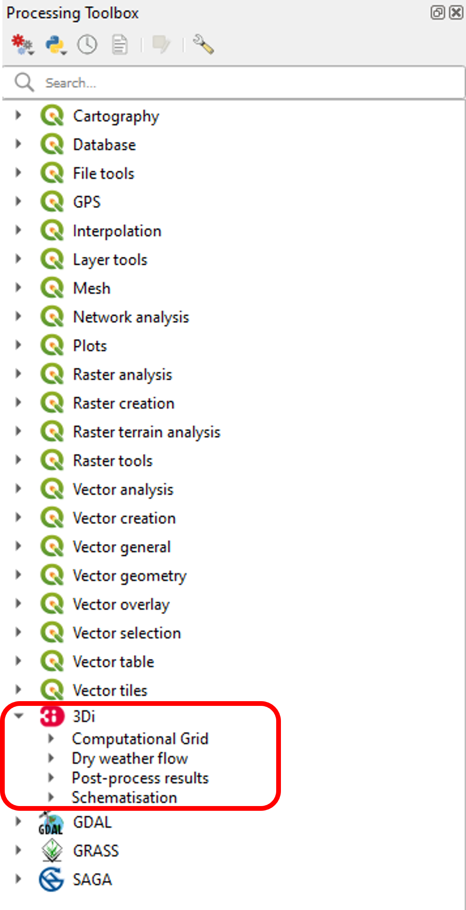

.. _3di_toolbox_plugin:

3Di Toolbox plugin
===================

The 3Di Toolbox plugin comes pre-installed with the Modeller Interface, and is made up of two parts: the **3Di Toolbox in the toolbar** and **The Processing Toolbox** as a panel. An overview for each of these is given below.

Functionality
---------------
With this plugin you can:

* Load schematisations
* Validate schematisation
* Load results
* Visualize and analyze a range results
* import GWSW HydX and SUF-HYD
* Migrate Spatialites

.. VRAAG: is dit lijstje goed zo?

.. _3ditoolbox_overview:

3Di Toolbox in the toolbar
---------------------------

In the Modeller Interface the 3Di Toolbox is directly available in the toolbar.

Overview of the 3Di Toolbox
^^^^^^^^^^^^^^^^^^^^^^^^^^^^

1) Clear cache 
2) :ref:`load_model_results`: loads schematisations and the 3Di results of a model simulation.
3) :ref:`graph_tool`: can be used for visualizing model results over time.
4) :ref:`sideviewtool`: gives a side view of the water hight a pipeline 
5) :ref:`statisticaltool`: can be used to calculate sewerage statistics from 3Di results.
6) :ref:`waterbalance`: computes the water balance in a sub-domain of your model.
7) :ref:`watershed_tool`: allows you to find what is upstream and downstream of any point or area in a 3Di simulation result. 
8) Log files
9) :ref:`animationtool`: allows a spacial view of the results, which can be played back and forth in time. Water level, velocities and discharges can be visualized by this tool.

.. _processing_toolbox:

Processing Toolbox
----------------------
The 3Di toolbox is activated by clicking on 'processing' in the menubar > 'toolbox'.
After activating the processing toolbox, a list of tools become available. The tools are partly QGIS processing tools and partly specific 3Di tools. 

Overview of the Processing Toolbox
^^^^^^^^^^^^^^^^^^^^^^^^^^^^^^^^^^

1) **Computational Grid:** can be used to calculate the computational grid from a schematisation or from a gridadmin.h5 file
2) **Dry weather flow:** calculate the dry weather flow on connection nodes for a given schematisation and simulation settings. Produces a formatted csv that can be used as a 1d lateral in the 3Di API Client.
3) **Post-process results:** calculates the water depth for a simulation in a specified timestep. 
4) **Schematisation:**

   * **Check Schematisation:** checks the validity of your schematisation.
   * **Guess Indicators:** fills field with NULL values with appropriate guesses.
   * **Import GWSW HydX:**  processing algorithm to import data in the format of the Dutch "Gegevenswoordenboek Stedelijk Water (GWSW)".
   * **Import Sufhyd:**  processing algorithm to import data in the format of a SUF-HYD.
   * **Migrate Spatialite:** updates an old database schema to the current version

.. VRAAG: wat doet migrate spatialite? -> nog beter uitleggen.

.. TODO: verwijzing nog toevoegen naar i_analyzing_results

