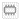

.. _results_aggregation:

Results aggregation tool
========================
With the Results Aggregation Tool (|resultsaggregationtoolbar|) you can quickly aggregate the results over the entire simulation (or a part of it), using preset outputs and styling.
Running the tool produces temporary layers. If you want to save the output export the layers as a GeoPackage by clicking |savescratchlayer|. To save the styling with your GeoPackage right-click the temporary layer > Styles > Copy Style > All Style Categories. Paste the styling by right-clicking the GeoPackage-layer > Styles > Paste Style > All Style Categories. Save the styling to the GeoPackage, by making it the default styling. Go to the Layer Properties by double clicking the layer > Symbology > Style (at the bottom) > Save as Default > Save default styling to Datasource Database). Whenever you add this GeoPackage to your Modeller Interface at a later time it will automatically load with this styling.

	

	
Options
^^^^^^^
**Inputs**

*3Di result:* Select the 3Di results you want to run you aggregation on. From the drop-down menu you can select any set of results you have loaded with the :ref:`3di_results_manager`.
*Preset:* From the drop-down menu you can choose to select a preset. This is optional and can be left to '(no preset selected)' if so desired. You can choose from the following presets:

- *Maximum water level* calculates the maximum water level for nodes and cells within the chosen time filter.
- *Change in water level* calculates the difference in water level (last - first). The NULL values in the cell (when the cell is dry) are replaced by the cells lowest pixel elevation (z_coordinate).
- *Source or sink (mm)* calculates by how many milimeters a node or cell is a net source or sink. A positive result indicates a source. A negative result indicates a sink.
- *Flow pattern* generates a flow pattern map. The aggregation calculates total outflow per node in x and y-directions, resampled to grid_space. In the styling that is applied, the shade of blue and the rotation of the arrows are based on the resultant of these two.
- *Timestep reduction analysis* calculates the percentage of time that the flow through each flowline limits the calculation timestep to below 1, 3 or 5 seconds. The styling highlights the flowlines that have a timestep of:

	- < 1 second 10% of the time and/or
	- < 3 seconds 50% of the time and/or
	- < 5 seconds 80% of the time
- *Water on street duration* calculates the duration that the water level is above the manhole drain level.

**Filters**

- *Extent* gives you the option to limit the analysis for only a part of your model. This can be done by defining a bounding box (this can be calculated from a Layer, Layout Map or Bookmark). Additionally you can set the map canvas as the bounding box. By default the entire model is taken into account. 
- *Temporal* gives you the option to limit the analysis for only a part of the simulation defined by the start and end time (e.g. the first hour). By default the full simulation is taken into account. 
- *Type* gives you the option to only look at manhole nodes. When unchecked it takes all nodes into account. This is automatically checked for the 'water on street duration'.

**Aggregations**

- *Variables*: Select the desired variable from the drop-down menu. If you've select a Preset in the Input-tab the required variables are automatically added.

	- Flowline: Discharge
	- Flowline: Velocity
	- Flowline: Wet cross-sectional area
	- Flowline: Discharge in interflow layer
	- Flowline: Velocity in interflow layer
	- Flowline: Max. possible timestep
	- Flowline: Water level gradient
	- Flowline: Bed level gradient
	- Flowline: Water level at cross-section
	- Node: Water level
	- Node: Volume	
	- Node: Rain intensity
	- Node: Rain depth
	- Node: Infiltration rate
	- Node: Infiltration rate per m\ :sup:`2`
	- Node: Wet surface area
	- Node: Flow velocity at cell center
	- Node: Flow velocity in x-direction at cell center
	- Node: Flow velocity in y-direction at cell center
	- Node: Lateral discharge
	- Node: Lateral discharge per m\ :sup:`2`
	- Node: Intercepted volume
	- Node: Intercepted volume per m\ :sup:`2`
	- Node: Surface sources and sinks discharge
	- Node: Surface sources and sinks discharge per m\ :sup:`2`
	- Node: Node inflow in x-direction
	- Node: Node inflow in x-direction per m\ :sup:`2`
	- Node: Node inflow in y-direction
	- Node: Node inflow in y-direction per m\ :sup:`2`
	- Node: Node outflow in x-direction
	- Node: Node outflow in x-direction per m\ :sup:`2`
	- Node: Node outflow in y-direction
	- Node: Node outflow in y-direction per m\ :sup:`2`
	
- *Direction*: Select the desired direction for the analysis, choosing from: net, positive, negative or absolute. For some variables this is greyed out (e.g. Node: Water level).

- *Method*: Select the required aggregation method:

	- Sum: cumulative value over all timesteps
	- Max: maximum value over all timesteps
	- Time to max: the time it takes to reach the maximum value
	- Min: minimum value over all timesteps
	- Mean: mean value over all timesteps
	- Median: median value over all timesteps
	- First: First value
	- First non-empty: first actual value. When a node is dry, it has the value NULL. When a node receives water, this changes and become the first non-empty value.
	- Last: Last value
	- Last non-empty: last actual value. When a node/flowline is dry, it has the value NULL. When a node/flowline receives water, this changes. The last non-empty value is the last value in a node or flowline with any non-NULL value.
	- Percentage of time above threshold: the percentage of time that a value is above the defined threshold.
	- Percentage of time below threshold: the percentage of time that a value is below the defined threshold.
	- Time above threshold: the time that a value is above the defined threshold.

- *Threshold*: Determine the threshold that is taken into account with the aggregation that used a threshold.

- *Units*: The units that correspond to the selected variable and associated aggregation method are automatically updated.
	
With the '+' and '-' buttons at the top right, you can add or remove variables.

**Outputs and styling**

For every output you can determine the way the output should be styled once the aggregation is complete. The results of the aggregation is a table with the result(s) of the aggregation added in one or more attributes ("Field"). A distinction is made between Flowlines, Cells, Nodse and Rasters.
You can change the name of the output layer is desired. For the nodes and rasters you can include a resolution.
