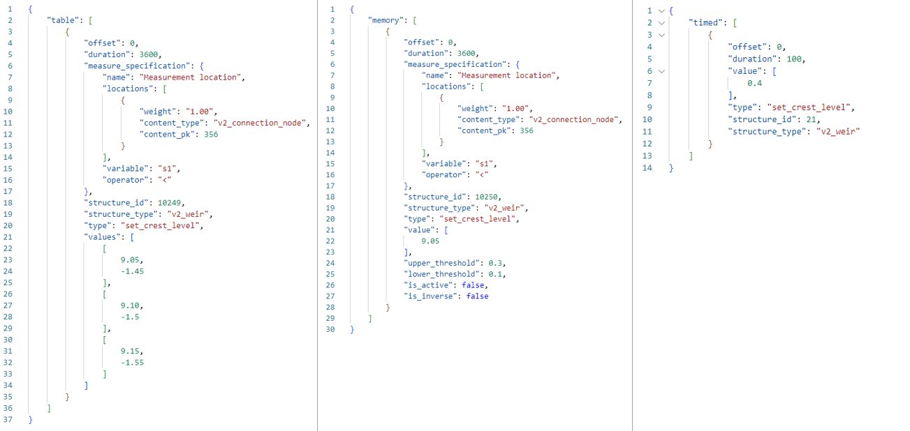

.. _simulate_api_qgis:

Simulating with the 3Di Modeller Interface
##########################################

This section explains the available options for running simulations in the 3Di Modeller Interface.

Starting a simulation
=====================

#) Open the 3Di Modeller Interface
#) Activate the '3Di Models and Simulation panel' by clicking on the pictogram (|modelsSimulations|) in the toolbar.
#) Click on the 'Simulate' icon.
#) Click on 'New Simulation'.
#) Select the model you want to simulate. If you have access to more than one organisation, choose the organisation that billing should go to. Then click on 'Next'.
#) A panel with different scenario options will now appear, check the options you want to be used in the calculations of your simulation:

    * Initial condition

      * :ref:`simulate_api_qgis_initial_conditions`: To define the use of initial water levels in 1D, 2D or Ground water or a (previously) saved state.

    * Forcings

      * :ref:`simulate_api_qgis_boundary_conditions`: Boundary conditions are taken from the spatialite directly.
      * :ref:`simulate_api_qgis_laterals`: Select laterals to use in the model.
      * :ref:`dry_weather_flow`: Include dry weather flow in your model.
      * :ref:`simulate_api_qgis_precipitation`: Define precipitation in the model.
      * :ref:`wind_apiclient`: Define wind in the model.
      * Raster edits
      * Leakage
      * Sources and sinks
      * Local or time series rain
      * Obstacle edits

          .. VRAAG: De opties die ik nu niet heb beschreven; zijn die in gebruik? Ik heb meerdere modellen geprobeerd maar ik kon ze nooit aanklikken

    * Events

      * :ref:`sim_structure_controls`: Modify hydraulic structure parameters.
      * :ref:`simulate_api_qgis_breaches`: To select a breach to open in the model.

    * Other options

      * :ref:`generate_api_qgis_saved_state`: To save the end result of the simulation as a saved state.
      * :ref:`simulate_api_qgis_post_processing`: This is a feature that is only available for users of organisations that have a Lizard account. It enables you to store the results in the cloud and it triggers automated post-processing of water depth, water levels, time of arrival, flood hazard rating and damage estimations maps.
      * :ref:`simulate_api_qgis_multi_sim` (becomes available when using either breaches or precipitation): To define multiple simulations with rainfall or breaches. Useful when simulating multiple events on the same model.

#) Name the simulation. Users within your organisation will be able to find this simulation and its results based on the name. Adding 'Tags' can clarify for other users what your simulation calculated or can be used to assign a simulation a certain project name or number.
#) Set the 'Duration' of the simulation. Optionally, you can specify the time zone for the simulation duration. This is especially relevant if you use radar rain in your simulation that is also defined in a specific time zone.
#) The next steps depend on the selection of options from the initial screen of the wizard (step 6). Unchecked options will be omitted by the wizard. The different options are explained below.
#) If you want, change the :ref:`simulation_settings`. The setting values that are shown are the ones you have specified in the schematisation spatialite. This page in the simulation wizard allows you to override specific  settings for this specific simulation. This does not change the values of the simulation settings in the spatialite.
#) Click *Add to queue* to start the simulation. 

You can follow the progress of your simulation by clicking on the *Simulate* icon in the :ref:`models_simulation_panel`. You can also terminate your simulation by clicking on 'Stop Simulation'. 

Once the simulation is done the results will be available for 7 days. For information on how to download, view and analyze results, see :ref:`mi_analysing_results`.

.. note::
    If you want to remove a simulation from the queue before it has started, use the :ref:`Live status page on 3Di Management <3di_management_live_status>`.

.. _simulation_wizard_substances:

Substances
==========

When using the water quality module, you define the substances to be used on the substances page. Each substance must have a unique name. Specifying the units is optional; units can be any text, with a max length of 16 characters. 

.. _simulate_api_qgis_boundary_conditions:

Boundary conditions
===================

* **From simulation template**: If the 3Di model contains boundary conditions, a timeseries for each boundary condition will be included in the simulation template. 

* **Upload files(s)**: You can upload CSV files to replace the boundary conditions that are included in the simulation template. 

  * Upload a CSV file (see :ref:`boundary_conditions_csv_file_format` for the format requirements).
  
  * Set the time units used in your CSV file (hours, minutes, or seconds). The default is minutes (mins), because this is the time unit that is used in the 3Di spatialite.
  
  * If the option 'Interpolate' is checked, the value between time steps will be linearly interpolated. For example, consider the following time series:

    .. list-table:: Timeseries example for interpolation
      :header-rows: 1

      * - time [hours]
        - discharge [m\ :sup:`3`/s]
      * - 0
        - 0
      * - 1
        - 16
      * - 3
        - 10

    If *interpolate* is checked, the discharge after half an hour will be 8 m\ :sup:`3`/s. If it is not checked, the discharge after half an hour will be 0 m\ :sup:`3`/s.

.. Note:: You can only replace *all* boundary conditions. For example, if your model contains two 1D boundary conditions and five 2D boundary condition, the CSV file for the 1D boundary conditions should contain time series for both of the two 1D boundary conditions and the CSV file for the 2D boundary conditions should contain time series for all five 2D boundary conditions. The simulation wizard will merge them into a single JSON file that is sent to the API

.. _boundary_conditions_csv_file_format:

Boundary conditions CSV file format
-----------------------------------

The columns in the CSV file are to be comma-separated. 

The CSV file input should have the following columns:

- "id": integer; is the id of the corresponding row in the 1D Boundary Conditions table in the spatialite
- "timeseries": a CSV-formatted text field: pairs of time step (in minutes or seconds) and value (in m\ :sup:`3`/s, m, or m/m, depending on the boundary condition type). The timestep is separated from the value by a comma and lines are separated from one another by a newline.

Any additional columns will be ignored.

The easiest way to generate such a file is by exporting it from the *1D Boundary Condition* or *2D Boundary Condition* layers of your schematisation, see :ref:`exporting_boundary_condition_data`.

Example as a table:

.. list-table:: Boundary conditions CSV file format
   :header-rows: 1

   * - id
     - timeseries
   * - 4
     - 0,1.2

       99999,1.2
   * - 5
     - 0,2.1

       99999,2.1
   * - 6
     - 0,1.3

       99999,5.6
   * - 7
     - 0,8.2

       99999,1.0
   * - 8
     - 0,63.307

       99999,63.307

Text example::

    id,timeseries
    "4","0,1.2
         99999,1.2"
    "5","0,2.1
         99999,2.1"
    "6","0,1.3
         99999,5.6"
    "7","0,8.2
         99999,1.0"
    "8","0,63.307
         99999,63.307"

.. _exporting_boundary_condition_data:

Editing a time series for boundary conditions
---------------------------------------------

To run a simulation in which only one or a few boundary conditions have a different time series, take the following steps. The instructions are for 1D Boundary conditions; for 2D Boundary conditions, the same instructions apply. 

- Load your schematisation
- In the Layers panel, right click on the layer '1D Boundary condition' > 'Export' > 'Save features as..'
- For 'Format', choose 'Comma Separated Value [CSV]'
- Choose a 'File name' and location to save the file to
- Click 'Select fields to export and their export options'
- Make sure only the checkboxes for the fields 'id' and 'timeseries' are checked
- Under 'Geometry' > 'Geometry type' choose 'No Geometry'
- Under 'Layer options', make sure the 'Separator' is 'comma'
- Click 'Ok' to save the file
- Open the file in a text editor to edit the values and save the CSV file
- You can now select the edited CSV file under the option "Upload file(s)" when adding scenario information
     

Running a simulation without boundary conditions
------------------------------------------------

If the 3Di model contains boundary conditions, you can only run a simulation if a time series is specified for each one of them. To run a simulation without boundary conditions, you will need to remove them from your schematisation and generate a new 3Di model. 

.. _simulate_api_qgis_initial_conditions:

Initial conditions
==================

Initial conditions either refer to the use of saved state file, or the use of initial water level in 1D, 2D or groundwater (2D):

1D options:

- Global value: a generic initial water level value in m MSL which is applied in all 1D nodes of the model.
- From Spatialite: the initial water level as defined in the column initial_waterlevel in the connection nodes in the spatialite.

2D Surface Water options:

- Global value: a generic initial water level value in m MSL which is applied in all 2D nodes of the model.
- Online Raster: the initial water level raster as uploaded with the model to the model database.
- Local Raster: a local the initial water level raster.
- Aggregation method: this can mean, min or max.

2D Groundwater options:

- Global value: a generic initial water level value in m MSL which is applied in all 2D groundwater nodes of the model.
- Online Raster: the initial water level raster as uploaded with the model to the model database.
- Local Raster: a local the initial water level raster.
- Aggregation method: this can mean, min or max.

.. VRAAG: moet er nog meer uitleg bij de aggregation method?

|

.. _simulate_api_qgis_laterals:

Laterals
========

For an explanation of what laterals are and how 3Di uses them, see :ref:`laterals`.

Laterals can be uploaded using .csv format for 1D and/or 2D. Depending on the type of laterals (1D or 2D), specific file format requirements apply, see :ref:`laterals_1d_csv_format_requirements` and :ref:`laterals_2d_csv_format_requirements`.

You can switch the 1D and/or the 2D laterals on and off by checking or unchecking the checkbox for the group.

If the option 'Interpolate' is checked, the value between time steps will be linearly interpolated. If not, the value will be constant until the next time frame starts.

.. note:: 
    
	If the box *Use 1D laterals from the simulation template* is checked and *Upload 1D laterals* is also checked, the uploaded laterals are added to the laterals already present in the simulation template. The same applies to 2D laterals.

.. note:: 
    
	The time units you choose should match the time units used in the CSV file. The default is minutes (mins), because this is the time unit that is used in the 3Di spatialite

.. _laterals_1d_csv_format_requirements:

1D laterals file format
-----------------------

The CSV file for 1D laterals should look like this::

    id,connection_node_id,timeseries
    1,3,"0,0.5
    60,1.0
    120,2.0"
    2,2,"0,0.5
    60,1.0
    120,2.0"
    3,1,"0,0.5
    60,1.0
    120,2.0"
    4,4,"0,0.5
    60,1.0
    120,2.0"

Requirements: 

- Columns are comma-separated

- The file includes the columns "id", "connection_node_id", and "timeseries". Any additional columns are ignored; the sequence of the columns is not important.

- The *timeseries* column contains a CSV-style list of *time,value* pairs, enclosed by double quotes. The rows in this nested table are separated by a newline, the values within the row are comma-separated.
 
- The time units in the CSV file must match the time units chosen in the user interface. The default is minutes (mins), because this is the time unit that is used in the 3Di spatialite

Generating a CSV file for 1D laterals
-------------------------------------

- Load your schematisation
- In the Layers panel, right click on the layer '1D lateral' > 'Export' > 'Save features as..'
- For 'Format', choose 'Comma Separated Value [CSV]'
- Choose a 'File name' and location to save the file to
- Click 'Select fields to export and their export options'
- Make sure only the checkboxes for the fields 'id', 'connection_node_id' and 'timeseries' are checked
- Under 'Geometry' > 'Geometry type' choose 'No Geometry'
- Under 'Layer options', make sure the 'Separator' is 'comma'
- Click 'Ok' to save the file
- You can now select the CSV file under the option "Upload file(s)" when adding scenario information. The time units in the spatialite (and therefore in the exported CSV) are minutes.

.. _laterals_2d_csv_format_requirements:

2D laterals file format
-----------------------

The CSV file for 2D laterals should look like this::

    X,Y,id,timeseries
    4.73305012754464,52.5607362843091,1,"0,0.5
    60,1.0
    120,2.0"
    4.73149460853063,52.5589740526876,2,"0,0.5
    60,1.0
    120,2.0"
    4.73018087976208,52.5556893490626,3,"0,2.5
    60,2.0
    120,5.0"

|

Requirements: 

- Columns are comma-separated

- The file includes the columns "x", "y", "id", "connection_node_id", and "timeseries". Any additional columns are ignored; the sequence of the columns is not important.

- The *timeseries* column contains a CSV-style list of *time,value* pairs, enclosed by double quotes. The rows in this nested table are separated by a newline, the values within the row are comma-separated.

- The "x" and "y" fields contain longitude/latitude coordinates in the spatial reference system WGS84 (EPSG:4326).
 
- The time units in the CSV file must match the time units chosen in the user interface. The default is minutes (mins), because this is the time unit that is used in the 3Di spatialite

Generating a CSV file for 2D laterals
-------------------------------------

- Load your schematisation
- In the Layers panel, right click on the layer '2D lateral' > 'Export' > 'Save features as..'
- For 'Format', choose 'Comma Separated Value [CSV]'
- Choose a 'File name' and location to save the file to
- As CRS, choose 'EPGS: 4326 - WGS 84'
- Click 'Select fields to export and their export options'
- Make sure only the checkboxes for the fields 'id', 'type' and 'timeseries' are checked
- Under 'Geometry', make sure the 'Geometry type' is 'Automatic'
- Under 'Layer options', set GEOMETRY to 'AS_XY'
- Under 'Layer options', make sure the 'Separator' is 'comma'
- Click 'Ok' to save the file
- You can now select the CSV file under the option "Upload file(s)" when adding scenario information

.. _laterals_substance_concentrations:

Substance concentrations in laterals
------------------------------------

If you have defined one or more substances on the :ref:`simulation_wizard_substances` page, you can upload substance concentrations time series for each of the laterals you upload.

The CSV file for substance concentrations added to 1D or 2D laterals should look like this::

    id,timeseries
    1,"0,0.5
    60,1.0
    120,2.0"
    2,"0,0.5
    60,1.0
    120,2.0"
    3,"0,0.5
    60,1.0
    120,2.0"
    4,"0,0.5
    60,1.0
    120,2.0"

Requirements: 

- Columns are comma-separated

- The file includes the columns "id", and "timeseries". The id's must match the ids in the uploaded 1D or 2D lateral discharge CSV. Any additional columns are ignored; the sequence of the columns is not important.

- The *timeseries* column contains a CSV-style list of *time,value* pairs, enclosed by double quotes. The rows in this nested table are separated by a newline, the values within the row are comma-separated.
 
- The time units in the CSV file must match the time units chosen in the user interface. The default is minutes (mins), because this is the time unit that is used in the 3Di spatialite

.. _dry_weather_flow:

Dry weather flow
================

Dry weather flow (DWF) is a 1D :ref:`lateral<laterals>` with one discharge value each of hour of the day. They are used to simulate the wastewater produced by households or industry, which usually follows a pattern that varies troughout the day. Ususally, dry weather flow is defined in the schematisation, so that 3Di reads it into the simulation template. 

The dry weather flow can also be added as a CSV file when starting the simulation. Follow these steps:

* 'Upload dry weather flow CSV'
* If the option 'Interpolate' is checked, the value between time steps will be linearly interpolated. 
* If the option 'CSV contains 24 hour time series' is checked, 24-hour timeseries are assumed to start and end at midnight. The simulation start and end time will determine which part of the timeseries is used.

The dry weather flow that you add to your simulation, will be added to the simulation as lateral discharges. If lateral discharges on the same connection nodes already exists, the dry weather flow will be added to these lateral discharges.

**Follow these steps to generate the dry weather flow CSV file:**

- Open the Processing Toolbox. You can find it by going to 'Processing' in the menubar and select 'Toolbox'. Alternatively, you can click |processing_toolbox_icon| in the attributes toolbar or use the keyboard shortcut Ctrl + Alt + T.
- Click *3Di* > *Dry weather flow* > *DWF Calculator*
- Set the *Input spatialite*
- Set a name and location to save the file under *Output CSV*

  - 'Input spatialite': valid spatialite containing the schematisation of a 3Di model
  - 'Start time of day': at which hour of the day the simulation is started (HH:MM:SS)
  - 'Simulation duration': amount of time the simulation is run (hours)
  - 'DWF progress file': timeseries that contains the fraction of the maximum dry weather flow at each hour of the day. 

      | Formatted as follows:
      | '0, 0.03'
      | '1, 0.015'
      | ...
      | '23, 0.04'
      | Defaults to a pattern specified by Rioned.

  - 'Output CSV': csv file to which the output 1d laterals are saved. This will be the input used by the API Client.

.. |processing_toolbox_icon| image:: /image/pictogram_processing_toolbox.png

|

.. _simulate_api_qgis_precipitation:

Precipitation
=============

There are several options to define a precipitation event for your simulation. In the drop-down menu, one can choose 'Constant', 'Custom', 'Design' and 'Radar - NL Only' events. 

Constant
--------

* 'Start after:' defines an offset. The offset is the duration between start simulation and the start of the rainfall event.
* 'Stop after:' the duration between the start of the simulation and the end of the rain event.
* 'Intensity:' The rain intensity (in mm/h) is uniform and constant in the given time frame. The rain intensity preview provides the rain intensity throughout the simulation in the form of a histogram.

From CSV
--------

* 'Start after:' defines an offset. The offset is the duration between the start of the simulation and the start of the rainfall event.
* 'Units:' select the units of the uploaded file.
* 'Interpolate:' will gradually change the rain intensity throughout a time series. Without the interpolate function the rain intensity will stay constant within a time step and will make an abrupt transition to the next time step. 
* Upload bar: the event is defined in a CSV file. The default format is in minutes, and the rainfall in mm for that time step. Please keep in mind that the duration of the rain in the custom format cannot exceed the duration of the simulation. Example of the format of a CSV file:

  .. figure:: image/d_qgisplugin_apiclient_csv_format.png
      :alt: Example CSV

From NetCDF
-----------

* 'The NetCDF contains:' choose between time series of global values and raster time series (for spatially and temporally varying precipitation data). 
* Upload bar: the event is defined in a NetCDF file. Use the processing algorithm *Rasters to spatiotemporal NetCDF* to generate such a file from a folder of tiffs. Please keep in mind that the duration of the rain in the custom format cannot exceed the duration of the simulation.

Design
------

* 'Start after:' defines an offset. The offset is the duration between start simulation and the start of the rainfall event.
* 'Design number:' a design number between 1 and 16 must be filled in. These numbers correlate to predetermined rain events, with differing return periods, that fall homogeneous over the entire model. Numbers 1 to 10 originate from `RIONED <https://www.riool.net/bui01-bui10>`_ and are heterogeneous in time. Numbers 11 to 16 have a constant rain intensity:

    | Rain 11 statistically occurs once every 100 years. The duration of this event is 1 hour with a constant rain intensity of 70 mm/h. (T= 100.0 year, V=70 mm, Standard rain event (local) from Delta Programme 2019).
    | Rain 12 statistically occurs once every 250 years. The duration of this event is 1 hour with a constant rain intensity of 90 mm/h. (T=250.0 year, V=90 mm, Standard rain event (local) from Delta Programme 2019).
    | Rain 13 statistically occurs once every 1000 years. The duration of this event is 2 hours, with a constant rain intensity of 80 mm/h. (T=1000.0 year, V=160 mm, Standard rain event (local) from Delta Programme 2019).
    | Rain 14 statistically occurs once every 100 years. The duration of this event is 48 hours, with a constant rain intensity of 2.5 mm/h. (T=100.0 year, V=120 mm, Standard rain event (regional) from Delta Programme 2019).
    | Rain 15 statistically occurs once every 250 years. The duration of this event is 48 hours, with a constant rain intensity of 2.7 mm/h. (T=250.0 year, V=130 mm, Standard rain event (regional) from Delta Programme 2019).
    | Rain 16 statistically occurs once every 1000 years. The duration of this event is 48 hours, with a constant rain intensity of 3.4 mm/h. (T=1000.0 year, V=160 mm, Standard rain event (regional) from Delta Programme 2019).

    These so-called design rain events are time series, which are traditionally used to test the functioning of a sewerage system in the Netherlands.

Radar - NL Only 
---------------

This option is only available in the Netherlands and uses historical rainfall data that is based on radar rain images. Providing temporally and spatially varying rain information. The Dutch `Nationale Regenradar <https://nationaleregenradar.nl/>`_ is available for all Dutch applications. On request, the information from other radars can be made available to 3Di as well.

* 'Start after:' defines an offset. The offset is the duration between start simulation and the start of the rainfall event.
* 'Stop after:' the duration between the start of the simulation and the end of the rain event.

.. note::
    
    Radar rain uses the time zone Central European Time. Make sure you select the same time zone for the start of your simulation on the *Duration* page to avoid confusion.

.. _wind_apiclient:

Wind
====

Wind in 3Di applies to 2D surface water. You can choose between a 'Constant' or a 'Custom' type of wind. Read more about wind and the physics used by 3Di here: :ref:`wind_effects`.

Constant
--------

* 'Start after:' defining an offset for the drag coefficient. The offset is the duration between the start of the simulation and the start of the wind event.
* 'Stop after:' the duration between the start of the simulation and the end of the wind event.
* 'Windspeed:' the constant windspeed that will be added for the given time range (in m/s or km/h).
* 'Drag coefficient:' by increasing the drag coefficient, you increase the influence of the wind. It has a default value of 0,005.
* 'Direction:' the (meteorological) wind direction is defined as the direction from which the wind originates, measured in degrees clockwise from due north. Therefore, wind blowing toward the south has a direction of 0 degrees. You can either use the wind rose to depict which way the wind is blowing, or enter the direction manually.

Custom
------

* 'Start after:' defining an offset for the drag coefficient. The offset is the duration between the start of the simulation and the start of the wind event.
* 'Drag coefficient:' by increasing the drag coefficient, you increase the influence of the wind. It has a default value of 0,005.
* 'Values:' upload a CSV in the format minutes, wind speed in m/s and wind direction, both for that time step.Here is and example of the format of a CSV file:

  .. figure:: image/d_qgisplugin_apiclient_wind_csv.png
    :alt: Overview new simulation

* the 'Interpolate' options will gradually change the wind speed or wind direction throughout a time series. Without the interpolate functions the wind speed and wind direction will stay constant within the time steps and will make an abrupt transition to the next time step.

|

.. _sim_structure_controls:

Structure controls
==================

Several structure properties can be changed during the simulation, such as the crest or gate level, pump capacity or discharge coefficients. These properties can be changed directly (using a timed control), or rules can be defined to let these properties react dynamically to changes in water level, volume, discharge, or flow velocity. See :ref:`control` for more information.

From simulation template
------------------------

When structure controls have been defined in the spatialite, this information will be read into the :ref:`Simulation template<simulation_and_simulation_templates>` when generating a :ref:`threedimodel`. In the simulation wizard, the option 'From simulation template' will become available, so you can switch off some or all of the structure controls that are included in the simulation template.

Upload file
-----------

You can supply a JSON file that defines additional structure controls to be used in the simulation. If structure controls are already defined in the simulation template, the structure controls in the file will be *added* to those. The structure of the file is explained below. You can combine timed, table, and memory control in the same file.

.. _sim_timed_control:

Timed control
^^^^^^^^^^^^^

The following arguments can be specified for a :ref:`timed_control`:

.. list-table:: Arguments for a timed control
   :header-rows: 1

   * - Name
     - Type
     - Units
     - Required
     - Description
     - Comments
   * - offset
     - integer
     - seconds
     - Yes
     - Offset of event in simulation
     - \-
   * - duration
     - integer
     - seconds
     - Yes
     - Defines how long the control structure is active
     - \-
   * - value
     - decimal number
     - m MSL, \-, m3/s
     - Yes
     - Structure property will be set to this value
     - Units depend on the *type*. Crest and gate levels in m MSL, discharge coefficients are unitless, pump capacities in m3/s.
   * - type
     - string
     - \- 
     - Yes
     - Defines which structure property to set
     - Options are: 'set_discharge_coefficients', 'set_crest_level', 'set_gate_level', 'set_pump_capacity'
   * - structure_id
     - integer
     - \-
     - No
     - ID of the structure as defined in the spatialite
     - Either structure_id or grid_id must be specified
   * - structure_type
     - string
     - \-
     - Yes
     - The type of structure that is to be controlled
     - Valid values: 'v2_pumpstation', 'v2_pipe', 'v2_orifice', 'v2_culvert', 'v2_weir', 'v2_channel'
   * - grid_id
     - integer
     - \-
     - No
     - ID of the flowline or pump that is to be controlled
     - Either structure_id or grid_id must be specified

The *value* parameter must be a list, even if it contains 1 value (e.g. [0.3]), except for the *set_discharge_coefficients* action that expects a value for both flow directions (e.g. [0.8, 0.0]).

The following example JSON file sets the discharge coefficients of weir 21 to 0.4 (positive) and 0.8 (negative) for the first 100 s of the simulation::

	{
		"timed": [
			{
			  "offset": 0,
			  "duration": 100,
			  "value": [
				0.4, 0.8
			  ],
			  "type": "set_discharge_coefficients",
			  "structure_id": 21,
			  "structure_type": "v2_weir"
			}
		]
	}

.. _sim_memory_control:

Memory control
^^^^^^^^^^^^^^

The following arguments can be specified for a :ref:`memory_control`:

.. list-table:: Arguments for a memory control
   :header-rows: 1

   * - Name
     - Type
     - Units
     - Required
     - Description
     - Comments
   * - offset
     - integer
     - seconds
     - Yes
     - Offset of event in simulation
     - \-
   * - duration
     - integer
     - seconds
     - Yes
     - Defines how long the control structure is active
     - \-
   * - measure_specification
     - :ref:`measure_specification`
     - \-
     - Yes
     - Specifies how the value to which the control should react is measured
     - \-
   * - structure_id
     - integer
     - \-
     - No
     - ID of the structure as defined in the spatialite
     - Either structure_id or grid_id must be specified
   * - structure_type
     - string
     - \-
     - Yes
     - The type of structure that is to be controlled
     - Valid values: 'v2_pumpstation', 'v2_pipe', 'v2_orifice', 'v2_culvert', 'v2_weir', 'v2_channel'
   * - type
     - string
     - \- 
     - Yes
     - Defines which structure property to set
     - Options are: 'set_discharge_coefficients', 'set_crest_level', 'set_gate_level', 'set_pump_capacity'
   * - value
     - list of decimal number(s)
     - m MSL, \-, m3/s
     - Yes
     - Structure property will be set to this value
     - Units depend on the *type*. Crest and gate levels in m MSL, discharge coefficients are unitless, pump capacities in m3/s.
   * - grid_id
     - integer
     - \-
     - No     
     - ID of the flowline or pump that is to be controlled
     - Either structure_id or grid_id must be specified
   * - upper_threshold
     - decimal number
     - m MSL, m3, m/s, m3/s
     - No
     - \-
     - \-
   * - lower_threshold
     - decimal number
     - m MSL, m3, m/s, m3/s
     - No
     - \-
     - \-
   * - is_active
     - boolean
     - \-
     - No
     - when True the initial state of the target is active
     - \-
   * - is_inverse
     - boolean
     - \-
     - No
     - when True the target will become active when the lower threshold has been reached
     - \- 

The *value* parameter must be a list, even if it contains 1 value (e.g. [0.3]), except for the *set_discharge_coefficients* action that expects a value for both flow directions (e.g. [0.8, 0.0]).

The following example JSON file activates a memory control after one hour since the start of the simulation, that sets the crest level of weir 13 to 9.05 m MSL when the water level at connection node 356 rises above 0.3m. It will go back to its initial value when the water level falls below 0.1 m MSL::

	{
		"memory": [
			{
			  "offset": 3600,
			  "duration": 259200,
			  "measure_specification": {
				"locations": [
				  {
					"weight": 1.00,
					"content_type": "v2_connection_node",
					"content_pk": 356
				  }
				],
				"variable": "s1",
				"operator": ">"
			  },
			  "structure_id": 13,
			  "structure_type": "v2_weir",
			  "type": "set_crest_level",
			  "value": [
				9.05
			  ],
			  "upper_threshold": 0.3,
			  "lower_threshold": 0.1,
			  "is_active": false,
			  "is_inverse": false
			}
		]
	}

The figure below shows three examples of JSON files.

.. _sim_table_control:

Table control
^^^^^^^^^^^^^

The following arguments can be specified for a :ref:`table_control`:

.. list-table:: Arguments for a table control
   :header-rows: 1

   * - Name
     - Type
     - Units
     - Required
     - Description
     - Comments
   * - offset
     - integer
     - seconds
     - Yes
     - Offset of event in simulation
     - \-
   * - duration
     - integer
     - seconds
     - Yes
     - Defines how long the control structure is active
     - \-
   * - measure_specification
     - :ref:`measure_specification`
     - \-
     - Yes
     - Specifies how the value to which the control should react is measured
     - \-
   * - structure_id
     - integer
     - \-
     - No
     - ID of the structure as defined in the spatialite
     - Either structure_id or grid_id must be specified
   * - structure_type
     - string
     - \-
     - Yes
     - The type of structure that is to be controlled
     - Valid values: 'v2_pumpstation', 'v2_pipe', 'v2_orifice', 'v2_culvert', 'v2_weir', 'v2_channel'
   * - type
     - string
     - \- 
     - Yes
     - Defines which structure property to set
     - Options are: 'set_discharge_coefficients', 'set_crest_level', 'set_gate_level', 'set_pump_capacity'
   * - values
     - list of decimal number(s)
     - m MSL, \-, m3/s
     - Yes
     - See :ref:`table_control_values`
     - \-
   * - grid_id
     - integer
     - \-
     - No
     - ID of the flowline or pump that is to be controlled
     - Either structure_id or grid_id must be specified

The following example JSON file activates a table control during the first hour of the simulation. It that sets the gate level of orifice 27 to an action value defined in the action table, when the water level at connection node 356 falls below the threshold value in the action table::

	{
		"table": [
			{
				"offset": 0,
				"duration": 3600,
				"measure_specification": {
					"locations": [
						{
							"weight": 1.00,
							"content_type": "v2_connection_node",
							"content_pk": 356
						}
					],
					"variable": "s1",
					"operator": "<"
				},
				"structure_id": 27,
				"structure_type": "v2_orifice",
				"type": "set_gate_level",
				"values": [
					[
						9.05,
						-1.45
					], 
					[
						9.10,
						-1.5
					],
					[
						9.15,
						-1.55
					]
				]
			}
		]
	}

.. _table_control_values:

Values parameter of table control
"""""""""""""""""""""""""""""""""

The *values* parameter is an action table, which consists of one or more (threshold, action value) pairs, e.g. [[9.05, -1.45], [9.10, -1.5], [9.15, -1.55]] 

To close/open or partially close/open a structure using the *set_discharge_coefficients* type, the values must contain three values. For example [[1.2, 0.5, 0.7]], where

- 1.2 is the threshold value

- 0.5 the action value for the positive flow direction

- 0.7 action value for the negative flow direction

Action values for *set_discharge_coefficients* type must be > 0.

For ALL operators threshold values must be ascending.

The units of the threshold values depend on the *measure_specification*. Water levels are in m MSL, volumes in m3, flow velocities in m/s, discharges in m3/s.

The units of the action values depend on the action *type*. Crest and gate levels in m MSL, discharge coefficients are unitless, pump capacities in m3/s.

.. _measure_specification:

Measure specification
"""""""""""""""""""""

A *Measure specification* defines how the value must be calculated that triggers a control structure action. It has the following parameters.

.. list-table:: Arguments for a control structure measure specification
   :header-rows: 1

   * - Name
     - Type
     - Units
     - Required
     - Description
     - Comments
   * - name
     - string
     - \-
     - No
     - A name that describes this measure specification
     - \-
   * - locations
     - list of :ref:`measure locations<measure_location>`
     - \-
     - Yes
     - \-
     - \-
   * - variable
     - string
     - \-
     - Yes
     - measurement variable, one of the following options: s1 (waterlevel), vol1 (volume), q (discharge), u1 (velocity)
     - \-
   * - operator
     - string
     - \-
     - Yes
     - e.g. >, <, >=, <=
     - \-

.. _measure_location:

Measure location
""""""""""""""""

A *Measure location* defines a location and its weight relative to other measure locations that are grouped in the same :ref:`measure_specification`. The sum of the weights for one *Measure specification* must equal 1. It is defined by the following arguments.

.. list-table:: Arguments for a control structure measure location
   :header-rows: 1

   * - Name
     - Type
     - Required
     - Description
   * - weight
     - decimal number
     - Yes
     - The weight to use for this location when calculating the weighted average of all measured values in their measure specification.
   * - content_type
     - string
     - Yes
     - spatialite table from which to select a feature to use as measure location.
   * - content_pk
     - integer
     - Yes
     - ID (primary key) of the feature to use as measure location.
   * - grid_id
     - integer
     - No
     - Computational grid ID of the node or flowline to use as measure location.
	 
	 
.. _simulate_api_qgis_breaches:

Breaches
========

The dimension of a breach in a levee can be added to determine the flow through the breach and subsequently the flood. For a description on breaches, see: :ref:`breaches`.

If you choose a model that incorporates breaches for simulation, a breaches file will be downloaded from the server and added to the layers panel when you select the desired model. The breaches will be visible in the map view. When adding a breach to your simulation the following parameters need to be filled in:

* 'ID of breach:' select the ID of the breach to be used in the simulation.
* 'Initial width:' specify the initial width of the breach.
* 'Duration till max depth:' determine the duration of the breach until it reaches its maximum depth.
* 'Start after:' defining an offset for the breach. The offset is the duration between the start of the simulation and the start of the breach event.
* 'Max breach depth:' set the maximum depth that the breach can reach.
* 'Discharge coefficient positive/negative:' these coefficients are utilized in the discharge formulation. Depending on the flow direction, the coefficients may vary.

.. VRAAG: Klopt deze uitleg zo? heb ik hem aangepast.

|

.. _generate_api_qgis_saved_state:

Generate saved state after simulation
=====================================

When you check this option the end result of the simulation will be saved as a saved state. A saved state file can be used as an initial condition. For more information, see: :ref:`saved_states`.

|

.. _simulate_api_qgis_post_processing:

Post-processing in Lizard
=========================

Storing your results in Lizard and automated post-processing is only available for users of organisations with a Lizard account.

Checking the **'Post-Processing in Lizard'** function will generate the following maps:

- water depth maps per output time step
- maximum water depth map for the whole simulation
- flood hazard rating
- rise velocity
- water level for each output time step
- maximum water level for the whole simulation
- max velocity
- rainfall

The Basic processed results are stored the 3Di output files in the Lizard platform:

- Result NetCDF (containing actual values)
- Aggregate NetCDF (availability and content dependent on user settings. required for water balance tool in Modeller Interface)
- Grid administration (gridadmin.h5 file. required to load NetCDF results in Modeller Interface)
- Calculation core logging (A zip containing logfiles)

All maps can be downloaded as GTiff, either via the interface `<https://demo.lizard.net/>`_ or via the lizard API.

**'Arrival time map'**: calculates a map showing the time of arrival of water per pixel in hours

**'Damage estimation'**: automated estimate maps of damage as a result of flooding. This option takes into account water depth and duration of flood, resulting ing the following damage maps:

- Water depth (WSS)
- Damage (direct)
- Damage (indirect)
- Total damage
- And a damage summary in csv format. For more information check the documentation here: https://docs.lizard.net/e_catalog.html#results

.. Note:: The damage estimations are only available in the Netherlands. Contact us at servicedesk@nelen-schuurmans.nl if you like to use this option and don't have access yet.

|

.. _simulate_api_qgis_multi_sim:

Multiple simulations
====================

This option becomes available when using either breaches or precipitation. You can define multiple simulations with different rainfall or breaches. Useful when simulating multiple events on the same model.

.. |modelsSimulations| image:: /image/pictogram_modelsandsimulations.png
    :scale: 90%
