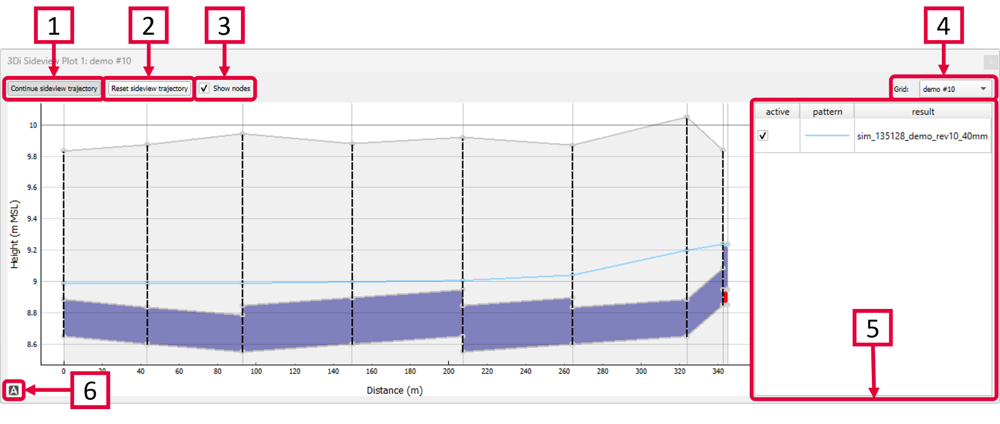

.. _sideview_tool:

Sideview Tool
===================
With the Sideview Tool (|sideviewtooltoolbar|) you can create sideviews of 1D elements, such as channels or sewerage systems, to visualise the change in water levels over time along a specific trajectory. The slider in the :ref:`temporal_controller` can be used to visualise the water levels through time. Any hydraulic structures, such as weirs or orifices are illustrated as well.

1) Click *Choose sideview trajectory* and click the 1D node you want to start the trajectory with. The network that is connected to the clicked node is illustrated by the yellow lines. Click one or more different nodes on the network to define your trajectory. The tool automatically detects the shortest route between the nodes and the trajectory is shown as a red line on the map. By hovering the cursor over the sideview-graph, a tracer appears on the corresponding location on the trajectory to help you intepret the results. Once a sideview has been added, you can click *Continue sideview trajectory* to add more nodes to the sideview.
2) Reset the sideview.
3) Check or uncheck this box to show or remove the nodes from the sideview.
4) If results from multiple grids (models) have been loaded, you can select the grid you want to analyse.
5) If you have loaded multiple simulations results from the same grid (model) they are shown here. They are simultaneously plotted in the sideview.
6) Click |A-icon| to recenter the graph. You can pan or zoom in and out on the sideview itself and along at either axis.

The Sideview Tool also works if you have only loaded the computational grid, without the results, but in that case, the Temporal Controller has no function.

\*Note: The sideview can  be exported as an image. Right-click the plot and choose 'Export...' from the drop-down menu. A new window pops up in which you can choose the desired output format. Click "Export" to select a location to save the data.

	
.. |A-icon| image:: /image/i_time_series_plotter_a_icon.png
	:scale: 120%

