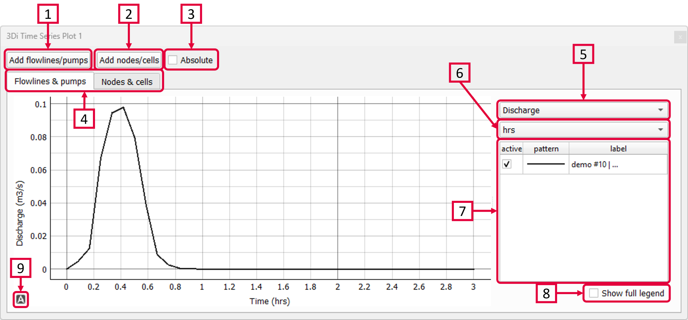

.. _sideview_tool:

Sideview Tool
===================
With the Sideview Tool (|sideviewtooltoolbar|) you can create sideviews of 1D elements, such as channels or sewerage systems to visualise the water levels through time.

2) A new panel opens. Click ‘Choose sideview trajectory’. 
3) A new layer is created and is directly shown with yellow lines. These yellow lines are all possible trajectories for a sideview. Choose a starting point by clicking on a yellow line (point A). By clicking on a second yellow line (point B), the end of your trajectory is defined. The tool automatically detects the shortest route from point A to B. The trajectory is shown as a red line on the map. The sideview of this trajectory is shown in the graph. 
4) A trajectory can contain multiple points. Just click on the next point on the yellow line (point C) and the sideview of the shortest route from point B to C is automatically added to the graph. 
5) The graph contains the following elements: 

    a. The pipe/channel dimensions, represented by the grey area.
    b. Dimensions and locations of manholes.
    c. Green line: surface levels of manholes
    d. Green dotted line: drain levels of manholes
    e. Blue line: the water level.

6) The slider in the :ref:`temporal_controller` can be used to visualise the water levels through time. 

.. |sideviewtooltoolbar| image:: image/i_3di_results_analysis_toolbar_sideview.png
	:scale: 20%
	
.. |A-icon| image:: /image/i_time_series_plotter_A_icon.png
	:scale: 120%	

