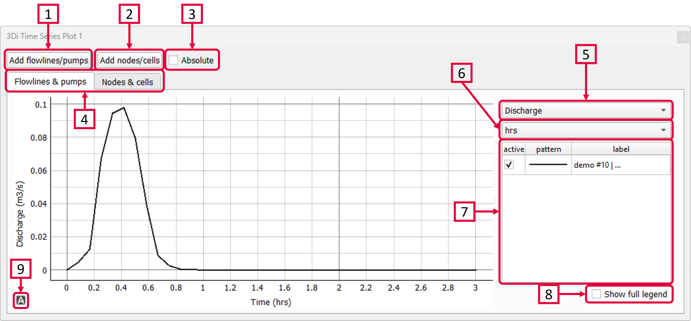

.. _time_series_plotter:

Time Series Plotter
===================
With the Time Series Plotter (|timeseriesplottertoolbar|) you can visualise simulation results by plotting the variables you are interested in. All the variables that are stored in the NetCDF (and accompanying aggregated NetCDF in case aggregated were used in the simulation) can be plotted. An complete overview of the variables in the NetCDF can be found in the section :ref:`3dinetcdf`. More information about aggregated variables can be found in the section :ref:`aggregationnetcdf`.

To following plot your results the following are required:

1) Click *Add flowlines/pumps* and then click a flowline or pumpline to plot the results of the clicked flowlines. To add multiple flowlines, simply click them one-by-one.
2) Click *Add nodes/cells* and then click a node or computational cell to plot the results of the clicked nodes/cells. To add multiple nodes/cells, simply click them one-by-one.
3) Check this box to make all the values absolute. This comes in handy when comparing results of flow in different directions.
4) You can switch between the results at flowlines or at nodes.
5) Select the variable of interest.
6) Select the unit of time that is used for the X-axis: seconds, minutes or hours.
7) All the flowlines/nodes that have been added to the plotter are shown here. In case of multiple loaded results they are all shown here. This helps to compare different simulations of the same model.
8) Check this box to see more information about the flowlines nodes (used revision, flowline/node id, flowline/node type.
9) Click |A-icon| to recenter the graph. You can zoom in and out by scrolling in the graph or at the axes.

	
.. |A-icon| image:: /image/i_time_series_plotter_A_icon.png
	:scale: 120%	

The graph tool (from the :ref:`3di_toolbox_plugin`) can be used for visualizing model results over time. for example, it allows users to quickly plot the water level variation of a specific node or the discharge variation of a flow link (e.g. a channel or pipe) over time. The information is quickly at hand in just a few steps. All the variable that are saved in the NetCDF are available. They are structured on flow lines and nodes, depending on how they are defined in the computational core. An overview of the variables in the NetCDF can be found in the section :ref:`3dinetcdf`. 

The following steps are required to view your results:
1) First, make sure you have loaded a schematisation and the corresponding results (NetCDF) into your QGIS project using :ref:`load_model_results`.
2) Activate the graph tool by clicking the *graph* button in the 3Di toolbar. A new panel with the title *3Di result plots* is launched in your QGIS-project. 
3) In the layer overview window go to the layer group *results: results_3di* and activate the 'flow-lines' layer or the 'nodes' layer: 

.. figure:: image/d_qgisplugin_graphtool_activateresults.png
    :alt: Results layers

4) Activate the *Select features* tool in QGIS, by clicking this logo in the *Attributes toolbar* from QGIS: 

.. figure:: image/d_qgisplugin_graphtool_selectiontool.png
    :alt: Selection tool

5) Select the specific nodes or flow lines. You can select multiple nodes or flow lines simultaneously, but for speed purposes it is advised to limit it to a maximum of 20 features.

6) Click the *Add* button in the *3Di results plot* panel. The results for the selected features are loaded from the NetCDF and visualized over time in the graph.

.. figure:: image/d_qgisplugin_graphtool_graphwindow.png
    :alt: Results graph example

7) You can switch between node and flow line results by activating the tab *Q-graph* for flow lines and *H-graph* for nodes. 
8) In the drop-down menu on the right side of the panel you can choose the type of results you want to see. The y-axis shows the corresponding range and unit of the results type. The x-axis shows the time. *Note: the time is often displayed in kilo-seconds (ks). 1 ks = 1000 seconds ≈ 16.7 minutes.*
9) Below the drop-down menu there is an overview of the nodes/flow lines you selected, with the id of the node/flow line and the type. In this overview you can activate or deactivate the results in the graph by clicking the checkbox next to it. A feature can be deleted by first selecting it in this overview and then clicking the *Delete* button below the overview. 
10) The data from the graph can also be exported to an image or csv-file. Right-click the graph figure and choose 'Export' from the drop-down menu. A new window pops-up in which you can choose the output format and settings. 