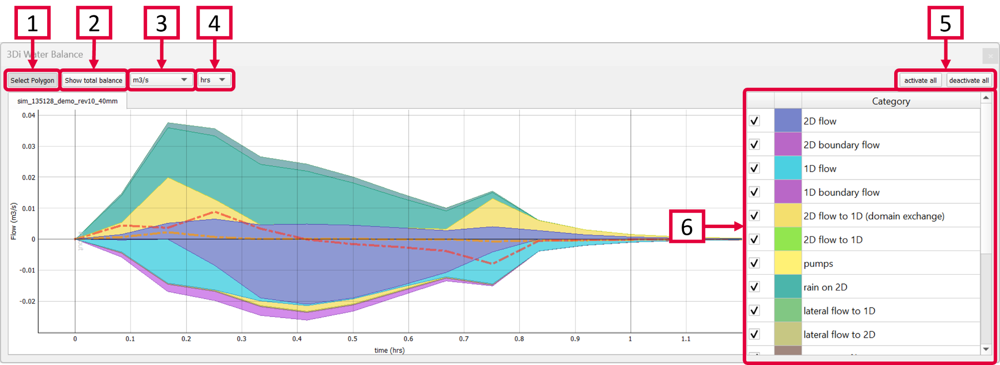
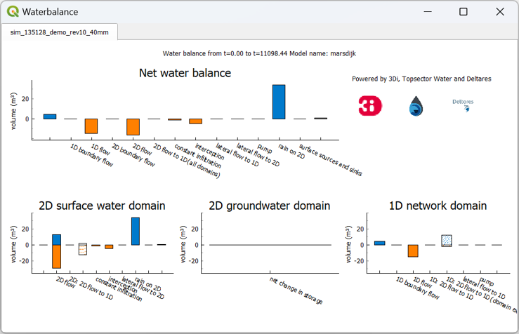

.. _water_balance_tool:

Water Balance Tool
==================
The Water Balance Tool (|waterbalancetoolbar|) computes the water balance in any area of your model, by using the incoming and outgoing fluxes at any polygon. The results are visualised as a graph. The development of this tool was an initiative of Deltares and was jointly developed with Nelen & Schuurmans and co-funded by the Dutch Top Sector Water (Ministry of Economic Affairs).

This is the only results tool that requires specific aggregation variables. If these are missing, an error will pop up. See :ref:`waterbalanceactivate` for more information on the required input for the Water Balance Tool.
    
1) Select a polygon from any layer to define the area of interest. The graph shows the water balance over time for the selected area. In case you are interested in only part of the water balance (e.g. the first 30 minutes) you can pan or zoom in and out on the plot itself and along either axis. Another way is to right-click the graph and change the range for either axis. The visible x-axis determines the period over which the water balance is calculated (see next step).
2) Click the "Show total balance" button to show the :ref:`water_balance_tool_total_balance` for the time period that is visible in the Water Balance graph. 
3) Choose between flow (m\ :sup:`3`/s) (default) or cumulative flow (m\ :sup:`3`). 
4) Select the temporal units that are shown on the X-axis. Choose between time in hours (default), minutes or seconds.
5) Activate or deactivate all categories in the graph.
6) Select or unselect the categories you are interested in. By hovering the cursor over each category, the corresponding plane in the graph lights up and the corresponding flowlines or nodes will be marked on the map. The change in volume per domain (1D or 2D) is shown as a dotted line. The volume change is the result of the total positive and negative flow (i.e. the inflow and outflow of the area, respectively).

\*Note: The different flow categories are 'stacked' in the graph. This means the (cumulative) flows are added to each other when multiple categories are activated. 

The water balance can be exported as an image or csv-file. Right-click the plot and choose 'Export...' from the drop-down menu. A new window pops up in which you can choose the desired output format. Click "Export" to select a location to save the data.

    
.. |waterbalancetoolbar| image:: /image/i_3di_results_analysis_toolbar_waterbalance.png
    :scale: 25%

.. |temporalcontroller| image:: /image/i_temporal_controller.png
    :scale: 90%

.. _water_balance_tool_total_balance:

Total water balance
-------------------
Clicking the 'Show total balance' button in the Water Balance Tool opens another window, giving you an overview of the total changes in volume. This gives a concise overview of the variables' relative importance across all domains. The description at the top shows the part of the simulation that is included in this water balance, it is based on the visible range of the X-axis in the Water Balance graph.

The top diagram shows the net water balance from all domains, whereas the bottom diagrams show the water balance per domain. 
The total water balance can be exported as an image or csv-file. Right-click the plot and choose 'Export...' from the drop-down menu. A new window pops up in which you can choose which plot(s) (or ViewBox(es)) you want to export, select the desired output format. Click "Export" to select a location to save the data.

.. _water_balance_tool_categories_explanation

Explanation of categories
"""""""""""""""""""""""""

In the total water balance, the 'net water balance', which shows the main compontents, is shown on top. At the bottom, the results area divided into the three domains of 3Di. See below for a description of the various components:

2D Surface water domain
#######################

- **2D Boundary flow:** Total inflow and outflow through 2D boundaries.
- **2D Flow:** Total inflow and outflow in the 2D domain through the flowlines crossing the borders of the polygon.
- **2D: 2D flow to 1D:** Flow exchange between the 2D and 1D domains crossing the borders of your polygon.
- **2D: 2D flow to 1D (domain exchange):** Flow exchange between the 2D surface domain and the 1D domain within your polygon.
- **Constant infiltration:** Total amount of infiltration in the 2D surface domain.
- **Interception:** Total intercepted volume.
- **Lateral flow to 2D:** Total inflow and outflow from 2D laterals.
- **Rain on 2D:** Total rain on the 2D domain.
- **Surface sources and sinks:** The total volumes of the sources and sinks terms.
- **Net change in storage:** The total net change in storage in the 2D domain.

2D Groundwater domain
#######################

- **Net change in storage:** The total net change in storage in the 2D groundwater domain.

1D Network domain
#######################

- **0D Rainfall runoff on 1D:** Total inflow volume from the 0D domain.
- **1D Boundary flow:** Inflow and outflow through 1D boundaries.
- **1D Flow:** Total inflow and outflow in the 1D domain through the flowlines crossing the borders of the polygon.
- **1D: 2D flow to 1D:** Flow exchange between the 2D domain and the 1D domain crossing the borders of your polygon.
- **1D: 2D flow to 1D (domain exchange:)** Flow exchange between the 2D domain and the 1D network elements within your polygon.
- **Lateral flow to 1D:** Total inflow and outflow from 1D laterals.
- **Pump:** Total pumped volume.
- **Net change in storage:** The total net change in storage in the 1D domain.

.. _waterbalanceactivate:

Requirements for the Water Balance Tool
---------------------------------------

To use the Water Balance Tool, aggregated results are required for a range of variables. This is to ensure that the computed water balance is consistent and complete. 
The aggregation settings can be found and configured in the spatialite-table *Aggregation settings*. For more information on the aggregation settings, see :ref:`aggregationnetcdf`. The default settings for the water balance tool are listed below.

.. csv-table:: Aggregation settings for Water Balance Tool
   :file: other/water_balance_aggregation_settings.csv
   :widths: 5, 10, 20, 15, 15, 20
   :header-rows: 1
   
The time step size (i.e. the period over which is aggregated) is adjustable. For new models, these settings are preloaded in the empty spatialite database. For older models, these settings must be added to the *Aggregation settings*-table. These SQL-queries will help you in doing so:

Remove existing aggregation settings::

    DELETE FROM aggregation_settings;
  
Add aggregation settings::

    INSERT INTO aggregation_settings(flow_variable, aggregation_method, interval)
    SELECT 'pump_discharge', 'cum', output_time_step FROM time_step_settings
    UNION
    SELECT 'lateral_discharge', 'cum', output_time_step FROM time_step_settings
    UNION
    SELECT 'simple_infiltration', 'cum', output_time_step FROM time_step_settings
    UNION
    SELECT 'rain', 'cum', output_time_step FROM time_step_settings
    UNION
    SELECT 'leakage', 'cum', output_time_step FROM time_step_settings
    UNION
    SELECT 'interception', 'current', output_time_step FROM time_step_settings
    UNION
    SELECT 'discharge', 'cum', output_time_step FROM time_step_settings
    UNION
    SELECT 'discharge', 'cum_negative', output_time_step FROM time_step_settings
    UNION
    SELECT 'discharge', 'cum_positive', output_time_step FROM time_step_settings
    UNION
    SELECT 'volume', 'current', output_time_step  FROM time_step_settings
    UNION
    SELECT 'surface_source_sink_discharge', 'cum_positive', output_time_step FROM time_step_settings
    UNION
    SELECT 'surface_source_sink_discharge', 'cum_negative', output_time_step FROM time_step_settings
    ;
    
.. note::
    
    The query above sets the aggregation time step equal to the output time step size. If you want to use a different aggregation time step size, make sure to use the same time step size for all aggregation variables, otherwise the Water Balance Tool cannot be used::
        
        UPDATE v2_aggregation_settings SET time_step = [desired time step size];

