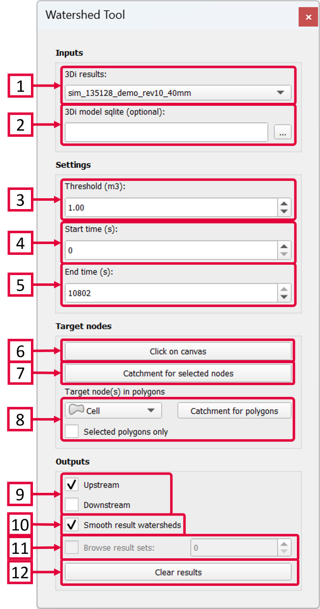
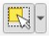

.. _watershed_tool:

Watershed tool
==============

The Watershed Tool (|watershedtoolbar|) allows you to determine the upstream and downstream catchment at any point or area. Upstream or downstream elements include surface areas (2D cells), sewerage and channel flow (1D flowlines) as well as impervious surfaces (0D inflow). If there is net flow from the element to the target node(s) above a user-defined threshold, the element is included in the upstream results; for the downstream area, this is based on flow originated from the target node(s) to the downstream elements. These connections may consist of any (combination of) flowline(s) included in the model. 

.. @Leendert: Is this still correct?
.. note::
   -  Pumplines (pumping stations that pump water from one location in the model to another) are not taken into account in the network analysis.
   -  Interflow is not taken into account in the network analysis.
   -  Groundwater flow is taken into account but has not been tested yet, please check the results.

.. @Leendert: is it still the case that v2_surfaces are not supported?

	
**Inputs**

1) Select the simulation results you want to analyse.
2) The 3Di schematisation spatialite (.sqlite-file) is an optional input, required only for visualizing the upstream v2_impervious_surfaces. This functionality is currently not supported for v2_surface features.

**Settings**

3) Set the threshold for the flow (default = 1 m\ :sup:`3`). Only flowlines with a cumulative discharge greater than this threshold are taken into account when deriving the upstream and downstream catchments. More specifically, the threshold applies to the absolute net cumulative discharge. E.g., if the time window is 30 minutes (1800 s) and the discharge is -1.0 m\ :sup:`3`/s, the net cumulative discharge is 1800 m\ :sup:`3`/s. If the flow direction changes during the simulation, the discharge may be -1.0 m\ :sup:`3`/s in the first 15 minutes (900 s) and 0.5 m\ :sup:`3`/s in the last 15 minutes, resulting in an absolute net cumulative discharge of abs(-900 + 450) = 450 m\ :sup:`3`.
4) Set the start time to determine which results should be used to derive the catchments (default = first simulation time step).
5) Set the end time to determine which results should be used to derive the catchments (default = last simulation time step).

**Target nodes**

6) Click the 'Click on canvas' button and then click a target node on the map canvas. This is the node for which the catchments are derived.
7) First use the Select tool (|qgisselecttool|) to select one or more target nodes, then click ‘Catchment for selected nodes’ to derive the catchments of multiple nodes.
8) Use this option to select target nodes based on their intersection with polygons in a layer of your choice. Select the layer from the dropdown menu. You can check the box for 'Selected polygons only' if you only want the use one or several selected polygons within a layer. Click the 'Catchment for polygons' button to derive the catchments.

**Outputs**

9) Check or uncheck the desired catchment: upstream or downstream of the target node(s).
10) If this box is checked a polygon will be drawn to create a smoother polygon of the catchments, instead of the blocky computational cells.
11) If you have derived multiple catchments at various locations you can browse the result sets.
12) Click 'Clear results' to remove all results sets from the tool.

.. |watershedtoolbar| image:: image/i_3di_results_analysis_toolbar_watershed.png
	:scale: 25%
	

